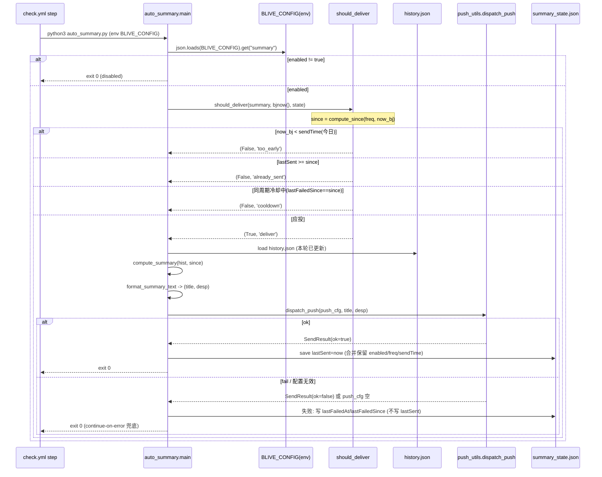
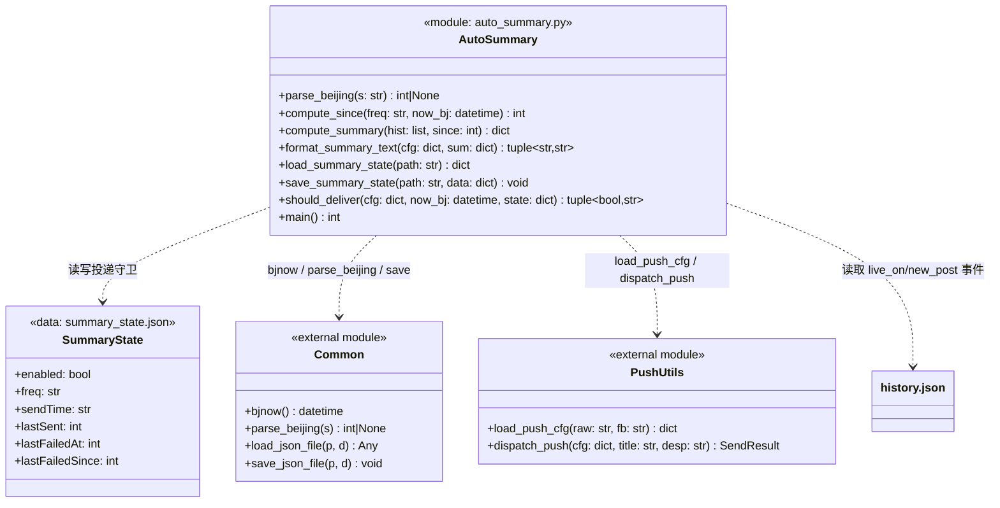
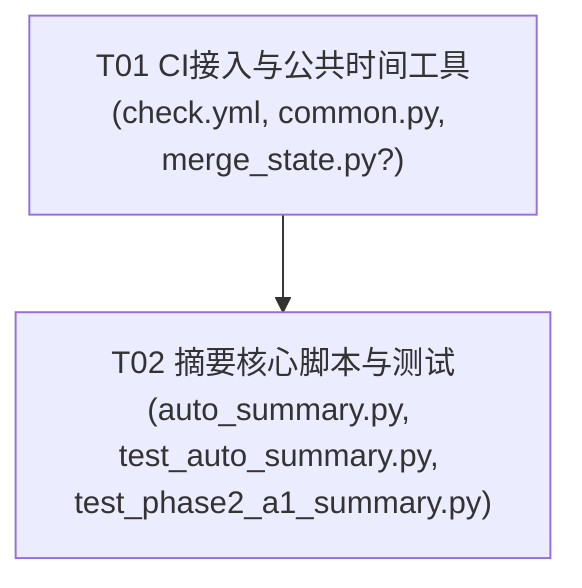

# A1 定时摘要自动投递 — 系统设计文档（PRD Q1）

> 作者：架构师 高见远（Gao）｜阶段：阶段二 A1（定时摘要无人值守投递）
> 关联代码（已主理人核实，本文档据此设计，未凭空假设）：
> - `monitor.html:4038` `computeSince` / `:4057` `computeSummary` / `:4092` `buildSummaryConfig` / `:4152` `copySummary`
> - `monitor.html:2691` `parseBeijing`（JS 口径：本地时区解释 + 叠回北京时差，减 `(offset+480)*60000`）
> - `push_utils.py` `load_push_cfg` / `dispatch_push` / `dispatch_push_ok`
> - `common.py` `bjnow` / `load_json_file` / `save_json_file`（**注：`parseBeijing` 当前不在 common.py，见 §待明确 T4**）
> - `.github/workflows/check.yml` `check` job 的「Persist state」step
> - `summary_state.json`（当前结构：`{enabled,freq,sendTime,lastSent}`，已存在于仓库根）
> - `tests/test_phase2_a1_summary.py`（已有字节级对齐的 Python 参考实现 `_parse_beijing`/`computeSince`/`computeSummary`）

> ⚠️ **文件命名说明**：项目级 `docs/system_design.md`、`docs/sequence-diagram.mermaid`、`docs/class-diagram.mermaid` 为全局架构文档，本文档不覆盖它们，改用 A1 专属文件名（`a1_summary_*`），避免破坏既有文档。

---

## 0. 现状核实（关键事实，影响设计）

| # | 事实 | 对 A1 的影响 |
|---|------|-------------|
| F1 | `parseBeijing` **仅存在于 `monitor.html:2691`（JS）** 与 `tests/test_phase2_a1_summary.py` 的本地 `_parse_beijing`，**`common.py` 没有**。 | A1 的 `auto_summary.py` 需要北京时字符串→UTC 秒的解析；需新增 canonical `parse_beijing`（归属见 §待明确 T4）。 |
| F2 | 已有字节级对齐的 Python 参考实现 `computeSince`/`computeSummary`（`tests/test_phase2_a1_summary.py:44-88`），公式与 JS 完全一致。 | `auto_summary.py` 的纯函数直接复用该公式（无需另起炉灶），测试可对照 JS 实跑校验。 |
| F3 | 「Persist state」step 的 `TMPD` 暂存循环 / `git add -f` 列表**不包含 `summary_state.json`**。 | 若直接 `git add -f summary_state.json` 而不加入 TMPD 暂存循环，`git reset --hard origin/master` 会覆盖掉本轮 CI 写入的 `lastSent`，导致重投。必须一并改 persist step。 |
| F4 | `concurrency.group: live-check, cancel-in-progress: false` → 严格串行（队列等待，新 run 不取消当前）。 | `summary_state.json` 无并发写冲突；`checkout` 即上一 run 的最终提交，`lastSent` 跨 run 一致，**无需 `merge_state.py` 语义合并**（但见 §待明确 T5 防御项）。 |
| F5 | `dispatch_push` 内部已做指数退避重试（≤3 次，2/4/8s），返回 `SendResult(ok,attempts,last_error,status_code)`；`is_retryable` 对 5xx/429/网络=True，对 4xx/biz_reject/config/auth/empty=False。 | A1 投递**只调一次** `dispatch_push`，不再在外层重试；失败分类交由 `dispatch_push` 内部分类。 |

---

## 1. A1 实现方案概述

**目标**：让 CI 每 5 分钟一轮、无人值守地按 `BLIVE_CONFIG.summary` 的配置，在到达 `sendTime` 时生成「今日/本周摘要」并推送到用户已配置的推送渠道，且每个周期只投一次（防重投）。

**机制四段（gate → 计算 → 投递 → 状态回写）**：

1. **gate（守卫）**：读 `BLIVE_CONFIG.summary`；未启用 / 未到 `sendTime` / 本周期已投 / 同周期失败冷却中 → 直接 `exit 0`，不投递。
2. **计算**：从本轮已更新的 `history.json` 取 `since` 之后的 `live_on`/`new_post` 事件，按房间去重聚合（与前端 `computeSummary` 同口径）。
3. **投递**：调用 `dispatch_push(push_cfg, title, desp)`（单通道，`summary.channel='push'` 走 `load_push_cfg` 解析出的 `push` 段，不调 A2 的 `resolve_channel`）。
4. **状态回写**：成功 → 写 `summary_state.json.lastSent = now`；失败 → 写 `lastFailedAt/lastFailedSince`（冷却用），**不写** `lastSent`，下一轮（≥5min 后）自动重试。

**CI 接入点**：在 `check.yml` 的「Persist state」step **之前**新增「Auto-deliver summary」step，复用同一轮 `BLIVE_CONFIG` 与已更新的 `history.json`；该 step 设置 `continue-on-error: true`，失败不影响状态持久化与 Pages 部署。

**零前端改动**：不动 `monitor.html` 任何既有摘要逻辑（前端 `saveSummaryConfig` 仍写 `summary_state.json` 的可读镜像，CI 只追加 `lastSent/lastFailedAt/lastFailedSince` 字段并合并保留前端字段）。

---

## 2. 文件列表

### 2.1 新增文件

| 文件 | 角色 | 说明 |
|------|------|------|
| `auto_summary.py` | CI 投递 CLI（核心） | 从 env `BLIVE_CONFIG` 读配置，从 `history.json` 算摘要，调 `dispatch_push` 投递，写 `summary_state.json`。仅 stdlib + 复用 `common`/`push_utils`。 |
| `tests/test_auto_summary.py` | 回归测试 | ①`compute_since` 对齐 JS ②`compute_summary` 对齐 JS ③gate 四分支单测 ④集成：monkeypatch `dispatch_push` 验证「应投」真实调用且写 `summary_state.json`。 |
| `docs/a1_summary_design.md` | 本设计文档 | — |
| `docs/a1_summary_sequence.mermaid` | 时序图（提取） | 见 §附 A。 |
| `docs/a1_summary_class.mermaid` | 类/模块图（提取） | 见 §附 B。 |

### 2.2 改动文件

| 文件 | 改动点 | 风险 |
|------|--------|------|
| `.github/workflows/check.yml` | ① 新增「Auto-deliver summary」step（置于「Persist state」前，`continue-on-error: true`，注入 `BLIVE_CONFIG`）② 在 persist step 的 `TMPD` 暂存循环、`git add -f` 列表（主循环 + 重试循环）补 `summary_state.json` | 低（串行语义不变，仅扩展强制纳入文件） |
| `common.py` | 新增纯函数 `parse_beijing(s)->Optional[int]`（北京时字符串→真实 UTC 秒，公式与 JS 一致） | 低（新增纯函数，不改既有符号） |

> `merge_state.py` **默认不改动**（见 §待明确 T5 防御可选项）。

---

## 3. 核心逻辑设计

### 3.1 `auto_summary.py` 模块结构（签名 + 行为，不含实现体）

```
# —— 纯函数（与 JS 字节对齐，可单测）——
parse_beijing(s: str) -> Optional[int]            # 北京时字符串 -> UTC 秒；空/非法 -> None
compute_since(freq: str, now_bj: datetime) -> int # daily=今日北京午夜; weekly=本周一北京午夜; 返回 UTC 秒
compute_summary(hist: list, since: int) -> dict   # {liveOnCount, newPostCount, byRoom, rangeText}
format_summary_text(cfg: dict, sum: dict) -> (str, str)  # (title, desp)，复用 copySummary 文案
should_deliver(cfg: dict, now_bj: datetime, state: dict) -> (bool, str)  # gate 纯函数

# —— 状态镜像读写（合并保留前端字段）——
load_summary_state(path: str) -> dict             # load_json_file 默认 {}
save_summary_state(path: str, data: dict) -> None # 读旧 -> 更新 -> save_json_file（原子写）

# —— 编排入口 ——
main() -> int   # 读 env -> gate -> 计算 -> 投递 -> 回写 -> exit 0
```

### 3.2 gate 逻辑（关键，对应 §待明确 T1/T2/T3）

`should_deliver(summary_cfg, now_bj, state) -> (should: bool, reason: str)`，reason ∈
`{'disabled','too_early','already_sent','cooldown','deliver'}`：

1. `summary_cfg.get('enabled') != true` → `(False, 'disabled')` → `main` `exit 0`。
2. `since = compute_since(freq, now_bj)`。
3. 解析 `sendTime="HH:MM"` 为**北京时**当日时刻：`send_at = now_bj.replace(hour=h, minute=m, second=0, microsecond=0)`。
   若 `now_bj < send_at` → `(False, 'too_early')` → `exit 0`（未到投递时刻）。
4. `last_sent = state.get('lastSent') or summary_cfg.get('lastSent') or 0`；
   若 `last_sent >= since` → `(False, 'already_sent')` → `exit 0`（本周期已投，防重投）。
5. **同周期失败冷却（防刷屏）**：
   `lfa = state.get('lastFailedAt')`，`lfs = state.get('lastFailedSince')`；
   若 `lfa` 存在 且 `lfs == since` 且 `(int(time.time()) - lfa) < COOLDOWN_SECONDS`
   → `(False, 'cooldown')` → `exit 0`。
   （`lfs != since` 表示已跨周期，冷却不生效，立即允许重投。）
6. 否则 → `(True, 'deliver')`。

> `COOLDOWN_SECONDS` 默认 `4*3600`（4 小时），可由 env `SUMMARY_RETRY_COOLDOWN`（秒）覆盖。

### 3.3 投递结果处理（对应 §待明确 T1）

- **成功**（`dispatch_push(...).ok == True`）：`save_summary_state` 写入
  `{enabled, freq, sendTime, lastSent: int(time.time())}`（合并保留前端既有字段，并清除 `lastFailedAt/lastFailedSince`）→ `exit 0`。
- **失败**（`ok == False` 或 `dispatch_push` 抛异常被捕获）：`save_summary_state` 写入
  `lastFailedAt: int(time.time())`、`lastFailedSince: since`，**不写 `lastSent`** → 下一轮（≥5min）自动重试，受 §3.2.5 冷却限制 → `exit 0`（`continue-on-error` 兜底）。
- **推送配置缺失/无效**（`load_push_cfg(BLIVE_CONFIG)` 返回 `{}` 或 `type` 未知）：视为 no-op，**不投递、不写任何失败冷却**，`log.warning` 后 `exit 0`（避免误配置天天刷屏，见 §待明确 T6）。

### 3.4 Python 复刻（与 JS 逐字节一致，依据 F2）

- `compute_since(freq, now_bj)`：
  - `d = now_bj.replace(hour=0,minute=0,second=0,microsecond=0)`；
  - weekly：`d -= timedelta(days=d.weekday())`（Python `weekday()` 周一=0..周日=6，等价于 JS `getDay()` 周日=0 时 `diff=(day===0?6:day-1)`）；
  - `return calendar.timegm(d.timetuple()) - 8*3600`（等价 JS `Date.UTC(y,m,d,0,0,0) - 8h`）。
- `compute_summary(hist, since)`：
  - 遍历 `l`：`t = l.get('type') or l.get('status')`；仅 `live_on`/`new_post`；
  - `ts = parse_beijing(l.get('time'))`；`ts is None or ts < since` 跳过；
  - `rid = str(l.get('rid') or l.get('account') or '')`；`key = (l.get('platform') or '') + '|' + rid`；
  - 房间聚合 `liveOn`/`newPost`；`liveOnCount = len(byRoom)`，`newPostCount = 新作总数`；
  - `rangeText`：`datetime.utcfromtimestamp(since + 8*3600).strftime('%Y-%m-%d')`（等价 JS `new Date(since*1000 + 8h)` 取 UTC 日期）。
  - 返回 `{liveOnCount, newPostCount, byRoom, rangeText}`。
- `parse_beijing(s)`（新增 canonical，见 F1）：
  - 正则 `^(\d{4})-(\d{2})-(\d{2})[ T](\d{2}):(\d{2}):(\d{2})$`；不匹配 → `None`；
  - `return calendar.timegm((y,mo,d,h,mi,se,0,0,0)) - 8*3600`（等价 JS `new Date(y,mo-1,d,h,mi,se).getTime() - (offset+480)*60000`）。

### 3.5 摘要文案（复用前端 `copySummary` 口径）

```
title = f"{(freq=='weekly'?'本周':'今日')}摘要（{rangeText}）"
desp  = f"{liveOnCount} 人开播 · {newPostCount} 条新作"
if byRoom:
    desp += "\n" + "\n".join(
        f"- {r['name'] or r['id']}：开播{r['liveOn']} 次 / 新作{r['newPost']} 条"
        for r in byRoom
    )
```
> 渠道 `decorate()` 会按 `push_cfg` 注入 `group`/`mention`（A1 不阻止，保持与现有推送一致）。

---

## 4. 数据流与调用时序（Mermaid sequence）

见 `docs/a1_summary_sequence.mermaid`，摘要如下：



---

## 5. 类 / 模块结构（Mermaid class）

见 `docs/a1_summary_class.mermaid`：



---

## 6. 依赖

- **运行时**：仅 Python 3.11 标准库（`json / re / time / datetime / calendar / os / sys / argparse`）+ 复用现有 `common` / `push_utils`。**不新增任何第三方依赖**。
- **CI**：复用既有 `setup-python@v5` + `BLIVE_CONFIG` secret；无需安装新 Action 或系统包。
- **测试**：`pytest`（已在 `requirements-dev.txt`），可选 `node`（用于对照 JS 实跑，`node` 缺失时相关用例 `skip`，不影响套件通过）。

---

## 7. 测试契约（`tests/test_auto_summary.py`）

| 用例 | 类型 | 断言要点 |
|------|------|---------|
| `test_compute_since_daily` | 单测（黄金值） | `now=2026-07-11 15:30 北京` → `since == timegm(2026,7,11,0,0,0)-8h`（即 2026-07-10 16:00 UTC）。 |
| `test_compute_since_weekly` | 单测 | `2026-07-11(周六)` → 本周一 `2026-07-06` 北京午夜 UTC 秒。 |
| `test_compute_since_vs_js` | **对照 JS（node 实跑）** | 抽取 `monitor.html` 的 `computeSince`/`parseBeijing` 经 node 执行，与 `auto_summary.compute_since` 对同一组 `freq`+`now_bj` 输出相等。 |
| `test_compute_summary_counts` | 单测 | 含同人多次开播、新作、跨日事件、非统计类型；断言 `liveOnCount`/`newPostCount`/`byRoom` 明细/`rangeText`。 |
| `test_compute_summary_legacy_status` | 单测 | 兼容旧字段 `status`（非 `type`）仍被计入。 |
| `test_compute_summary_vs_js` | **对照 JS（node 实跑）** | 抽取 JS `computeSummary` 与 Python 对同一 `hist`+`since` 产出逐字段相等（房间去重、计数、rangeText）。 |
| `test_gate_disabled` | gate 单测 | `enabled=false` → `(False,'disabled')`。 |
| `test_gate_too_early` | gate 单测 | `now_bj` 早于今日 `sendTime` → `(False,'too_early')`。 |
| `test_gate_already_sent` | gate 单测 | `state.lastSent >= since` → `(False,'already_sent')`。 |
| `test_gate_deliver` | gate 单测 | 启用 + 已到时刻 + `lastSent < since` + 非冷却 → `(True,'deliver')`。 |
| `test_gate_cooldown` | gate 单测 | 同周期 `lastFailedSince==since` 且距 `lastFailedAt` < 冷却 → `(False,'cooldown')`；跨周期（`lastFailedSince!=since`）则不被冷却拦截。 |
| `test_integration_deliver_writes_state` | **集成（monkeypatch）** | `monkeypatch` `push_utils.dispatch_push` 返回 `ok=True`；构造临时 `history.json` + `BLIVE_CONFIG` + `summary_state.json`；运行 `auto_summary.main()`；断言 `dispatch_push` 被以正确 `(title,desp)` 调用一次，且 `summary_state.json.lastSent>0`、无 `lastFailedAt`。 |
| `test_integration_fail_no_lastSent` | **集成（monkeypatch）** | `dispatch_push` 返回 `ok=False`；运行 `main()`；断言 `summary_state.json` **未**写 `lastSent`，但写了 `lastFailedAt`/`lastFailedSince`；退出码 0。 |
| `test_integration_no_push_cfg` | **集成** | `BLIVE_CONFIG` 无 `push` 段；运行 `main()`；断言 `dispatch_push` 未被调用、`summary_state.json` 无 `lastFailedAt`（no-op）。 |

> 对照 JS 的用例沿用仓库既有范式（参考 `test_selfcheck.py` 的 `_has_node()` + 抽取 JS 经 `subprocess` 跑 `node`），`node` 不可用则 `skip`。

---

## 8. 共享约定（跨模块 / 工程师须知）

1. **时间基准**：所有摘要时间均为**北京时**；对外存储为 **UTC 秒**（`calendar.timegm(...) - 8*3600`），与前端 `parseBeijing`/`computeSince` 同口径，杜绝 8 小时 bug。
2. **`summary_state.json` 拥有权**：
   - 前端拥有 `enabled`/`freq`/`sendTime`/`lastSent`（用户配置镜像 + 手动触发的 lastSent）；
   - CI 拥有 `lastSent`（投递成功守卫）与 `lastFailedAt`/`lastFailedSince`（失败冷却，可选扩展字段，前端忽略即兼容）；
   - **CI 写回必须「读旧 → 合并 → 写回」**，只更新自己字段，绝不覆盖前端 `enabled/freq/sendTime`。
3. **投递守卫单一真相**：是否「本周期已投」以 `summary_state.json.lastSent >= since` 为准（fallback `BLIVE_CONFIG.summary.lastSent`）；`BLIVE_CONFIG.summary` 是配置（enabled/freq/sendTime/channel）的唯一真相。
4. **渠道**：A1 固定单通道（`summary.channel='push'`），`push_cfg = load_push_cfg(BLIVE_CONFIG)`；**不调用** A2 `resolve_channel` 多通道（留后续）。
5. **原子写**：写 `summary_state.json` 一律走 `common.save_json_file`（`.tmp` + `os.replace`），避免 CI 被 kill 留下损坏 JSON。
6. **退出码**：新增 CI step 一律 `exit 0`（非致命），配合 `continue-on-error: true`，绝不阻断状态持久化 / Pages 部署。
7. **串行语义不变**：不改 `concurrency`；`summary_state.json` 仅加入 persist 的 `git add -f` + TMPD 暂存循环，保持快进推送。
8. **空摘要**：`liveOnCount==0 && newPostCount==0` 仍按正常流程投递（文案即「0 人开播 · 0 条新作」），保证周期守卫稳定（见 §待明确 T8）。

---

## 9. 待明确事项 + 主理人默认（拍板）

| ID | 待明确点 | **主理人默认（推荐）** | 备选 / 风险 |
|----|---------|----------------------|------------|
| **T1** | 投递失败是否写 `lastSent`？ | **成功才写 `lastSent`；失败写 `lastFailedAt/lastFailedSince`（冷却用），不写 `lastSent`**，下一轮（≥5min）自动重试。 | 备选：失败也写 `lastSent` → 当天不再重试，token 临时失效恢复后当天漏投（不推荐）。 |
| **T2** | `sendTime` 时区 | **北京时**（与前端 `computeSince` 同口径，`bjnow()` 返回北京 naive datetime，直接 `<` 比较，无需 UTC 换算）。 | 若未来支持 UTC/本地时，需在前端同步改口径。 |
| **T3** | weekly 跨周边界 | **自然周（周一~周日）**，`compute_since('weekly')` 取本周一北京午夜；`lastSent >= since` 自然处理跨周重投；冷却仅作用于同周期（`lastFailedSince==since`），跨周立即重投。 | 若需「滚动 7 天」口径需另设计。 |
| **T4** | `parse_beijing` 归属 | **新增 canonical `parse_beijing` 到 `common.py`**（与 `bjnow` 同模块，DRY）；`auto_summary.py` 与 `tests/test_phase2_a1_summary.py` 改从 `common` 复用，删本地 `_parse_beijing` 避免双源。 | 备选：`auto_summary.py` 本地定义（零改 `common.py`）。推荐前者。 |
| **T5** | `merge_state.py` 是否需改 | **默认不改**（F4：串行 + checkout 即最新提交，TMPD 暂存循环已保全；`merge_state.py` 当前不处理 `summary_state.json`，无需语义合并）。列为**防御可选**：可把 `summary_state.json` 加入其「keep local」列表（仿 `state.json`/`tracking.json`），以防未来并发策略变化。 | 改动 `merge_state.py` 属非必需风险，默认跳过。 |
| **T6** | 推送配置缺失/无效 | **视为 no-op**：`log.warning` 后 `exit 0`，**不写** `lastFailedAt/lastSent`（避免误配置天天刷屏）。 | 若希望「配置缺失也重试」，会与 T1 冷却冲突且无意义。 |
| **T7** | 失败冷却时长 | **默认 4h**（`COOLDOWN_SECONDS=4*3600`），env `SUMMARY_RETRY_COOLDOWN`（秒）可配。daily 周期 24h → 同周期最多 ~6 次尝试；serverchan 5条/天硬限下 `biz_reject` 不重试 → 不刷爆。 | 可调大（如 6h）进一步降频。 |
| **T8** | 空摘要（0 开播 0 新作）是否投递 | **仍投递**（文案即「0 人开播 · 0 条新作」），周期守卫一致、简单。 | 备选：0 事件跳过不投（省配额，但需额外 gate 分支）。 |
| **T9** | `summary_state.json` 是否入库 | **入库**：加入 persist `git add -f` 列表（当前未被跟踪/未被纳入）。前端经 GitHub API 写的镜像与 CI 写的守卫在同一文件，CI 合并保留。 | 若不入库，跨 run 的 `lastSent` 会丢失 → 每 run 重投（破坏防重投）。 |

---

## 10. 任务分解（有序 + 依赖）

> 遵循 SOP：≤5 任务、每任务 ≥3 文件、首任务=基础设施、按层/模块分组、任务间尽量仅依赖 T01。

### T01 — CI 接入与公共时间工具（基础设施）｜P0｜依赖：无

| 项 | 内容 |
|----|------|
| 源文件 | `.github/workflows/check.yml`、`common.py`、`merge_state.py`（防御可选） |
| 改动 | ① `common.py` 新增 canonical `parse_beijing`（T4 默认）② `check.yml` 新增「Auto-deliver summary」step（置于「Persist state」前，`continue-on-error: true`，注入 `BLIVE_CONFIG`）③ `check.yml` persist step 的 `TMPD` 暂存循环、`git add -f`（主+重试循环）补 `summary_state.json`（F3）④（可选）`merge_state.py` 把 `summary_state.json` 纳入 keep-local 列表（T5） |
| 验证 | `check.yml` YAML 合法；`python3 -c "from common import parse_beijing; ..."` 通过字节对齐断言 |

### T02 — 定时摘要核心脚本与测试｜P0｜依赖：T01

| 项 | 内容 |
|----|------|
| 源文件 | `auto_summary.py`、`tests/test_auto_summary.py`、`tests/test_phase2_a1_summary.py`（T4 去重增强） |
| 改动 | ① 新建 `auto_summary.py`（`parse_beijing` 复用 `common`；`compute_since`/`compute_summary`/`format_summary_text`/`should_deliver`/`load_summary_state`/`save_summary_state`/`main`）② 新建 `tests/test_auto_summary.py`（§7 契约）③ 增强 `tests/test_phase2_a1_summary.py`：改从 `common` import `parse_beijing`，移除本地 `_parse_beijing` 重复定义 |
| 验证 | `python -m pytest -q` 全绿；对照 JS 用例在 `node` 可用时通过、缺失时 `skip` |

> 两任务均为 P0；T02 仅依赖 T01（复用 `common.parse_beijing`），无长依赖链。

### 任务依赖图（Mermaid）



---

## 附 A：`docs/a1_summary_sequence.mermaid`（完整时序）


## 附 B：`docs/a1_summary_class.mermaid`（完整类图）


