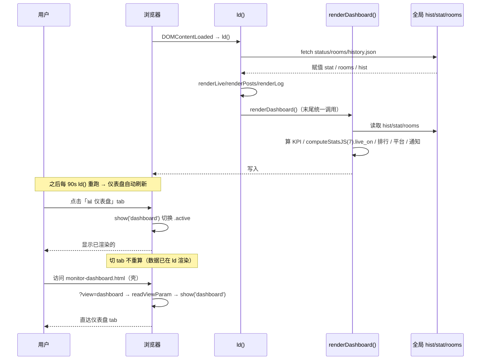

# P0-7 统一健康仪表盘 · 架构设计（轻量 · 阶段1 收官）

> 架构师：高见远（Bob）｜ 上游 PRD：`docs/p0_health_dashboard_prd.md`
> 模块：blive-monitor 纯静态前端 `monitor.html`｜ 语言：中文

---

## 1. 实现方案（一句话）

在第 5 个 tab「仪表盘」内新增一个 `renderDashboard()` 函数，纯前端复用 `ld()` 已载入的全局 `hist`/`stat`/`rooms` 聚合渲染 **5 张 KPI 卡 + 近 7 天开播趋势（CSS 条形，零图表库）+ 主播开播排行 Top5 + 平台分布 + 通知健康**，并在 `ld()` 成功路径末尾统一调用它（切 tab 不重新渲染，因 `ld()` 90s 刷新会重算）。

---

## 2. 文件列表（仅 2 个，纯前端、零依赖、<10 文件）

| 文件 | 改动类型 | 说明 |
|---|---|---|
| `monitor.html` | 修改 | ① 底部 `.tabbar` 加第 5 个 tab 按钮；② `<main>` 内加 `<section id="view-dashboard">` 容器骨架；③ `show()` 两处索引同步（views 字典 + tabs 数组）；④ `readViewParam()` 的 `dashboard` 分支由 `show('log')` 改为 `show('dashboard')`；⑤ 新增 `renderDashboard()` 及辅助函数（`todayBJ`/`liveOnToday`/`notifyAnomalyCount`/`liveOnRank`/`platformDist`/`recentAnomalies`）；⑥ `ld()` 成功路径末尾加 `renderDashboard()`；⑦ 配套 CSS（复用 `.logstats`/`.stat-card`/`.spark`/`.bar`/`.room`/`.log-item`，仅补 `.dash-block`/`.dash-grid`/`.dash-block-title` 极小骨架）。 |
| `tests/test_dashboard.py` | 新增 | CI 跑 Python：① 结构断言 `monitor.html` 含 `view-dashboard`/`onclick="show('dashboard')"`/`renderDashboard`/`computeStatsJS(hist`/5 个 KPI 容器 id/`show` 含 dashboard；② 纯 Python 参考实现 `compute_dashboard_metrics(...)` 复刻 5 项 KPI + 7 天趋势 + 排行 + 平台分布 + 通知健康口径，对夹具（含「今日」边界、`level=warn`、多平台）验证正确。 |

**不改动**：`monitor-dashboard.html`（已是 `?view=dashboard` 重定向壳，改 `readViewParam` 后自然落到仪表盘 tab）；后端 / Python 检测脚本 / CI workflow；现有四 tab 逻辑；P0-1 健康条与 90s 定时刷新。

---

## 3. 数据结构 / 接口（签名伪代码）

> 全部函数为 `monitor.html` 内全局函数；只读全局 `hist`/`stat`/`rooms`，**不发起任何网络请求、不调用 `ld()`**。

### 3.1 今日北京时间（复用 `bjNow()`，严禁 `new Date()` 直读本地时区）

```js
// 复用现有 bjNow()（L585）：返回已折算为北京墙钟的 Date
function todayBJ(){
  var d=bjNow();
  function p(n){return (n<10?'0':'')+n;}
  return d.getFullYear()+'-'+p(d.getMonth()+1)+'-'+p(d.getDate()); // "YYYY-MM-DD"（北京）
}
```

### 3.2 五项聚合辅助函数

```js
// 今日开播次数：type==='live_on' 且 time 前 10 位 === 今日北京时间
function liveOnToday(hist){
  var t=todayBJ();
  return (hist||[]).filter(function(l){
    return (l.type||l.status)==='live_on' && (l.time||'').substring(0,10)===t;
  }).length;
}

// 通知异常计数：level 优先，type 兜底（cookie_warn/error 计入，保证不漏）
function notifyAnomalyCount(hist){
  return (hist||[]).filter(function(l){
    var lv=l.level, tp=l.type||l.status;
    return lv==='warn' || lv==='error' || tp==='error' || tp==='cookie_warn';
  }).length;
}

// 开播排行 Top N（按 name 聚合 live_on，次数降序；并列按最近开播时间倒序）
function liveOnRank(hist, n){
  var m={}, last={};
  (hist||[]).forEach(function(l){
    if((l.type||l.status)==='live_on'){
      m[l.name]=(m[l.name]||0)+1;
      if(!last[l.name] || l.time>last[l.name]) last[l.name]=l.time;
    }
  });
  return Object.keys(m).map(function(k){return {name:k,count:m[k],last:last[k]||''};})
    .sort(function(a,b){ return b.count-a.count || (b.last>a.last?1:-1); })
    .slice(0,n);
}

// 平台分布：rooms 按 platform 计数；hist 的 live_on 按 platform 分桶
function platformDist(rooms, hist){
  var r={bilibili:0,douyin:0,other:0}, lv={bilibili:0,douyin:0,other:0};
  (rooms||[]).forEach(function(r0){
    if(r0.platform==='bilibili')r.bilibili++; else if(r0.platform==='douyin')r.douyin++; else r.other++;
  });
  (hist||[]).forEach(function(l){
    if((l.type||l.status)!=='live_on')return;
    if(l.platform==='bilibili')lv.bilibili++; else if(l.platform==='douyin')lv.douyin++; else lv.other++;
  });
  return {rooms:r, live:lv};
}

// 最近 N 条异常（通知健康列表）：与 notifyAnomalyCount 同口径，按 time 倒序
function recentAnomalies(hist, n){
  return (hist||[]).filter(function(l){
    var lv=l.level, tp=l.type||l.status;
    return lv==='warn' || lv==='error' || tp==='error' || tp==='cookie_warn';
  }).sort(function(a,b){ return (b.time||'')>(a.time||'')?1:-1; }).slice(0,n);
}
```

### 3.3 主渲染函数 `renderDashboard()`

```js
function renderDashboard(){
  var dash=document.getElementById('view-dashboard');
  if(!dash) return;
  // —— 防御：数据未载入时优雅降级 ——
  var fresh = calcFreshness();                      // 复用 P0-1 → {state,label}
  var roomTotal = rooms.length;
  var liveNow = (stat&&stat.rooms) ? stat.rooms.filter(function(r){return r.status==='live';}).length : 0;
  var todayLive = liveOnToday(hist);                // 今日北京时间口径
  var notifyCnt = notifyAnomalyCount(hist);
  // —— 趋势：复用 computeStatsJS 的北京日分桶，live_on[] 与 days[] 对齐（oldest→newest）——
  var s = computeStatsJS(hist||[], 7);
  var trend = s.live_on, days = s.days;
  // —— 排行 / 平台 / 通知 ——
  var rank = liveOnRank(hist, DASH_TOP_N);          // DASH_TOP_N = 5
  var plat = platformDist(rooms, hist);
  var recent = recentAnomalies(hist, DASH_NOTIFY_N); // DASH_NOTIFY_N = 5

  // —— 写入各容器（容器 id 见 §7 共享知识）——
  document.getElementById('kpiRooms').textContent = roomTotal;
  document.getElementById('kpiLive').textContent   = liveNow;
  document.getElementById('kpiToday').textContent  = todayLive;
  document.getElementById('kpiNotify').textContent = notifyCnt;
  var fc = {ok:'var(--green)',warn:'var(--yellow)',stale:'var(--live)',fail:'var(--live)'}[fresh.state]||'var(--text2)';
  document.getElementById('kpiFresh').textContent  = fresh.label;
  document.getElementById('kpiFresh').style.color  = fc;

  // 趋势 CSS 条形（复用 .spark/.bar，高度按最大值归一，title=MM-DD: N）
  var max=Math.max(1, Math.max.apply(null, trend));
  document.getElementById('dashTrend').innerHTML = trend.map(function(v,i){
    return '<div class="bar" title="'+days[i]+': '+v+'" style="height:'+Math.round(v/max*100)+'%;background:var(--live)"></div>';
  }).join('');

  // 排行列表
  document.getElementById('dashRank').innerHTML = rank.length ? rank.map(function(r,i){
    return '<div class="log-item"><span class="log-dot live"></span><span class="log-txt"><b>'+(i+1)+'. '+e(r.name)+'</b> · '+r.count+' 场</span></div>';
  }).join('') : '<div class="empty">暂无开播记录</div>';

  // 平台分布（比例条：B站 var(--bili) / 抖音 var(--dy)）
  document.getElementById('dashPlatform').innerHTML = buildPlatformHTML(plat);

  // 通知健康最近 N 条
  document.getElementById('dashNotify').innerHTML = recent.length ? recent.map(function(l){
    var cls = (l.level==='error'||l.type==='error')?'err':'warn';
    var detail = e(l.detail || l.title || l.type || '—');
    return '<div class="log-item"><span class="log-dot '+cls+'"></span>'
         + '<span class="log-txt"><b>'+e(l.name||'—')+'</b> · '+(l.platform==='bilibili'?'B站':'抖音')+' · '+(l.time||'').substring(5,16)+'<br>'+detail+'</span></div>';
  }).join('') : '<div class="empty">✅ 近期无通知异常</div>';
}
function buildPlatformHTML(plat){
  function row(label, bili, dy, biliVar, dyVar){
    var tot=bili+dy, bp=tot?Math.round(bili/tot*100):0, dp=100-bp;
    return '<div style="font-size:12px;color:var(--text2);margin:6px 0 3px">'+label+'（'+tot+'）</div>'
      + '<div style="display:flex;height:10px;border-radius:6px;overflow:hidden;background:var(--card2)">'
      + '<div style="width:'+bp+'%;background:'+biliVar+'"></div>'
      + '<div style="width:'+dp+'%;background:'+dyVar+'"></div></div>'
      + '<div style="display:flex;font-size:11px;margin-top:3px"><span style="color:var(--bili)">B站 '+bili+' ('+bp+'%)</span><span style="margin-left:auto;color:var(--dy)">抖音 '+dy+' ('+dp+'%)</span></div>';
  }
  return row('房间数', plat.rooms.bilibili, plat.rooms.douyin, 'var(--bili)','var(--dy)')
       + row('开播数', plat.live.bilibili,  plat.live.douyin,  'var(--bili)','var(--dy)');
}
```

### 3.4 接入点（两处改动）

```js
// (A) show() 两处同步（当前 L386-390），加 dashboard：
var views={'live':'view-live','posts':'view-posts','log':'view-log','config':'view-config','dashboard':'view-dashboard'};
tabs.forEach(function(b,i){b.classList.toggle('active',['live','posts','log','config','dashboard'][i]===t);});

// (B) readViewParam()（当前 L781-782），dashboard 分支改落本 tab：
if(v==='dashboard'||v==='feed'||v==='hero'){
  show(v==='dashboard' ? 'dashboard' : 'log');   // 仅 dashboard 落仪表盘，feed/hero 仍落日志
  ...
}

// (C) ld() 成功路径（当前 L1226-1227）末尾统一调：
readViewParam();
renderLive(); renderPosts(); renderLog();
renderDashboard();   // ← 新增：数据载入即聚合渲染，切 tab 不重算
```

> **设计决策**：`renderDashboard()` 仅由 `ld()` 触发（初始加载 + 90s 刷新 + 手动刷新），`show('dashboard')` 只做 `.view.active` 切换、不重复渲染——因为切 tab 不会重新加载数据，DOM 内容由 `ld()` 渲染后持久存在。这样一处触发、零重复计算，避免与 90s 刷新重复。

---

## 4. 程序调用流程



---

## 5. 任务列表（有序、含依赖）

| ID | 任务名 | 源文件 | 依赖 | 优先级 |
|---|---|---|---|---|
| **T1** | **加第 5 个 tab（接入骨架）** | `monitor.html` | — | P0 |
| | ① `.tabbar` 追加 `<button class="tab" onclick="show('dashboard')"><span class="ic">📊</span>仪表盘</button>`；② `<main>` 内 `#view-config` 后追加 `<section class="view" id="view-dashboard">` 骨架（含 `panel-head` + 5 个 KPI 容器 `kpiRooms/kpiLive/kpiToday/kpiNotify/kpiFresh` + `dashTrend/dashRank/dashPlatform/dashNotify` + CSS 骨架 `.dash-block/.dash-grid/.dash-block-title`）；③ `show()` 两处同步（views 字典 + tabs 数组）；④ `readViewParam()` 的 dashboard 分支改 `show('dashboard')`。 | | | |
| **T2** | **实现 `renderDashboard()` 及全部聚合 + CSS** | `monitor.html` | T1 | P0 |
| | 实现 `todayBJ/liveOnToday/notifyAnomalyCount/liveOnRank/platformDist/recentAnomalies` + `renderDashboard()` + `buildPlatformHTML()`；`ld()` 末尾加 `renderDashboard()`；补齐 KPI 卡网格（`.logstats` 5 列，移动端回退）、趋势 `.spark/.bar`、排行/通知 `.log-item`、平台比例条样式；含空数据降级。 | | | |
| **T3** | **新增 `tests/test_dashboard.py`** | `tests/test_dashboard.py` | T1, T2 | P0 |
| | 结构断言（`view-dashboard` / `onclick="show('dashboard')"` / `renderDashboard` / `computeStatsJS(hist` / 5 个 KPI 容器 id / `show` 含 `dashboard` / `view=dashboard`）；纯 Python 参考实现 `compute_dashboard_metrics(hist, stat, rooms, today_bj_str)` 复刻全部口径，对夹具（含「今日」边界、`level=warn`、多平台）断言 5 项 KPI + 趋势 + 排行 + 平台 + 通知健康正确。 | | | |

> 各任务均 ≥3 个相关改动点；T1/T2 同文件分组，T3 独立测试文件。无过多线性依赖链（T2 仅依赖 T1 容器存在，T3 依赖前两者落地）。

---

## 6. 依赖包

**无。** 纯原生 HTML / CSS / JS，零外部依赖、零图表库（趋势/平台均用 CSS 条形/比例条手绘）。

---

## 7. 共享知识（跨文件约定 · 工程师必读）

| 约定 | 取值 / 规则 |
|---|---|
| **第 5 tab 接入点** | `.tabbar` 追加按钮 + `<main>` 内 `#view-dashboard` 容器 + `show()` 两处（`views` 字典、`tabs` 数组）同步 + `readViewParam()` 分支改 `show('dashboard')`；`monitor-dashboard.html` 壳无需改（已 `?view=dashboard` 重定向）。 |
| **`computeStatsJS` 复用键** | 趋势取 `computeStatsJS(hist, 7).live_on`，与返回 `days[]`（MM-DD，oldest→newest）逐位对齐；`live_on[i]` 对应 `days[i]`。桶内 type 直接取 `e.type \|\| e.status`。**不要另写时区分桶**。 |
| **「今日」口径（北京时间）** | 一律用 `bjNow()`/`todayBJ()` 取 `YYYY-MM-DD`，用 `l.time.substring(0,10)` 字符串相等判断；**严禁 `new Date(str)` / 本地时区**。 |
| **KPI 容器 id 命名** | 5 个数值位：`kpiRooms`（监控房间总数）、`kpiLive`（当前直播中）、`kpiToday`（今日开播）、`kpiNotify`（通知异常数）、`kpiFresh`（新鲜度 label）；4 个块容器：`dashTrend`、`dashRank`、`dashPlatform`、`dashNotify`。 |
| **新鲜度来源** | 直接 `calcFreshness()`（P0-1 复用），取 `{state,label}`；state→色：ok=绿 / warn=黄 / stale·fail=红（`--live`）。 |
| **异常口径（通知健康）** | `level==='warn' \|\| level==='error' \|\| type==='error' \|\| type==='cookie_warn'`（`live_off` 不计入开播）；detail 显示优先 `l.detail \|\| l.title \|\| l.type`。 |
| **转义** | 所有动态文本经 `e()` 转义（已存在，L383），防止 `name`/`detail` 含 `<` `&` 破坏 DOM。 |
| **排名并列** | 次数降序；相同则按最近开播 `time` 倒序。 |
| **常量** | `DASH_TOP_N = 5`（开播排行）、`DASH_NOTIFY_N = 5`（通知最近条数），置于 `renderDashboard` 上方便于调。 |
| **视觉复用** | KPI 卡用 `.logstats`/`.stat-card`；趋势用 `.spark`/`.bar`（`--live`）；排行/通知用 `.log-item`/`.log-dot.warn`/`.log-dot.err`；平台用 `--bili`/`--dy`；整体容器 `.view` + `max-width:760px`。 |

---

## 8. 待明确事项（PRD 待确认问题收敛）

| # | PRD 问题 | 设计默认处理 | 仍需用户拍板？ |
|---|---|---|---|
| 1 | tab 放第几位？ | **第 5 位（最右）**，追加不改默认首屏（live）。改动最小、风险最低。 | 默认已处理；若想设为默认首屏请拍板（需改 `view-live` 的 `active` 与 `ld()` 默认视图）。 |
| 2 | 是否本轮回退自动刷新？ | **回退**。仪表盘跟随 `ld()` 90s 刷新，无独立定时器（切 tab 亦不重算）。 | 默认已处理。 |
| 3 | Top N 取几？ | **N=5**（开播排行 + 通知最近均 5）。 | 默认已处理。 |
| 4 | 顶栏 `.overview` 3 卡是否改动？ | **不改动**，与仪表盘互补（仪表盘新增今日开播/通知异常/新鲜度等更全口径）。 | 默认已处理。 |
| 5 | 通知异常计数口径？ | **level 优先、type 兜底**（见 §7），确保不漏 `cookie_warn`。 | 默认已处理。 |
| 6 | 异常列表可否点跳日志？ | **P0 仅展示，跳转留 P1**。 | 默认已处理。 |

> **结论：6 项待确认均按 PRD「建议」默认处理，无硬阻塞项。** 唯一需主理人留意的是 #1（tab 位置）——当前默认最右第 5 位，若产品希望仪表盘作为打开即见的首屏，请明确，届时仅调整 `active` 与默认视图即可，工作量极小。

---

*—— 设计结束。本文件不可改代码、不提交 git，由主理人统一编排与提交。*
