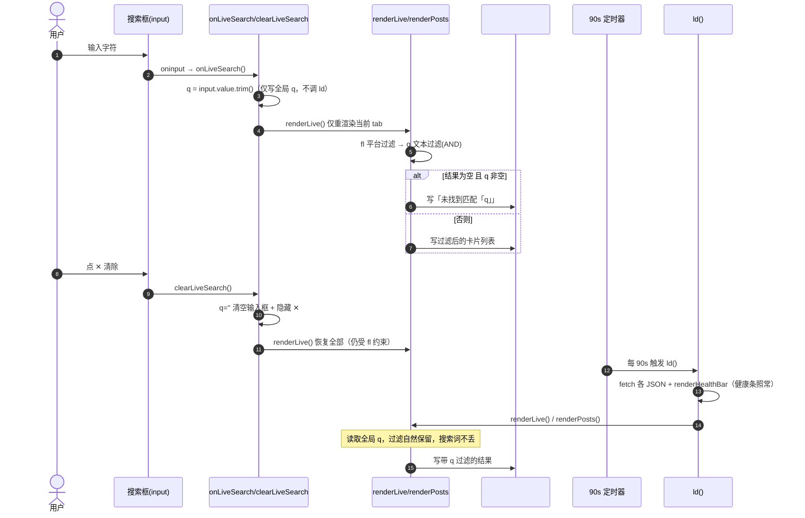
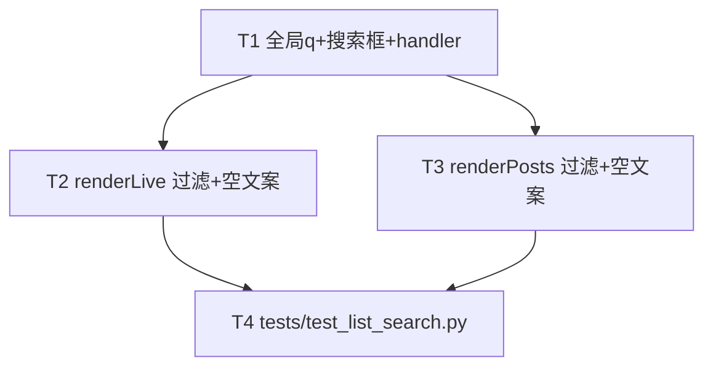

# P0-4 列表批量搜索 · 架构设计（轻量版）

> 架构师：高见远（Bob）｜ 上游 PRD：`docs/p0_list_search_prd.md`（许清楚 / Alice）
> 模块：blive-monitor 纯静态前端 `monitor.html` ｜ 语言：中文
> 范围：仅 P0 纯前端文本搜索；批量操作 / 持久化 / 状态 chip 回退为 P1/P2（见 §8）
> 约束：纯前端、主要改 `monitor.html`；不改后端、不动既有 chip 平台筛选、不碰 P0-1 健康条与 `ld()`。

---

## 1. 实现方案

加一个全局 `q`（与 `fl` 并列）→ 两个 tab 各放一个搜索框（输入框 + 清除 ✕）→ `oninput` 实时把值写入 `q` 并对**当前 tab 的 body** 重渲染 → `renderLive`/`renderPosts` 在既有 `fl` 平台过滤之后、按 `q` 做大小写不敏感子串过滤（AND 叠加）→ 过滤后为空且 `q` 非空时显示「未找到匹配「xxx」」（区别于真无数据的「暂无监控房间」）；搜索路径**严禁调用 `ld()`、不发网络请求、不重算健康条**。

---

## 2. 文件列表

纯前端，<10 文件，仅改 1 个 + 新增 1 个测试：

| 文件 | 操作 | 改动点 |
|---|---|---|
| `monitor.html` | 修改 | ① `var …q=''` 全局变量；② 直播/新作 tab 各加 `.searchbar` 搜索框 HTML；③ 少量 `.searchbar` CSS；④ `onLiveSearch`/`clearLiveSearch`/`onPostsSearch`/`clearPostsSearch` 四个 handler；⑤ `matchQ`/`matchPostQ` 匹配函数；⑥ `renderLive`/`renderPosts` 内 `q` 过滤 + 空结果文案；⑦ `show()` 末尾同步搜索框值到 `q` |
| `tests/test_list_search.py` | 新增 | 结构性断言（搜索框 id / 全局 `q` / 「未找到匹配」模板 / handler 存在）+ Python 参考实现 `match_text(haystacks, q)` 行为测试 |

> 不动：`monitor-dashboard.html` / `monitor-feed.html` / `monitor-hero.html`（重定向壳）、后端 Python、既有 `.chip` 平台筛选、`#healthBar`、`ld()`。

---

## 3. 数据结构 / 接口（签名伪代码）

### 3.1 全局状态（改 L317）

```js
// 原：var stat=null,rooms=[],hist=[],postRooms=[],postTrack={},fl='all';
var stat=null,rooms=[],hist=[],postRooms=[],postTrack={},fl='all',q='';
// q：全局搜索词，与 fl 并列；ld() 不重置 q，故 90s 定时刷新后搜索词保留。
```

### 3.2 搜索框 HTML（插入位置见 §7 约定）

```html
<!-- 直播 tab：#view-live 的 panel-head(≈L186) 之后、#addWrap(≈L187) 之前 -->
<div class="searchbar">
  <input id="liveSearch" class="ainput" placeholder="搜索 名称/ID…" autocomplete="off" oninput="onLiveSearch()">
  <button class="rmbtn" id="liveClear" style="display:none" onclick="clearLiveSearch()">✕</button>
</div>
<!-- 新作 tab：#view-posts 的 panel-head(≈L204) 之后、#postAddWrap(≈L205) 之前，id 换 postsSearch/postsClear -->
<div class="searchbar">
  <input id="postsSearch" class="ainput" placeholder="搜索 备注名/抖音号/昵称…" autocomplete="off" oninput="onPostsSearch()">
  <button class="rmbtn" id="postsClear" style="display:none" onclick="clearPostsSearch()">✕</button>
</div>
```

### 3.3 清量 CSS（并入 `<style>`，复用既有 `.ainput`/`.rmbtn`）

```css
.searchbar{display:flex;gap:8px;margin:0 2px 10px;position:relative}
.searchbar .ainput{flex:1;min-width:0}
/* .rmbtn 已有 flex-shrink:0（≈L110），清除按钮不挤压输入框 */
```

### 3.4 输入 / 清除 handler（新增，不调 ld）

```js
// 直播搜索：写全局 q → 仅重渲染 #liveBody
function onLiveSearch(){
  q = (document.getElementById('liveSearch').value || '').trim();
  document.getElementById('liveClear').style.display = q ? '' : 'none';
  renderLive();                 // 仅重渲染当前 body，不调 ld
}
function clearLiveSearch(){
  q = '';
  var i = document.getElementById('liveSearch'); if(i) i.value = '';
  var c = document.getElementById('liveClear');   if(c) c.style.display = 'none';
  renderLive();
}

// 新作搜索：写全局 q → 仅重渲染 #postsBody
function onPostsSearch(){
  q = (document.getElementById('postsSearch').value || '').trim();
  document.getElementById('postsClear').style.display = q ? '' : 'none';
  renderPosts();
}
function clearPostsSearch(){
  q = '';
  var i = document.getElementById('postsSearch'); if(i) i.value = '';
  var c = document.getElementById('postsClear');   if(c) c.style.display = 'none';
  renderPosts();
}
```

> **契约（onSearch 契约）**：每个 tab 搜索框各自绑定 handler，handler 把输入框值 `trim()` 后写全局 `q`，并只调用本 tab 的 `render*()`。`oninput` 实时触发（名单小，不加防抖，见 §8）。**严禁在任意搜索/清除路径调用 `ld()`。**

### 3.5 匹配函数

```js
// 直播：按 name / id（任一阵列命中即显示；name 可能为空，回退按 id 命中）
function matchQ(r, q){
  var s = (q || '').toLowerCase();
  return (r.name || '').toLowerCase().indexOf(s) >= 0
      || String(r.id || '').toLowerCase().indexOf(s) >= 0;
}
// 新作：追加 nickname（来自 postTrack['douyin_'+id].nickname）
function matchPostQ(r, q){
  var s  = (q || '').toLowerCase();
  var tt = postTrack['douyin_' + r.id] || {};
  return (r.name || '').toLowerCase().indexOf(s) >= 0
      || String(r.id || '').toLowerCase().indexOf(s) >= 0
      || (tt.nickname || '').toLowerCase().indexOf(s) >= 0;
}
```

### 3.6 renderLive 改法（在既有 `fl` 平台过滤之后、`_rk` 排序之前插入 q 过滤）

```js
function renderLive(){
  var lb = document.getElementById('liveBody');
  if(!rooms.length){ lb.innerHTML = '<div class="empty">📭 暂无监控房间</div>'; return; }
  var rs = rooms.slice();
  // 既有平台过滤（fl）
  if(fl === 'bilibili') rs = rs.filter(function(r){ return r.platform === 'bilibili'; });
  else if(fl === 'douyin') rs = rs.filter(function(r){ return r.platform === 'douyin'; });
  // ★ 新增：q 文本过滤，与 fl 顺序 AND 叠加
  if(q) rs = rs.filter(function(r){ return matchQ(r, q); });
  // ★ 空结果分支：区分「搜索态」与「平台态」
  if(!rs.length){
    lb.innerHTML = '<div class="empty">' + (q ? '未找到匹配「' + e(q) + '」' : '该平台暂无房间') + '</div>';
    return;
  }
  // …以下排序 + 卡片渲染保持不变，仅循环 rs…
}
```

### 3.7 renderPosts 改法（对 `postRooms` 先按 q 过滤，再渲染 list）

```js
function renderPosts(){
  var body = document.getElementById('postsBody');
  var cnt  = document.getElementById('postsCount');
  if(!postRooms || !postRooms.length){ body.innerHTML = '<div class="empty">⌛ 暂无监控的抖音号</div>'; if(cnt) cnt.textContent=''; return; }
  var list = postRooms.slice();
  // ★ 新增：q 文本过滤（name/id/nickname 任一命中）
  if(q) list = list.filter(function(r){ return matchPostQ(r, q); });
  if(!list.length){
    body.innerHTML = '<div class="empty">' + (q ? '未找到匹配「' + e(q) + '」' : '⌛ 暂无监控的抖音号') + '</div>';
    if(cnt) cnt.textContent = '';   // 搜索态空：清空计数，避免与「共 N 个」矛盾
    return;
  }
  if(cnt) cnt.textContent = q ? ('匹配 ' + list.length + ' / ' + postRooms.length) : ('共 ' + postRooms.length + ' 个');
  var h = '';
  for(var i = 0; i < list.length; i++){   // 改循环 list 而非 postRooms
    var r = list[i];
    // …以下卡片渲染逻辑完全不变…
  }
  body.innerHTML = h;
}
```

### 3.8 show() 同步（单 q 跨 tab 值同步，≈L347 末尾追加）

```js
function show(t){
  // …既有激活切换逻辑不变…
  // ★ 同步两个搜索框到全局 q（单全局 q，切 tab 不丢搜索词）
  var ls = document.getElementById('liveSearch');  if(ls) ls.value = q;
  var ps = document.getElementById('postsSearch'); if(ps) ps.value = q;
  var lc = document.getElementById('liveClear');   if(lc) lc.style.display = q ? '' : 'none';
  var pc = document.getElementById('postsClear');  if(pc) pc.style.display = q ? '' : 'none';
}
```

---

## 4. 程序调用流程

### 4.1 时序图（mermaid）



### 4.2 文字步骤说明

1. **输入即时过滤**：`oninput` → handler 把输入框值 `trim()` 写入全局 `q` → 调用对应 `renderLive()`/`renderPosts()` 仅重写当前 tab 的 body。
2. **AND 叠加**：render 内先按 `fl` 平台过滤，再按 `q` 文本过滤，取交集（与日志模块 `applyFilters` 多条件叠加范式一致）。
3. **空结果区分**：过滤后 `list.length===0` 时，`q` 非空 → 「未找到匹配「q」」；`q` 为空 → 原有「该平台暂无房间」/「暂无监控的抖音号」；列表真为空（无监控）→ 原「📭 暂无监控房间」。
4. **定时刷新兼容**：`ld()` 每 90s 刷新数据源后调 `renderLive()`/`renderPosts()`，二者读全局 `q`，搜索词跨刷新保留；新拉到的数据立即按当前 `q` 过滤显示。
5. **零干扰保证**：搜索/清除 handler 体内**不出现 `ld()`**（已与 `onLogSearch` L678 的「写状态→仅重渲染」范式对齐），故无网络请求、健康条 `#healthBar` 不受影响。

---

## 5. 任务列表（有序，含依赖）

| Task | 名称 | 源文件 | 依赖 | 优先级 |
|---|---|---|---|---|
| **T1** | 基础设施：全局 `q` + 两 tab 搜索框 HTML/CSS + 四个 handler + `show()` 同步 | `monitor.html` | 无 | P0 |
| **T2** | `renderLive` 应用 `q` 过滤（AND 叠加 `fl`）+ 空结果「未找到匹配」文案 | `monitor.html` | T1 | P0 |
| **T3** | `renderPosts` 应用 `q` 过滤（含 nickname）+ 空结果「未找到匹配」文案 | `monitor.html` | T1 | P0 |
| **T4** | 新增 `tests/test_list_search.py`（结构断言 + `match_text` 行为测试） | `tests/test_list_search.py` | T1, T2, T3 | P0 |

> 任务数 4，满足 ≤5 上限；每任务均 ≥3 处关联改动（T1 含全局变量/HTML/CSS/handler/show 同步；T2/T3 含 match 函数/过滤插入/空分支/循环变量；T4 含多组断言+参考实现）。T2/T3 仅依赖 T1 的 `q` 与 handler，互相独立，可并行实现。

### 任务依赖图（mermaid）



---

## 6. 依赖包

**无。** 纯静态前端，原生 HTML/JS，复用仓库既有 `.ainput`/`.rmbtn` 样式，无新增第三方库（测试为纯 Python 标准库 `os`，与现有 `test_frontend_log.py` 一致）。

---

## 7. 共享知识（跨文件约定）

- **搜索框 id**：直播 `liveSearch` / 清除 `liveClear`；新作 `postsSearch` / 清除 `postsClear`。测试据此断言存在。
- **全局变量命名**：单一 `var q=''`（与 `fl` 并列），两 tab 搜索框共享同一 `q`；切换 tab 由 `show()` 把两输入框值同步为 `q`。
- **空结果文案格式**：统一 `未找到匹配「<escaped q>」`，`q` 必须经现成 `e()` 转义（防 `<`/`&` 注入）；该字符串作为测试断言锚点。
- **实时性**：`oninput` 即时过滤（**不加防抖**，当前名单 ≤10、未来百级仍顺滑）；名单规模非本轮回退项。
- **渲染隔离契约**：搜索/清除路径只调 `renderLive()`/`renderPosts()`，只写 `#liveBody`/`#postsBody`，**绝不调 `ld()`、绝不碰 `#healthBar`**。
- **匹配字段**：直播 = `name` ∪ `id`；新作 = `name` ∪ `id` ∪ `postTrack['douyin_'+id].nickname`（三者任一命中即显示）。大小写不敏感子串（`.toLowerCase().indexOf(s)>=0`）。
- **`fl` 与 `q` 关系**：顺序 AND 叠加（先平台后文本），互不覆盖；`q=''` 时退化为仅平台过滤。
- **postsCount 行为**：无 `q` 显示「共 N 个」；有 `q` 显示「匹配 M / N」；搜索态空结果显示空（不显示总数），避免与「未找到匹配」矛盾。

---

## 8. 待明确事项（PRD 待确认问题收敛）

| 问题 | 处理结论 |
|---|---|
| **Q1 批量操作**（多选/批量移除） | **已按默认处理：本轮回退**，列为 P1-1 独立成轮，不在本设计内。 |
| **Q2 防抖** | **已按默认处理：不加**。`oninput` 直接 `filter`，名单小开销可忽略；百级再议。 |
| **Q3 单 `q` vs 各 tab 独立** | **已按默认处理：单全局 `q`**，两输入框共享 `q`，`show()` 同步值。若后续要两 tab 互不干扰，再拆 `qLive`/`qPosts`（非本轮）。 |
| **`currentView` 变量** | **重要核对结论**：实际 `monitor.html` **无 `currentView` 全局**（`show()` 不设置它）。设计**改用双 handler（`onLiveSearch`/`onPostsSearch`）**替代 PRD 里的单 `onSearch(v)`+`currentView` 分支，避免改动 `show()` 的 tab 判定、且语义更清晰。**仍需用户拍板**：若坚持 PRD 原始 `onSearch(v)` 签名，则需在 `show()` 顶部加 `var currentView='live';` 并在切换时赋值——默认不采用。 |
| **跨整页 reload 持久化** | 属 **P1-2**，本轮回否（`ld()` 不重置 `q` 已满足 90s 内保留；整页刷新需 `?q=` 或 localStorage，另排期）。 |
| **搜索后 `postsCount` 是否显示匹配数** | 设计默认显示「匹配 M / N」（轻量增强）；若团队认为应保持「共 N 个」不变也可，非硬约束。 |

### 硬阻塞评估

**无硬阻塞。** 所有 PRD 待确认项均已给出默认处理，可直接进入实现；唯一需用户知晓的事实是「代码无 `currentView`、设计已改用双 handler」——不影响落地，仅作记录。

---

*—— 轻量设计结束。仅此一份文件，未改动代码、未提交 git。*
