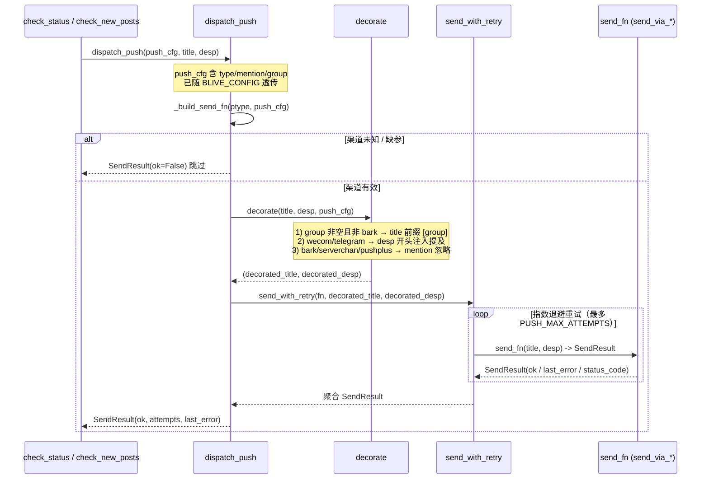
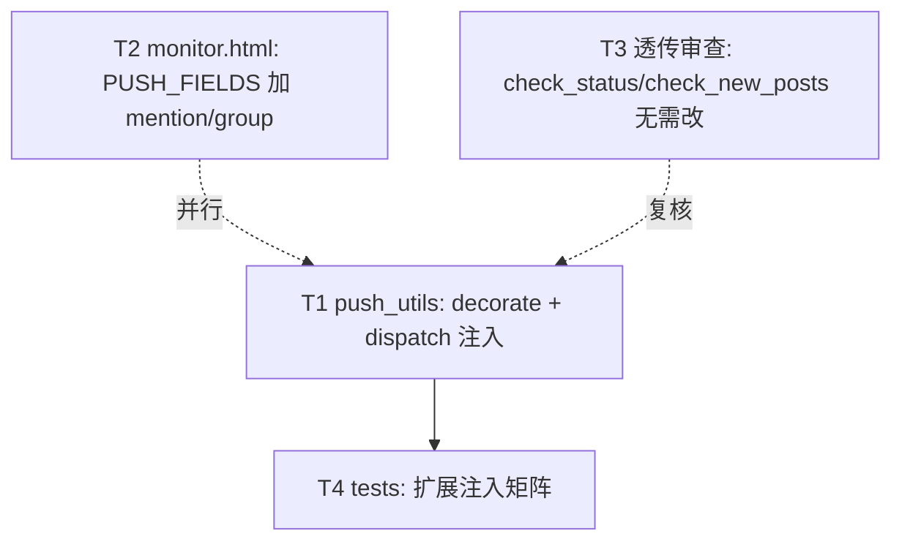

# P0-3 通知精细化（轻量版）· 设计 + 任务分解

> 关联 PRD：`docs/p0_notify_refine_prd.md`（许清楚）
> 架构师：高见远　|　语言：中文　|　本文件为**设计 + 任务分解**单一交付物（不改代码、不提交 git）

## 0. 核对结论速览（基于代码审查）

| 文件 | 是否需改动 | 理由 |
|---|---|---|
| `push_utils.py` | **需改** | 新增 `decorate()` 并在 `dispatch_push` 内注入 mention/group |
| `monitor.html` | **需改** | 仅扩展 `PUSH_FIELDS` 字典（加 `mention`/`group` 字段项） |
| `check_status.py` | **无需改** | 第 729 行 `dispatch_push(push_cfg, title, desp)` 已透传完整 `push_cfg`；`format_push_title/desp` 只基于 name/result 格式化，与 mention/group 无关 |
| `check_new_posts.py` | **无需改** | 第 831 行 `dispatch_push(push_cfg, title, desp)` 已透传完整 `push_cfg`；title/desp 内联格式化，不依赖 push_cfg |
| `tests/test_push_utils.py` | **需改** | 扩展注入矩阵（mention/group/各渠道降级/push_cfg 透传） |

> 关键洞察：调用方（`check_status` / `check_new_posts`）**无需感知** mention/group——`push_cfg` 作为普通 dict 字段随配置自然到达 `dispatch_push`，注入完全内聚在推送层。这正是 PRD P0-4「透传确认」的本意。

---

## 1. 实现方案（一句话）

在 `push_utils.py` 新增 `decorate(title, desp, push_cfg) -> (title, desp)`，由 `dispatch_push` 在**进入重试前、调用 `send_with_retry` 之前**对 `(title, desp)` 完成 mention/group 装饰（按渠道类型区分注入语义）；前端 `monitor.html` 的 `PUSH_FIELDS` 为支持渠道补 `mention`/`group` 字段项（仅当前渠道渲染、非必填、自动并入 `cfg`），其余逻辑零改动。

---

## 2. 文件列表

| 文件 | 改动类型 | 改动点 |
|---|---|---|
| `push_utils.py` | 修改 | 新增 `decorate()`；`dispatch_push` 在 `send_with_retry` 前调用 `decorate`；`send_via_bark` 的 `group` 参数维持现状（由 `_build_send_fn` 读取，不重复前缀） |
| `monitor.html` | 修改 | 仅扩展 `PUSH_FIELDS` 字典（bark/serverchan/wecom/pushplus/telegram 各自增加 `mention`/`group` 字段项）；`onPushChannelChange` / `buildPushConfig` **不改** |
| `check_status.py` | **无需改动** | `dispatch_push(push_cfg, ...)` 已透传；标注「无需改动（push_cfg 已透传）」 |
| `check_new_posts.py` | **无需改动** | `dispatch_push(push_cfg, ...)` 已透传；标注「无需改动（push_cfg 已透传）」 |
| `tests/test_push_utils.py` | 修改 | 新增注入矩阵用例：mention 注入、group 前缀、各渠道降级、`push_cfg` 透传断言、合并推送单注入 |

变更文件共 **3 个**（实际写码 2 个 + 测试 1 个），远低于 PRD `<10 文件` 约束。

---

## 3. 数据结构 / 接口（签名伪代码）

### 3.1 新增函数 `decorate`

```python
def decorate(title: str, desp: str, push_cfg: Dict[str, Any]) -> Tuple[str, str]:
    """在发送前对 (title, desp) 注入 mention / group（装饰一次，重试不重复）。

    注入规则（按渠道类型 ptype = push_cfg["type"]）：
      - group 标题前缀：当 group 非空且 ptype != "bark" 时，
        title = f"[{group}] {title}"  （Bark 走原生 group 参数，不改 title）
      - mention 注入：
          * wecom    : desp 开头插入 "<@userid>"（userid 取 mention，系统负责包 <@>）
          * telegram : desp 开头插入 "@username"（系统确保带 @）
          * bark / serverchan / pushplus : 忽略（按本设计默认，不破坏渠道、不报错）
      - 多提及：mention 支持逗号分隔，逐个包裹后空格拼接
      - 任意解析失败 / 为空：等价于「无 mention / 无 group」，绝不抛异常

    Args:
        title: 推送标题（来自 format_push_title / 内联格式化）。
        desp: 推送正文。
        push_cfg: 透传的推送配置 dict（含 "type" / 可选 "mention" / "group"）。

    Returns:
        装饰后的 (title, desp)。Bark 的 group 不在 title 体现，仍由 send_via_bark 参数承载。
    """
    ptype = str(push_cfg.get("type") or "").lower()
    group = (push_cfg.get("group") or "").strip()
    mention = (push_cfg.get("mention") or "").strip()

    # ---- group 标题前缀（非 Bark 文本渠道）----
    if group and ptype != "bark":
        title = f"[{group}] {title}"

    # ---- mention 注入 ----
    if mention:
        users = [u.strip() for u in mention.split(",") if u.strip()]
        if users:
            if ptype == "wecom":
                tags = " ".join(f"<@{u}>" for u in users)
                desp = f"{tags}\n{desp}"
            elif ptype == "telegram":
                tags = " ".join(f"@{u[1:] if u.startswith('@') else u}" for u in users)
                desp = f"{tags}\n{desp}"
            # bark / serverchan / pushplus -> 忽略（优雅降级）
    return title, desp
```

### 3.2 `dispatch_push` 改动点（伪代码 diff 示意）

```python
def dispatch_push(push_cfg, title, desp) -> SendResult:
    try:
        if not push_cfg:
            return SendResult(ok=False, attempts=0, last_error="config: empty push_cfg", status_code=None)
        ptype = (push_cfg.get("type") or "").lower()
        fn = _build_send_fn(ptype, push_cfg)
        if fn is None:
            logger.warning("未知推送渠道: %s（跳过推送）", ptype)
            return SendResult(ok=False, attempts=0, last_error=f"config: unknown channel {ptype}", status_code=None)
        # ===== 新增：进入重试前完成 mention/group 装饰（仅一次）=====
        title, desp = decorate(title, desp, push_cfg)
        return send_with_retry(fn, title, desp)
    except Exception as e:
        logger.error("推送分发异常: %s", e)
        return SendResult(ok=False, attempts=0, last_error=f"error: {e}", status_code=None)
```

> 注意：`_build_send_fn` 对 Bark 仍读取 `push_cfg["group"]` 并传入 `send_via_bark(base, title, desp, group)`——`decorate` 对 Bark **不前缀 title**，因此 Bark 的 group 仅经由原生参数生效，二者不冲突。`is_retryable` / `send_with_retry` **不改**。

### 3.3 前端 `PUSH_FIELDS` 扩展（伪代码）

```javascript
var PUSH_FIELDS={
  bark:[{id:'url',label:'Bark 地址',ph:'https://api.day.app/你的KEY',req:true},
        {id:'group',label:'分组名（可选，App 内归类）',ph:'blive'}],
  serverchan:[{id:'sendkey',label:'Server酱 SendKey',ph:'SCTxxxxxxxx',req:true},
        {id:'group',label:'分组标签（可选，标题前缀 [分组名]）',ph:'B站'}],
  wecom:[{id:'webhook',label:'企业微信机器人 Webhook',ph:'https://qyapi.weixin.qq.com/cgi-bin/webhook/send?key=xxxx',req:true},
        {id:'mention',label:'提及成员 UserID（可选，多个逗号分隔）',ph:'zhangsan'},
        {id:'group',label:'分组标签（可选，标题前缀 [分组名]）',ph:'B站'}],
  pushplus:[{id:'token',label:'PushPlus Token',ph:'token',req:true},
        {id:'topic',label:'Topic（可选）',ph:''},
        {id:'group',label:'分组标签（可选，标题前缀 [分组名]）',ph:'B站'}],
  telegram:[{id:'token',label:'Bot Token',ph:'123456:ABC-DEF',req:true},
        {id:'chat',label:'Chat ID',ph:'-100123456',req:true},
        {id:'mention',label:'提及 @username（可选，多个逗号分隔）',ph:'@username'},
        {id:'group',label:'分组标签（可选，标题前缀 [分组名]）',ph:'B站'}]
};
```

> `onPushChannelChange` 仅渲染当前渠道的字段 → 天然「仅在对应渠道显示」；`buildPushConfig` 自动把非空字段并入 `cfg` 且 `mention`/`group` 非必填 → **写入逻辑零改动**。旧配置无 `mention`/`group` 时行为完全等同现状（向后兼容）。

---

## 4. 程序调用流程

### 4.1 单次推送（含 P0-2 重试）



### 4.2 文字说明（关键路径）

1. 调用方用 `format_push_title/desp`（或内联）生成 `(title, desp)`，连同完整 `push_cfg` 调用 `dispatch_push(push_cfg, title, desp)`。
2. `dispatch_push` 构造 `fn = _build_send_fn(ptype, push_cfg)`（Bark 的 `group` 在此被读入并作为 `send_via_bark` 的 `group` 参数）。
3. **进入重试前**调用 `decorate(title, desp, push_cfg)`：
   - 非 Bark 且 `group` 非空 → title 加 `[分组名] ` 前缀；
   - `wecom` → desp 开头插入 `<@userid>`（多提及逗号分隔逐个包裹）；
   - `telegram` → desp 开头插入 `@username`（系统确保带 @）；
   - `bark/serverchan/pushplus` 的 `mention` → 忽略。
4. 以装饰后的 `(title, desp)` 进入 `send_with_retry`（P0-2 重试/退避/分类不变），返回聚合 `SendResult`。
5. 装饰**只发生一次**（在重试外），重试不重复装饰。

---

## 5. 任务列表（有序、含依赖）

| 任务 | 名称 | 源文件 | 依赖 | 优先级 |
|---|---|---|---|---|
| **T1** | `push_utils.py` 新增 `decorate` + `dispatch_push` 注入 | `push_utils.py` | — | P0 |
| **T2** | `monitor.html` 的 `PUSH_FIELDS` 加 `mention`/`group`（仅对应渠道显示） | `monitor.html` | — | P0 |
| **T3** | 代码审查确认 `check_status.py` / `check_new_posts.py` 无需改（透传验证） | `check_status.py`、`check_new_posts.py` | — | P0 |
| **T4** | 扩展 `tests/test_push_utils.py` 注入矩阵 | `tests/test_push_utils.py` | T1 | P0 |

> 说明：
> - **T1** 是基础层（推送注入核心），无依赖，最先落地。
> - **T2** 前端独立，与 T1 无代码依赖，可并行；落地点仅是 `PUSH_FIELDS` 字典扩展。
> - **T3** 为验证型任务（不写新代码，产出「透传已确认」结论 + 必要注释），可独立进行，建议在 T1 设计定型后做最终复核。
> - **T4** 依赖 T1（测试直接调用 `decorate` / `dispatch_push`），在 T1 完成后补充用例。

### 任务依赖图



### 各任务验收要点

- **T1 验收**：`dispatch_push({"type":"wecom","webhook":"...","mention":"a,b","group":"B站"}, "🔴 x 开播了！", "正文")` → 实际发送 content 为 `[B站] 🔴 x 开播了！` 标题 + `<@a> <@b>\n正文` 正文；Bark 配置 `group` 仍走 `send_via_bark` 参数、title 无前缀；`serverchan`/`pushplus` 配 `mention` 不报错、无注入。
- **T2 验收**：切换渠道下拉时仅显示该渠道字段；`mention`/`group` 为非必填；保存后 `BLIVE_CONFIG` 的 `push` 段含 `mention`/`group`（非空时）。
- **T3 验收**：核对 `dispatch_push(push_cfg, ...)` 调用处 `push_cfg` 未被裁剪；产出文档化确认结论。
- **T4 验收**：覆盖 §3.1 全部分支；`push_cfg` 透传断言；合并推送（多主播）mention 仅注入一次。

---

## 6. 依赖包

**无新依赖。** 纯 Python 标准库（`push_utils.py` 已仅用标准库）；前端为原生 HTML/JS，不引入框架（与仓库现状一致）。

---

## 7. 共享知识（跨文件约定）

| 约定 | 说明 |
|---|---|
| **mention 语法（wecom）** | 用户填**纯 userid**（如 `zhangsan`）；系统负责用 `<@userid>` 包裹，企微内高亮。 |
| **mention 语法（telegram）** | 用户填 `@username` 或 `username` 均可；系统确保最终带 `@`（自动补 `@` 若缺失）。 |
| **多提及分隔符** | `mention` 支持**英文逗号分隔**（如 `zhangsan,lisi` / `@a,@b`），逐个包裹后空格拼接；空项跳过。 |
| **group 前缀格式** | 文本渠道前缀格式统一为 `[分组名] `（方括号 + 尾随空格），避免与标题 emoji 冲突；`group` 为空则不前缀（向后兼容）。 |
| **Bark 的 group** | 走原生 `group` 参数（App 内折叠归类），**不在 title 加前缀**；Bark `mention` 忽略。 |
| **不支持渠道优雅降级** | `bark/serverchan/pushplus` 上的 `mention` 直接忽略（默认）；绝不抛异常、绝不中断 `dispatch_push`。 |
| **装饰时机** | `decorate` 在**重试前调用一次**；`send_with_retry` 内部重试复用已装饰的 `(title, desp)`，不重复装饰。 |
| **调用方零改动** | 调用方只需 `dispatch_push(push_cfg, title, desp)` 透传完整 `push_cfg`；格式化函数不感知 mention/group。 |
| **去重 key 不变** | mention/group 不改变去重键（`live:platform_rid` / `post:...`），去重可视化不在本轮。 |

---

## 8. 待明确事项（PRD 待确认问题收敛）

| # | PRD 待确认问题 | 本设计处理 | 仍需用户拍板？ |
|---|---|---|---|
| Q1 | mention 语法差异 / 多提及 | 已按默认处理：wecom 填纯 userid（系统包 `<@>`）；telegram 填 `@username` 或 username（系统补 `@`）；支持逗号分隔多提及。 | 否（已给合理默认，前端 placeholder 已体现） |
| Q2 | P1/P2 本轮回退 | 确认本轮回退（仅交付 P0：@提及 + 分组标签）。 | 否 |
| Q3 | group 文案格式 / 合并推送取值 | 前缀统一 `[分组名] `；合并推送取**首个主播的 group**（详见注①）。 | 部分（注①） |
| Q4 | mention 降级形态（忽略 vs 退化为文字） | **本设计默认「忽略」**（不破坏渠道、最稳）；前端 serverchan/pushplus **不展示 mention 输入**。⚠️ 注意：PRD §5.1 表格曾写 serverchan/pushplus「退化为可见文字『提及：@xxx』」，与本节默认「忽略」不一致。 | **是**（需用户确认：serverchan/pushplus 上 mention 到底「忽略」还是「退化为文字」） |
| Q5 | 多主播合并推送的 mention/group | mention 仅注入**一次**（整条消息级，不做逐主播重复）；group 取首个主播（见注①）。 | 随 Q3 |
| Q6 | serverchan/pushplus 是否展示 group | **已决定暴露 group、不暴露 mention**（与 PRD §5.3 默认一致）。 | 否 |

> **注①（合并推送 group 取值）**：`check_status.py` 多主播同轮开播走 `else` 分支拼接 `desp`，`title = f"🔴 {n}位主播开播：{names}"`。`decorate` 对整条 `(title, desp)` 装饰一次，故 `group` 仅来自 `push_cfg["group"]`（即配置级全局 group），不逐条拼接——这与「配置驱动 group」一致。若未来需要「按首个主播 group 动态取」，需调用方在拼装 title 时传入，超出本轮配置驱动范围。**建议本轮维持全局配置 group**，请在 Q3 上确认。

> **明确阻塞项**：**无硬阻塞**。唯一需用户拍板的是 **Q4（serverchan/pushplus 上 mention 的降级形态：忽略 vs 退化为文字）**——本设计已选「忽略」作为默认以零风险交付，待确认后若改「退化为文字」仅需微调 `decorate` 的 `serverchan/pushplus` 分支（不影响其他渠道与任务排期）。

---

## 附：注入规则速查表（落地直接照此实现）

| 渠道 | group 行为 | mention 行为（本设计默认） |
|---|---|---|
| **bark** | 原生 `group` 参数（不改 title） | 忽略 |
| **wecom** | title 前缀 `[group] ` | desp 开头 `<@userid>`（多提及逗号分隔、逐个包裹） |
| **telegram** | title 前缀 `[group] ` | desp 开头 `@username`（系统补 @） |
| **serverchan** | title 前缀 `[group] ` | 忽略（待 Q4 确认是否退化为文字） |
| **pushplus** | title 前缀 `[group] ` | 忽略（待 Q4 确认是否退化为文字） |
