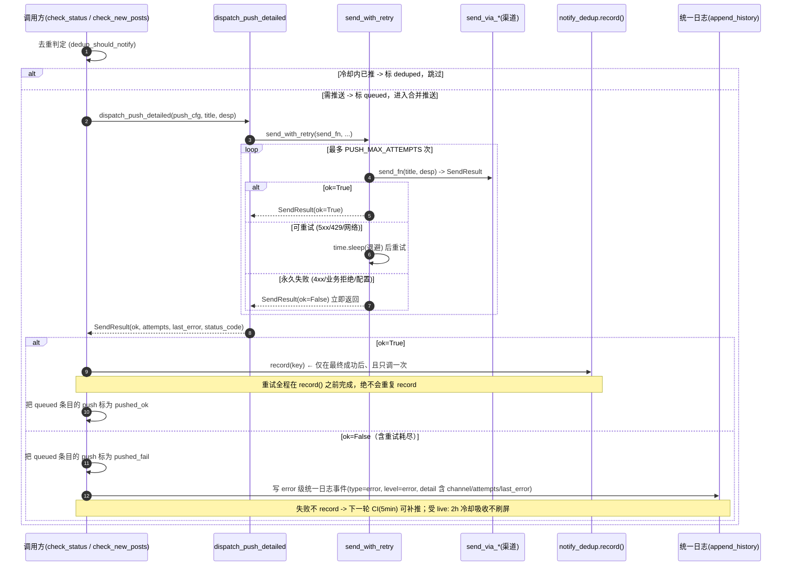
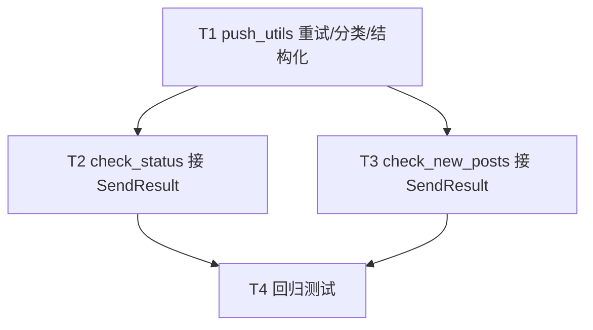

# P0-2 通知可靠性 · 架构设计（轻量版）

> 架构师：高见远（Bob）｜ 关联 PRD：`docs/p0_notify_reliability_prd.md`（许清楚 / v1.0）
> 范围：**纯后端**可靠性，不碰前端；纯标准库（`time` / `urllib`，退避用 `time.sleep`），不引入新依赖。
> 改动文件 < 10 个。本文件仅设计、不写代码、不提交 git。

---

## 1. 实现方案（一句话）

在 `push_utils.py` 增加 `SendResult` 结构 + `send_with_retry`（带指数退避的重试）+ `is_retryable`（失败分类），把 `send_via_*` 改为返回 `SendResult`、新增 `dispatch_push_detailed` 承载重试并回 `SendResult`；调用方（`check_status.py` / `check_new_posts.py`）改用 `dispatch_push_detailed`，**成功才 `record()`、失败标 `pushed_fail` 并写 error 级统一日志**；`record()` 永远在重试之后、仅最终成功时调用一次，去重账本安全。保留 `dispatch_push(...) -> bool` 兼容薄包装，旧调用方零改动即获得重试。

---

## 2. 文件列表（纯后端，< 10 文件）

| 文件 | 改动类型 | 说明 |
|---|---|---|
| `push_utils.py` | 改 | 新增 `SendResult` / `send_with_retry` / `is_retryable`；`send_via_*` 改返回 `SendResult`（捕获状态码）；新增 `dispatch_push_detailed`；`dispatch_push` 退化为 bool 兼容包装。 |
| `check_status.py` | 改 | Step 3 改用 `dispatch_push_detailed`，失败标 `pushed_fail` + 注入 error 统一日志事件（合并进 `log_entries`，在 `dedupe_by_throttle` 前）。 |
| `check_new_posts.py` | 改 | 推送段改用 `dispatch_push_detailed`，失败写 error 统一日志事件（复用 `append_event` 或直构事件）。 |
| `tests/test_push_utils.py` | 改 | `send_via_*` 既有 `is True/is False` 断言适配 `SendResult.ok`（因 `send_via_*` 返回形状变化）。 |
| `tests/test_notify_reliability.py` | 新增 | P0-2 回归测试（见任务 T4）。 |

> 不改动：`log_utils.py`（复用 `append_history` / `dedupe_by_throttle`，失败 type 复用现有 `"error"`）、`notify_dedup.py`（`record()` 调用时机不变）、前端、CI workflow。

---

## 3. 数据结构 / 接口（签名伪代码）

### 3.1 常量（集中配置，便于调参）

```python
import time
import urllib.error

PUSH_MAX_ATTEMPTS = 3        # 含首次；默认 3（2s / 4s / 8s）
PUSH_BASE_DELAY   = 2        # 首跳退避秒数；退避序列 = BASE * 2**(i-1) => 2,4,8
NOTIFY_FAIL_TYPE  = "error"  # 失败事件 type（默认复用现有 "error"，零跨端改动）
```

### 3.2 SendResult（单次或重试后的结构化结果）

```python
from dataclasses import dataclass
from typing import Optional

@dataclass
class SendResult:
    ok: bool                     # 是否最终成功
    attempts: int                # 实际尝试次数（含首次）
    last_error: str              # 最后一次失败原因（含状态码/类别前缀）
    status_code: Optional[int]   # HTTP 状态码（网络/业务错误为 None）
```

> 说明：`send_via_*` 单次发送返回 `SendResult(ok=.., attempts=1, last_error=.., status_code=..)`；
> `send_with_retry` / `dispatch_push_detailed` 返回聚合后的 `SendResult`（`attempts` = 总次数）。

### 3.3 is_retryable —— 失败分类（与渠道解耦）

```python
def is_retryable(status_code: Optional[int], last_error: str) -> bool:
    """True = 可重试（退避后重试）；False = 永久失败（立即放弃，不重试）。

    分类依据（仅看状态码 + last_error 类别前缀，不再持有原始 exc）：
      - 5xx / 429            -> True
      - 4xx（含 401/403/400/404）-> False（鉴权/参数失效，重试无意义）
      - 网络/超时/连接错误     -> True（last_error 无类别前缀或带 timeout/urlerror）
      - 业务拒绝 / 配置缺失    -> False（last_error 以 biz_reject / config / auth / empty 前缀）
    """
    if status_code is not None:
        return 500 <= status_code < 600 or status_code == 429
    le = (last_error or "").lower()
    if le.startswith(("biz_reject", "config", "auth", "empty")):
        return False
    return True   # timeout / URLError / 未知网络错误 一律重试
```

> **与 PRD §4.2 / 任务简报的差异（已按默认处理）**：简报写 `is_retryable(exc, status_code)`，但本设计改为 `(status_code, last_error)`。
> 原因：`send_via_*` 已把异常收敛进 `SendResult`（含 `status_code` 与带类别前缀的 `last_error`），重试循环不再持有原始 `exc`；用 `(status_code, last_error)` 即可完整分类，且避免异常在两层间透传。分类信息无损。

### 3.4 send_with_retry —— 指数退避重试

```python
def send_with_retry(send_fn, title: str, desp: str,
                    max_attempts: int = PUSH_MAX_ATTEMPTS,
                    base_delay: int = PUSH_BASE_DELAY) -> SendResult:
    """对 send_fn(title, desp) -> SendResult 做带退避重试。

    - 成功立即返回（ok=True）。
    - 失败且 is_retryable 为 False -> 立即返回（ok=False，不重试）。
    - 失败且可重试 -> time.sleep(base_delay*2**(i-1)) 后重试，最多 max_attempts 次。
    - 仅在「全部重试耗尽」后返回 ok=False。
    """
    last: Optional[SendResult] = None
    for attempt in range(1, max_attempts + 1):
        res = send_fn(title, desp)          # SendResult(attempts=1)
        if res.ok:
            return SendResult(ok=True, attempts=attempt,
                              last_error="", status_code=res.status_code)
        last = res
        if attempt >= max_attempts or not is_retryable(res.status_code, res.last_error):
            break
        time.sleep(base_delay * (2 ** (attempt - 1)))   # 2, 4, 8
    return SendResult(ok=False, attempts=(last.attempts if last else 0) or max_attempts,
                      last_error=last.last_error if last else "unknown",
                      status_code=last.status_code if last else None)
```

### 3.5 send_via_* 改造（统一返回 SendResult，捕获状态码）

以 `send_via_wecom` 为例（其余 4 个同构）：

```python
def send_via_wecom(webhook: str, title: str, desp: str) -> SendResult:
    if not webhook:
        return SendResult(ok=False, attempts=1, last_error="config: empty webhook", status_code=None)
    content = f"{title}\n\n{desp}"[:2000]
    payload = json.dumps({"msgtype": "text", "text": {"content": content}}).encode("utf-8")
    req = urllib.request.Request(webhook, data=payload,
                                 headers={"Content-Type": "application/json"})
    try:
        with urllib.request.urlopen(req, timeout=10) as resp:
            result = json.loads(resp.read())
        if result.get("errcode") == 0:
            return SendResult(ok=True, attempts=1, last_error="", status_code=None)
        # 渠道业务拒绝（HTTP 200 但业务失败）：不重试
        return SendResult(ok=False, attempts=1,
                          last_error=f"biz_reject: errcode={result.get('errcode')}",
                          status_code=None)
    except urllib.error.HTTPError as e:
        # 4xx/5xx/429：状态码进入 SendResult，由 is_retryable 决定重试
        return SendResult(ok=False, attempts=1, last_error=f"HTTP {e.code}", status_code=e.code)
    except urllib.error.URLError as e:
        return SendResult(ok=False, attempts=1, last_error=f"URLError: {e.reason}", status_code=None)
    except Exception as e:                       # 含 socket.timeout
        return SendResult(ok=False, attempts=1, last_error=f"error: {e}", status_code=None)
```

### 3.6 dispatch_push_detailed / dispatch_push（兼容）

```python
def dispatch_push_detailed(push_cfg, title: str, desp: str) -> SendResult:
    """按配置分发推送（含重试 + 分类 + 明细）；返回 SendResult。"""
    if not push_cfg:
        return SendResult(ok=False, attempts=0, last_error="config: empty push_cfg", status_code=None)
    ptype = (push_cfg.get("type") or "").lower()
    fn = _build_send_fn(ptype, push_cfg)        # 按渠道包出 send_fn(title, desp)->SendResult
    if fn is None:
        return SendResult(ok=False, attempts=0, last_error=f"config: unknown channel {ptype}", status_code=None)
    return send_with_retry(fn, title, desp)

def dispatch_push(push_cfg, title: str, desp: str) -> bool:
    """向后兼容薄包装：旧调用方继续拿 bool。内部已含重试。"""
    return dispatch_push_detailed(push_cfg, title, desp).ok
```

**迁移策略**：保留 `dispatch_push` 返回 bool，本轮只把 `check_status.py` / `check_new_posts.py` 两个调用方升级为 `dispatch_push_detailed` 以取 `attempts` / `last_error` 写日志；其余潜在调用方（若有）零改动即获得重试。

---

## 4. 程序调用流程

### 4.1 一次推送时序（mermaid）



### 4.2 编号步骤（调用方改造要点）

1. **去重判定**：`if dedup_should_notify(dkey):` 通过 → `push_result="queued"`；否则 `push_result="deduped"`（跳过）。
2. **合并推送**：构造 `title` / `desp`（多房间合并为一条），调 `res = dispatch_push_detailed(push_cfg, title, desp)`。
3. **结果标记**：`push_tag = "pushed_ok" if res.ok else "pushed_fail"`；把 `log_entries` 中 `push=="queued"` 的条目改为 `push_tag`。
4. **成功 → record（关键不变量）**：仅当 `res.ok` 时，对每个推送对象 `dedup_record(key)`；`record()` 在重试之后、只调用一次。
5. **失败 → 可见**：`res.ok == False` 时：
   - `logger.error("通知推送失败 channel=%s attempts=%d last_error=%s: %s", ...)`（runtime.log，**不受节流**）；
   - 构造一条 error 级统一日志事件（见 §7 字段），注入 `log_entries`（check_status）或经 `append_event`（check_new_posts），随既有 `dedupe_by_throttle` + `append_history` 落盘。
6. **异常兜底**：`dispatch_push_detailed` 内部已吞尽异常并返回 `SendResult(ok=False)`，调用方外层 `try/except` 仍可保留，但失败现已结构化、可见。

---

## 5. 任务列表（有序、含依赖）

> 全部 P0；依赖仅向后指 T1，T2/T3 可并行，T4 最后回归。

| Task | 名称 | 源文件 | 依赖 | 优先级 |
|---|---|---|---|---|
| **T1** | `push_utils` 加 `SendResult` + `send_with_retry` + `is_retryable` + 改 `send_via_*` + `dispatch_push_detailed`/兼容包装；同步修正 `tests/test_push_utils.py` 的 `send_via_*` 断言为 `.ok` | `push_utils.py`、`tests/test_push_utils.py` | 无 | P0 |
| **T2** | `check_status.py` 改用 `dispatch_push_detailed`：失败标 `pushed_fail` + 注入 error 统一日志事件（合并进 `log_entries`，在 `dedupe_by_throttle` 前） | `check_status.py` | T1 | P0 |
| **T3** | `check_new_posts.py` 改用 `dispatch_push_detailed`：失败写 error 统一日志事件（复用 `append_event` 或直构事件，带 `push="pushed_fail"`） | `check_new_posts.py` | T1 | P0 |
| **T4** | 新增回归测试：重试成功(attempts=3)、不重试(4xx,attempts=1)、退避序列(2/4/8)、去重安全(record 仅一次)、兼容契约(`dispatch_push` 返回 bool) | `tests/test_notify_reliability.py` | T1,T2,T3 | P0 |

### 任务依赖图（mermaid）



---

## 6. 依赖包

**无新依赖。** 仅用 Python 标准库：`time`（退避 `time.sleep`）、`urllib.request` / `urllib.error`（发送 + 状态码捕获）、`json`（荷载）。复用既有 `log_utils.append_history` / `dedupe_by_throttle` 与 `notify_dedup.record`。

---

## 7. 共享知识（跨文件约定，工程师落地直接复用）

| 约定 | 值 / 说明 |
|---|---|
| 重试次数 | `PUSH_MAX_ATTEMPTS = 3`（含首次） |
| 退避基数 | `PUSH_BASE_DELAY = 2`；序列 = `2, 4, 8`（`BASE * 2**(i-1)`） |
| `SendResult` 字段 | `ok: bool`、`attempts: int`、`last_error: str`、`status_code: Optional[int]` |
| 推送状态字符串（`push` 字段） | `pushed_ok`（sent）/ `pushed_fail`（failed）/ `queued` / `deduped`（沿用既有；新增 `push_error`/`no_sendkey` 保持不变） |
| 失败事件 `type` | 默认 `"error"`（复用现有 `EVENT_TYPES`，零跨端改动）；`level` 由 `level_from_type` 推导为 `"error"` |
| 失败事件 `detail` 格式 | `"channel=<wecom> attempts=3 last_error=<最后一次原因>"`（含 `rid`/`name`/`platform` 供聚合） |
| 失败事件落盘 | `append_history`（check_status 注入 `log_entries` 经 `dedupe_by_throttle`；check_new_posts 经 `append_event`）。`runtime.log` 用 `logger.error` 始终落盘（**不受节流**）。 |
| **日志节流注意** | error 类事件受 `ERROR_THROTTLE_MINUTES=30`（同 `rid+type`）节流，避免 history 刷屏；但 **`logger.error` 不受节流**，关键告警不丢。下一轮 CI（5min）仍会重推并重写 runtime.log；节流仅抑制 history 重复条，不影响失败可见性。 |
| `last_error` 类别前缀 | 业务拒绝 `biz_reject:`、配置/鉴权缺失 `config:`/`auth:`/`empty:` → `is_retryable` 判为不重试；其余（HTTP 状态 / `URLError:` / `timeout`）按状态码或网络类重试。 |
| 去重不变量 | 重试完全在 `dispatch_push_detailed` 内部完成；调用方**仅 `ok=True` 时 `record()` 一次**；失败不 `record`，可补推。 |

---

## 8. 待明确事项（收敛：设计已默认处理 / 仍需用户拍板）

| # | 问题 | 设计处理 |
|---|---|---|
| 1 | 重试次数 / 退避取值（3 次 / 2·4·8，还是 2 次 / 1·2） | **已按默认处理**：`PUSH_MAX_ATTEMPTS=3`、`PUSH_BASE_DELAY=2`，集中常量，后续可调；CI 单 run 额外 ≤14s，远低于 5min 周期。 |
| 2 | 失败事件 `type` 命名：`"error"` 还是新增 `"notify_fail"` | **默认 `"error"`（零跨端改动，健康条 error 桶直接命中）**。改用 `"notify_fail"` 需：① 在 `log_utils.EVENT_TYPES` 加入该字符串；② 前端 JS 镜像同一字符串（否则新类型被前端忽略）——属跨端改动，超出 P0-2「前端不改」边界。**仍建议用户拍板**是否接受 `"error"`。 |
| 3 | 是否本轮引入备用通道（P1-1）/ 渠道降级（P2-4） | **本轮不做**（PRD 明确边界）。`dispatch_push_detailed` 仅单通道重试；多通道兜底留待后续。 |
| 4 | `send_via_*` 返回形状是否改为 `SendResult` | **已采纳推荐方案**：改为返回 `SendResult`（仅被 `dispatch_push` 内部消费），并同步更新 `tests/test_push_utils.py` 断言（T1）。 |
| 5 | 是否进 `status.json` 展示失败明细 | **默认仅入 `history.json` + `runtime.log`**（前端本轮不改）；如需前端展示失败摘要，留作后续。 |
| 6 | 批量合并推送失败时的 `rid` 维度 | **已默认处理**：合并推送为单次 `dispatch_push_detailed`，失败时写**一条** error 事件，`rid` 取主房间（如 `newly_live[0]`）；节流按该 `rid+type`，不重复刷屏。 |

### 硬阻塞评估

**无硬阻塞。** 所有 P0 需求均可在现有 API 内闭环（复用 `append_history`/`dedupe_by_throttle`/`record`，纯标准库）。唯一需用户拍板的是**失败事件 `type` 命名（问题 2）**——但已给出零跨端改动的默认方案（`"error"`），不阻塞落地；若用户坚持 `"notify_fail"` 则需追加 `EVENT_TYPES` + 前端 JS 镜像（跨端，建议另立 P1）。其余均按默认处理。
