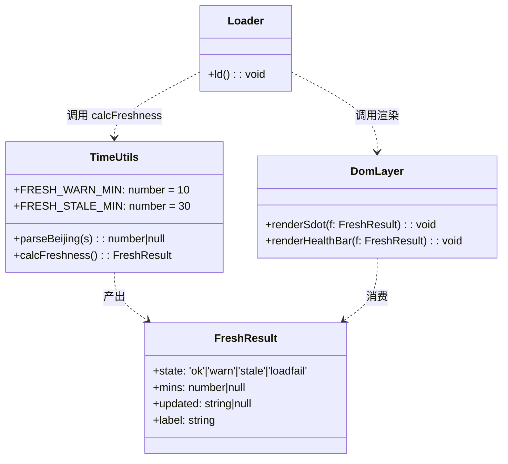
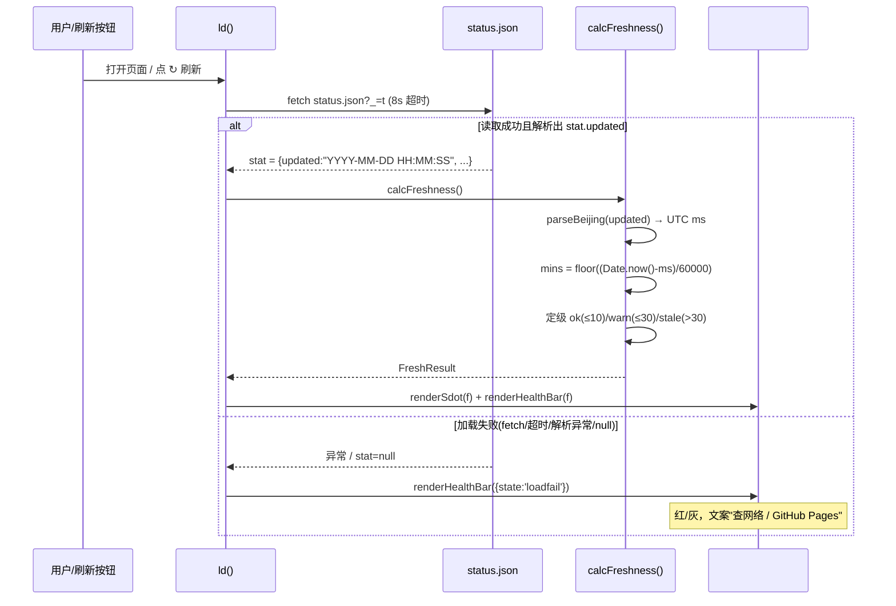
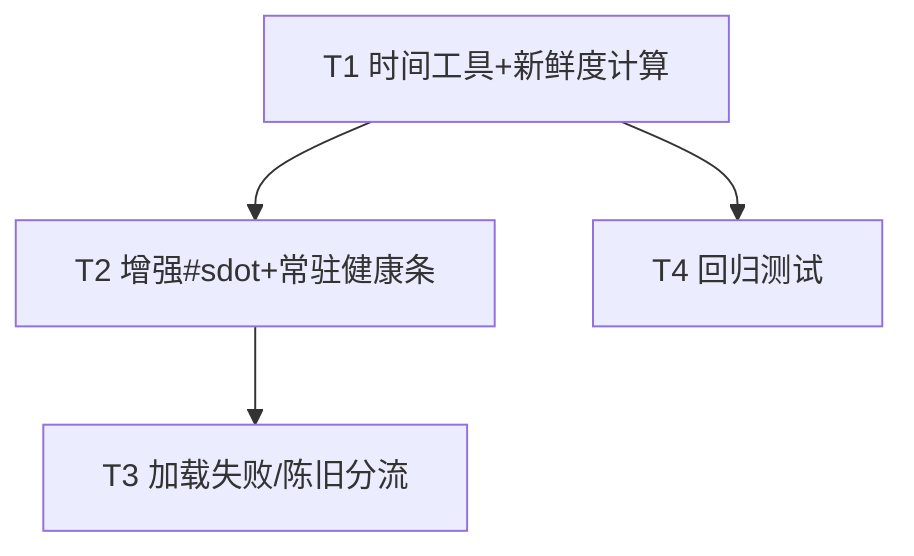

# P0-1 监控自检心跳 · 系统设计与任务分解（轻量）

> 架构师：高见远（Bob）｜ 模块：P0-1「监控自检与心跳」
> 定位：**纯前端、轻量**实现，不新增后端文件、不改 CI workflow
> 输入：`docs/p0_selfcheck_prd.md`（许清楚）｜ 现状核对：`monitor.html`

---

## 1. 实现方案

**一句话方案**：复用并增强现有顶部 `#sdot` 状态点 + 在 `.overview` 之下新增一条**常驻跨 tab 健康条**；在 `ld()` 成功读取 `status.json` 后，用 `parseBeijing(stat.updated)`（复用 `bjNow()` 思路）把北京时间字符串转成真实 UTC 毫秒，算出「新鲜度」并据此渲染颜色与文案（绿 ≤10 / 黄 10–30 / 红 >30），同时区分「加载失败」与「数据陈旧」两套文案与排查指向。

---

## 2. 框架选型

- **纯原生 JS**（无框架、无新依赖），全部改动落在 `monitor.html` 内；新增回归测试沿用仓库既有 pytest + 字符串/算法断言范式（`tests/test_frontend_log.py` 同款），**不引入任何新包**。
- 复用现有全局 `stat`（`ld()` 已写入 `status.json`）、`bjNow()` 时区折算思路、`ago()` 相对时间函数。
- **明确边界**：无新增后端文件、无 `.github` workflow 改动、不改动其余 html。

---

## 3. 文件列表（相对路径）

| 文件 | 动作 | 说明 |
|---|---|---|
| `monitor.html` | **修改** | ① 新增 `parseBeijing` + `calcFreshness` 及阈值常量；② 增强 `#sdot` 渲染（颜色 + 新鲜度文案）；③ 新增常驻 `#healthBar`（CSS + HTML + 渲染）；④ `ld()` 的 `.catch` 与解析失败分支挂载 loadfail 文案 |
| `tests/test_selfcheck.py` | **新增** | 回归测试：结构断言 + `parseBeijing`/`calcFreshness` 算法 golden 用例（Python 等价实现，无需 JS 运行时） |

> 仅 2 个文件变动，符合「纯前端小特性、轻量落地」。无后端、无 CI 改动。

---

## 4. 数据结构 / 接口

### 4.1 北京时间解析契约 `parseBeijing(str) -> ms | null`

```js
// 复用 bjNow()(L493-497) 思路：北京时间字符串 -> 真实 UTC 毫秒
// 入参：status.json.updated，格式 "YYYY-MM-DD HH:MM:SS"（空格分隔，无时区）
// 返回：成功=UTC 毫秒(number)；格式非法/空= null（上层据此判 loadfail）
function parseBeijing(s){
  if(!s) return null;
  var m = String(s).match(/^(\d{4})-(\d{2})-(\d{2})[ T](\d{2}):(\d{2}):(\d{2})$/);
  if(!m) return null;
  var d = new Date(+m[1], +m[2]-1, +m[3], +m[4], +m[5], +m[6]); // 先按本地解释
  return d.getTime() + (d.getTimezoneOffset() + 480) * 60000;    // +480min ⇒ 真实 UTC 毫秒
}
```

> ⚠️ **禁止** `new Date("2026-07-10 21:20:52")` 直接解析——会因运行环境时区错位（差 8 小时 bug）。必须走 `parseBeijing`。

### 4.2 新鲜度计算结果结构 `FreshResult`

```js
// calcFreshness() 基于全局 stat.updated 计算
// 返回结构：
// {
//   state: 'ok' | 'warn' | 'stale' | 'loadfail',  // 四态
//   mins : number | null,   // 距上次更新的分钟数（floor）；loadfail 时为 null
//   updated: string | null, // 原始 updated 字符串（用于显示绝对时间）
//   label: string           // 健康条完整文案（含排查指向）
// }
```

### 4.3 阈值常量（集中定义，勿散落魔法数字）

```js
var FRESH_WARN_MIN  = 10;  // ≤10 分钟 → ok（绿）
var FRESH_STALE_MIN = 30;  // >30 分钟 → stale（红）；10<mins≤30 → warn（黄）
```

### 4.4 关键函数签名（伪代码）

```js
// 顶层工具（放在 bjNow() 附近）
parseBeijing(s) : number|null
calcFreshness() : FreshResult            // 读全局 stat.updated
buildPillText(f) : string                // #sdot 短文案
buildHealthText(f) : string              // #healthBar 完整文案
renderSdot(f)                            // 写 #sdot 的 dot class + txt
renderHealthBar(f)                       // 写 #healthBar 的 class + 文案

// 在 ld() 内调用：
//   .then(v => { ...现有 stat/rooms 赋值...; var f = calcFreshness(); renderSdot(f); renderHealthBar(f); ... })
//   .catch(() => { renderHealthBar({state:'loadfail',...}); })
```

### 4.5 类图（mermaid classDiagram）



---

## 5. 程序调用流程

### 5.1 时序图（mermaid sequenceDiagram）



### 5.2 分支分流（编号步骤）

1. `ld()` 启动 → `fetch('status.json?_='+t)`，8s 超时，失败进 `.catch`。
2. **成功分支**（`.then`）：
   2.1 现有逻辑赋值 `stat=status.json`；
   2.2 调用 `f = calcFreshness()`：
       - `stat` 或 `stat.updated` 缺失/非法 → 返回 `{state:'loadfail'}`；
       - 否则算 `mins` 与 `state` ∈ {ok, warn, stale}。
   2.3 `renderSdot(f)`：dot class = `ok/warn/stale`（loadfail 用 `err`），txt = `buildPillText(f)`（"刚刚更新"/"12 分钟前"/"可能已停更"）。
   2.4 `renderHealthBar(f)`：写 `#healthBar` 的 class 与 `buildHealthText(f)` 四态文案。
3. **失败分支**（`.catch`，含 status 解析失败且 `stat` 为空）：
   - `renderHealthBar({state:'loadfail', label:'加载失败·无法读取状态文件，请检查网络 / GitHub Pages'})`；
   - `#sdot` 保留/降级为 `dot err + 加载失败`。
4. **两种异常分流要点**：`loadfail`（红/灰，指向"网络 / Pages 部署"）≠ `stale`（红，指向"CI / PAT 是否失效"）。文案与排查指向必须不同（满足 P0-1.4）。

### 5.3 相对时间复用

健康条里的「X 分钟前」直接复用既有 `ago()`：`ago(parseBeijing(stat.updated)/1000)`（`ago` 入参为秒级 unix 时间戳）。**不新写相对时间函数**，避免重复。

---

## 6. 任务列表（有序、含依赖）

| 任务 | 名称 | 源文件 | 依赖 | 优先级 |
|---|---|---|---|---|
| **T1** | 新增时间工具 `parseBeijing` + `calcFreshness`（含阈值常量 `FRESH_WARN_MIN/FRESH_STALE_MIN`），并在 `ld()` 成功后调用、暂存结果 | `monitor.html` | 无 | P0 |
| **T2** | 增强顶部 `#sdot` 健康 pill（颜色 + 新鲜度文案）+ 新增常驻 `#healthBar`（`.overview` 之下，跨 tab，四态渲染）+ 配套 CSS/HTML | `monitor.html` | T1 | P0 |
| **T3** | 区分「加载失败」与「数据陈旧」分流：`ld()` 的 `.catch` 与解析失败分支挂载 `loadfail` 文案（查网络/Pages），与 `stale`（查 CI/PAT）明确分流 | `monitor.html` | T1, T2 | P0 |
| **T4** | 新增回归测试 `tests/test_selfcheck.py`：结构断言（函数/ID/class 存在）+ `parseBeijing`/`calcFreshness` 算法 golden 用例（Python 等价实现） | `tests/test_selfcheck.py` | T1 | P0 |

> 可选（**待确认 #4 去留，不阻塞**）：T2 内可顺带移除 `renderLive` L353-354 的「更新于」行，统一由健康条承担。若用户不拍板，默认**保留原行 + 新增健康条**，不阻塞交付。

### 6.1 任务依赖图（mermaid）



---

## 7. 依赖包列表

- **无新增依赖**。仅使用浏览器原生 API（`fetch`、`Date`、`AbortSignal.timeout`、`element.innerHTML`）。
- 测试侧沿用仓库已有 `pytest`，不新增任何 Python 包（算法用例用纯 Python 等价实现，无需 JS 运行时）。

---

## 8. 共享知识（跨文件约定）

- **北京时间解析规则**：数据源 `status.json.updated` 为 `"YYYY-MM-DD HH:MM:SS"`（空格分隔，无时区）。一律经 `parseBeijing()` 转真实 UTC 毫秒后做差，**禁止** `new Date(str)` 直接解析（环境时区错位 → 差 8 小时 bug）。
- **阈值常量命名**：`FRESH_WARN_MIN = 10`、`FRESH_STALE_MIN = 30`（单位：分钟），集中定义在 `calcFreshness` 上方，全代码仅此一处定义，后续调阈值改一处即可。
- **状态/颜色 class 约定**（避免与现有 `.s-*`、`.ostat*`、`.log-dot*` 冲突）：
  - dot class：`ok`（绿，沿用）、`warn`（**新增**，黄）、`stale`（**新增**，红）、`err`（沿用，黄，仅用于 loadfail）。
  - 健康条 class：前缀 `health`，取值 `health ok / health warn / health stale / health fail`。
  - **新增 CSS**：`.status-pill .dot.warn{background:var(--yellow)}`、`.status-pill .dot.stale{background:var(--live)}`，以及 `.health{...}` 四态边框/底色样式。
- **相对时间**：健康检查条里的「X 分钟前」复用 `ago(parseBeijing(updated)/1000)`，不新写。
- **结果缓存**：`calcFreshness()` 结果可缓存在 `window.__fresh`，供多 tab / 定时器回调用，避免重复计算。
- **边界**：不动 `.github/`、不动其余 html、不新增任何后端/接口文件。

---

## 9. 待明确事项

### 9.1 设计层面已按默认处理（不影响本次实现）

| PRD 待确认项 | 处理 |
|---|---|
| #1 阈值 10/30 取值 | 按 PRD 默认实现，常量集中，后续一处可改 |
| #2 P1-1 Actions 查询 | 本期不做（需 Token，超出纯前端），已在范围外 |
| #3 健康条位置 | 默认置于 `.overview` 之下常驻（PRD 推荐），跨 tab 可见 |
| #5 per-platform 新鲜度 | 本期暂缓，超出纯前端 |
| #6 加载失败排查指向 | 默认文案"查网络 / GitHub Pages 部署"（status.json 走 Pages 静态、不需 Token），与 rooms 读取失败（需 Token）区分 |

### 9.2 仍需用户拍板（建议确认，非硬阻塞）

1. **#4 「更新于」行去留**（唯一建议拍板项）：建议移除 `renderLive` L353-354 并统一由健康条承担（避免重复，契合 P0-1.6）。若不拍板，**默认保留原行 + 新增健康条**，不阻塞交付。
2. **颜色语义倒挂风险**：现有 `.dot.err` 为**黄色**，PRD 5.3 将 `loadfail` 映射到 `.err`（黄），而 `stale` 映射到新增 `.stale`（红）。即"加载失败（黄）"告警力度弱于"已停更（红）"，与严重度直觉倒挂。**建议**：`loadfail` 也用红色（改 `.err` 为红，或新增 `.dot.fail` 红）。设计已按 PRD 默认给出可运行版本，但建议拍板后 T2 顺手定色。

> **结论**：无硬阻塞项。T1–T4 可立即开工；仅 #4、#颜色 两处建议用户在评审时拍板，默认实现不卡进度。

---

*—— 本设计仅覆盖 P0-1 监控自检心跳，不改动代码、不提交 git，由主理人统一编排与提交。*
