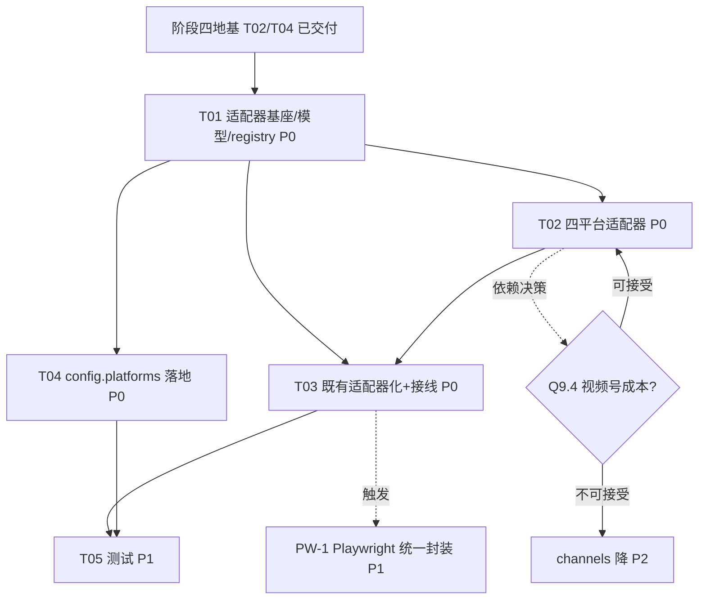

# 阶段三技术设计：多平台适配器（建在阶段四地基之上）

> 架构师：高见远（Bob）｜ 关联：`docs/phase34_prd.md` §3、`docs/phase4_design.md`、`docs/phase4_class.mermaid`、`docs/phase4_sequence.mermaid`
> 范围：**仅阶段三（多平台适配器）**。阶段四（后端 + DB 地基，`2cc5394`）已落地，本设计在其契约之上长出平台适配能力。
> 语言：中文（与需求一致）。本文**只产出设计 + mermaid，不含任何实现代码**。
> 硬约束（用户）：适配器**绝不**直接写仓库 JSON；一律经阶段四 `DetectionService` + `persistence` + `push_utils.dispatch_event`；复用 `common`/`push_utils` 路由与推送逻辑不变；保持 `BLIVE_CONFIG` 兼容（仅新增 `platforms` 段）；`monitor.html` 不改。

---

## 0. 设计总览与核心决策

| 决策点 | 采用方案 | 理由 |
|--------|----------|------|
| 抽象边界 | 适配器只做「抓取 + 归一化」，输出 `RoomModel`/`PostModel`；**不碰持久化/推送** | 满足硬约束：所有写盘/推送仍走阶段四 `persist`/`Persistence`/`push_utils`（一字不改）。 |
| 编排层保持通用 | `run_live_check`/`run_post_check` 由「按平台 if/else 内联」改为「遍历 `AdapterRegistry` 注册表」；比较/去重/推送逻辑**完全复用现有纯函数** | 行为不降级；新增平台 = 新增一个 adapter 类，零改编排层。 |
| 归一化模型 | `RoomModel`/`PostModel` 为 dataclass，字段与 `backend/models.py` 的 `Room`/`Post` ORM **逐字段对齐**（外加 `extra` 承载平台专属基线） | 适配器输出可直接交给 `persist.set_room_status`/`upsert_post`，无需转换层。 |
| 既有 bilibili/douyin 适配器化 | 把 `fetch_bilibili_batch`/`fetch_douyin`/`get_latest_aweme` **包进** `BilibiliAdapter`/`DouyinAdapter`，原纯函数不变 | 阶段四已落地的检测逻辑一字不改，仅换一层薄封装；bilibili 批量接口经 `fetch_room_status_batch` 保持批量效率。 |
| 能力标志 | 基类加 `supports_live` / `supports_posts` 布尔能力，编排层据此跳过不支持的项（如 `xhs` 直播、`taobao_live` 新作） | 天然实现「小红书仅新作」「淘宝仅直播」的差异化能力，无需特判平台字符串。 |
| 批量优化 | 适配器可选实现 `fetch_room_status_batch(ids)`，编排层命中则批量取，未实现则逐房间回退 | bilibili 批量 API 效率保留；其余平台逐房间无性能损失（量级小）。 |
| 配置 | `BLIVE_CONFIG['platforms']` 段（阶段四 `config_store` 已把 `platforms` 列入 `CONFIG_SECTIONS`，无需改表结构），`AdapterRegistry` 据此构建可用 adapter | 仅新增配置段，既有 `channels/routes/templates/silence/summary/push` 100% 兼容。 |
| 失败隔离 | 编排层对「单房间检测异常」`try/except` 包成 `status="error"`（沿用现有 `run_live_check` 模式） | 单平台/单房间失效不影响其他平台（PRD P3-1.3）。 |

---

## 1. 实现方案 + 框架选型

### 1.1 适配器所在位置与依赖关系

- 全部新增于 **`backend/adapters/`**（后端侧），与现有 `check_status`/`check_new_posts` 同进程、同语言（Python）。前端 `monitor.html` 绝不感知适配器，仍经后端 API 读状态（阶段四契约不变）。
- 适配器**依赖**：`common`（时间/路由/静默纯函数）、`push_utils`（`dispatch_event`，仅在**编排层**调用，适配器内部不调用）、`urllib`/Playwright（抓取，沿用现有依赖）。
- 适配器**不依赖** `persistence`/DB 直写——任何写盘都通过编排层交给 `persist` 门面（即 `LivePersist`/`PostPersist`）。这是硬约束的物理边界。

### 1.2 复用阶段四地基的既有契约（消费方）

| 阶段四契约 | 阶段三如何使用 |
|------------|----------------|
| `Room(platform, external_id, kind, live_status[str], current_title, online, area, cover, meta[JSON], …)` | 适配器输出的 `RoomModel` 归一化后由编排层映射到这些列（`live_status` 经 BOOL→"live"/"offline" 映射）。 |
| `Post(platform, post_id, author, url, cover, published_at)` | 适配器 `PostModel` 直接 upsert。 |
| `Persistence.set_room_status(...)` / `upsert_post(...)` | 编排层在「比较判定后」调用，落库。 |
| `push_utils.dispatch_event(cfg_all, ctx, title, desp)` | 编排层在「应推送」判定后调用（**不变**）。 |
| `ConfigStore.get_config()` → `cfg_all['platforms']` | `AdapterRegistry` 构建 adapter 实例的凭证/轮询来源。 |
| `LivePersist`/`PostPersist` 门面协议（`list_rooms`/`get_tracking`/`set_room_status`/`append_event`/`dedup_*`/`notify_log`） | 编排层 `run_live_check`/`run_post_check` 已依赖此协议，**接口不变**，仅把内联平台分支换成「查 registry → 调 adapter」。 |

### 1.3 与阶段四接线点（一句话预览，详见 §6）

`DetectionService.run_live`/`run_post` 各新增一个 `adapters: AdapterRegistry` 参数；编排层 `run_live_check`/`run_post_check` 用 `adapters.get(platform)` 取代 `if platform=='bilibili'… elif 'douyin'… else skip`。**其余（should_push / dispatch_event / persist 落库 / 节流 / 去重）原样不动。**

---

## 2. 文件列表及相对路径

### 2.1 新增：适配器包 `backend/adapters/`

```
backend/adapters/
  __init__.py            # 导出 PlatformAdapter / RoomModel / PostModel / AdapterRegistry
  base.py                # PlatformAdapter(ABC) + RoomModel / PostModel(dataclass) + 能力标志 + 归一化映射辅助
  registry.py            # AdapterRegistry: 从 cfg_all['platforms'] + 内置 bilibili/douyin 构建可用 adapter 表
  bilibili.py            # BilibiliAdapter（封装现有 fetch_bilibili_batch，支持 fetch_room_status_batch）
  douyin.py              # DouyinAdapter（封装 fetch_douyin + get_latest_aweme + sec_uid 解析，支持 posts）
  kuaishou.py            # KuaishouAdapter（P0：直播 + 新作）
  channels.py            # ChannelsAdapter（P0：视频号；直播 + 新作，mode=open_platform|playwright）
  xhs.py                 # XhsAdapter（P0：仅新作，直播 NotSupported；签名 API / Playwright 双策略）
  taobao_live.py         # TaobaoLiveAdapter（P0：仅直播，新作 NotSupported）
```

### 2.2 改造：既有检测编排（接口不变，仅换平台分支为 registry）

| 文件 | 改造内容 | 行为影响 |
|------|----------|-----------|
| `check_status.py` | `run_live_check` 的「bilibili/douyin/else」内联分支 → `adapter = adapters.get(platform)` → `adapter.fetch_room_status(rid)`（bilibili 走 `fetch_room_status_batch` 批量）；`fetch_bilibili_batch`/`fetch_douyin` 纯函数**保留不动**（被 adapter 内部调用）。 | 无降级；既有 bilibili/douyin 行为一致。 |
| `check_new_posts.py` | `run_post_check` 的「硬编 douyin」→ `adapter = adapters.get(platform)`；`if not adapter.supports_posts: 记录 system 事件并跳过`；`fetch_new_posts` 返回 `PostModel[]` → 通用「新于基线」比较。`get_latest_aweme`/`resolve_sec_uid` 等纯函数保留（被 DouyinAdapter 内部调用）。 | 无降级；新平台自动获得 posts 检测。 |
| `backend/jobs/detection_service.py` | `run_live`/`run_post` 新增 `adapters` 入参（默认从 `ConfigStore` 构建 `AdapterRegistry`）；`run_live_check`/`run_post_check` 调用时透传 `adapters=`。 | 仅注入点变化；`persist` 仍由 `LivePersist`/`PostPersist` 提供。 |
| `backend/config_store.py` | 新增辅助 `get_platform_cfg(platform) -> dict`（= `cfg_all['platforms'].get(platform, {})`）；不改 `put_config`/`CONFIG_SECTIONS`（`platforms` 已在白名单）。 | 配置读取更顺手；向后兼容。 |

### 2.3 测试（P1，详见 §7）

```
tests/test_adapters_base.py         # RoomModel/PostModel 映射、能力标志、基类抽象
tests/test_adapters_xhs.py          # 小红书：仅新作，直播 NotSupported；mock 签名 API / Playwright 响应
tests/test_adapters_kuaishou.py     # 快手：直播+新作 mock（SSR/签名 API）
tests/test_adapters_channels.py     # 视频号：open_platform/playwright 两种 mode mock
tests/test_adapters_taobao.py       # 淘宝直播：仅直播 mock；posts NotSupported
tests/test_adapters_bili_douyin.py  # 既有平台适配器化后行为对齐（mocket fetch_*）
tests/test_detection_wiring.py      # 端到端：注入 mock AdapterRegistry，验证编排层遍历/归一化/落库/推送
```

> 不改 `monitor.html`，不新增前端文件（阶段四后续单列）。不写 JSON、不引入 `requests`（沿用 `urllib`）。

---

## 3. 数据结构和接口（类图见 `docs/phase3_class.mermaid`）

### 3.1 归一化模型（`backend/adapters/base.py`）

与 `backend/models.py` 的 `Room`/`Post` ORM **逐字段对齐**，额外用 `extra: dict` 承载平台专属运行时基线（如 douyin 的 `sec_uid`、快手签名态、小红书 `latest_note_id`），由编排层合并进 `Room.meta`/`Post` 之外不另建表。

```text
RoomModel {                       # 对齐 Room(kind='live')
  platform:    str                # kuaishou / channels / xhs / taobao_live / bilibili / douyin
  room_id:     str                # = Room.external_id
  name:        str = ""
  title:       str = ""
  live_status: bool = False       # True=直播中 ★归一化 BOOL（PRD §3.3）；持久化时映射为 "live"/"offline"
  url:         str = ""
  cover:       str = ""
  tags:        list[str] = []
  online:      int = 0            # 观看人数
  area:        str = ""           # 分区/分类
  extra:       dict = {}          # 平台专属基线，落 Room.meta
}

PostModel {                      # 对齐 Post
  platform:     str
  post_id:      str
  author:       str = ""
  url:          str = ""
  cover:        str = ""
  published_at: str = ""          # 北京时间 "YYYY-MM-DD HH:MM:SS"
  title:        str = ""          # 描述/标题（笔记正文摘要）
  extra:        dict = {}         # 平台专属：类型(图文/视频)、conf 标志、resolved sec_uid 等
}
```

### 3.2 适配器抽象基类（`PlatformAdapter`）

```text
abstract PlatformAdapter:
    platform:        str                  # 类常量，如 "kuaishou"
    poll_interval:   int = 300           # 默认轮询间隔（秒），可被 config.platforms 覆盖
    rate_limit:      dict = {}           # {max_requests, window_sec, backoff_sec}
    supports_live:   bool = True         # 能力标志（xhs=False）
    supports_posts:  bool = True         # 能力标志（taobao_live=False）

    __init__(self, credentials: dict = {}, poll_interval: int = None, rate_limit: dict = None)

    fetch_room_status(self, room_id: str) -> RoomModel
        # 取单房间直播状态；不支持直播时抛 NotImplementedError（由编排层按 supports_live 提前跳过）

    fetch_new_posts(self, author_or_room: str, since: datetime = None, baseline: dict = None) -> list[PostModel]
        # 取 since 以来的新作；baseline 携带平台专属先验(如 sec_uid)；
        # 不支持新作时抛 NotImplementedError（由编排层按 supports_posts 提前跳过）

    fetch_room_status_batch(self, room_ids: list[str]) -> dict[str, RoomModel]   # 可选，bilibili 实现
        # 未实现则编排层逐房间回退 fetch_room_status
```

**归一化映射约定（对齐 `backend/models.py` 字段）**：
- `RoomModel.live_status: bool` → 编排层写 `Room.live_status` 时映射为 `"live"`(True)/`"offline"`(False)/`"error"`(异常)；`should_push(prev, curr)` 仍用字符串比较（prev 取自 `Room.live_status`，curr 取自映射后字符串），与现有 `should_push` 语义完全一致。
- `RoomModel.{name,title,online,area,cover,url,tags}` → 直接填入 `status_item`/`result` 交给 `persist.set_room_status`。
- `RoomModel.extra` → 合并进 `meta_update` 写 `Room.meta`（保持阶段四「基线存 meta」约定）。
- `PostModel.{platform,post_id,author,url,cover,published_at,title}` → `persistence.upsert_post`；`extra` → `Post` 表无需存（可落 `Room(kind='post').meta` 作基线）。
- 时间一律北京时间字符串（复用 `common.bjnow`/`parse_beijing`），与 `history.json`/`state.json` 逐字节一致。

---

## 4. 逐平台检测策略（P0 四平台）

> 通用策略参考：PRD §3.2 明确复用既有 bilibili/douyin 的「官方 API / 服务端 HTML(SSR) / Playwright 无头」多策略经验。每个适配器内部实现「主策略 + 降级策略」，单平台失效不影响其他（编排层 `try/except` 隔离）。

### 4.1 快手 `kuaishou`（直播 ✅ + 新作 ✅）

- **直播数据源（主）**：快手直播 API `https://live.kuaishou.com/live_api/liveroom/liveroomDetail?principalId={userId}`，返回 JSON 含 `data.liveStreamInfo`（及 `living`/`caption`/`coverUrl`/`watcherCount`）。需带 `Referer: https://live.kuaishou.com/`、`User-Agent`、以及一个 `did`（设备 ID cookie，无登录可生成匿名 `did`）。
- **直播数据源（降级）**：主播主页 SSR HTML 解析 `window.__INITIAL_STATE__`（`living` 标志 / `title` / `cover` / `counts`）。若签名失效或无 `did`，回退 Playwright 渲染主页抓 DOM。
- **新作数据源**：创作者作品列表——`https://www.kuaishou.com/graphql`（`visionProfilePhotoList` 查询）或用户主页 SSR 解析 `__INITIAL_STATE__.visionProfilePhotoList`。需 `did` + `client_key`（快手 web 通用 `client_key=3c7cd4d734b53483`）。高风控账号需登录 Cookie。
- **解析**：JSON 直解 `living`/`caption`/`coverUrl`/`watcherCount`（直播）、`feeds[].photoId/coverUrl/caption/timestamp`（新作）；SSR 用正则抽取 `__INITIAL_STATE__` 后 JSON 解析。
- **限流**：`poll_interval=300`（PRD 默认）；`rate_limit={max_requests:20, window_sec:60, backoff_sec:30}`（待实测校准，见 §9）。
- **复用**：bilibili/douyin 的「SSR 解析 + Playwright 兜底」经验直接迁移；无需 OAuth。
- **失败降级**：快手异常 → 该房间 `status="error"`，编排层记录并继续；不影响 kuaishou 其他房间及 channels/xhs/taobao。

### 4.2 微信视频号 `channels`（直播 ✅ + 新作 ✅，访问成本高）

- **访问成本说明（关键）**：视频号强绑定微信 App，无公开 Web 直播状态 API。两条可行路径：
  1. **开放平台（mode=`open_platform`）**：需「视频号助手」/微信开放平台**认证服务号 + 视频号创作者权限**（企业资质 + 审核，**接入成本高**），走官方「获取直播状态」接口。最稳但门槛高。
  2. **登录态无头（mode=`playwright`）**：用已登录微信 Web 的 Cookie 起 Playwright，渲染视频号直播页 `https://channels.weixin.qq.com/web/pages/...` / 直播间 `https://finderlive.weixin.qq.com/...`，抓取 `liveStatus` DOM / 捕获 `finder` XHR。优点零认证；缺点**登录态脆弱、易风控、设备绑定**，维护成本高。
- **直播检测路径**：`mode=open_platform` → 官方接口（若有凭证）；`mode=playwright` → Playwright 抓 `liveStatus`/`title`/`cover`/`onlineCount`。
- **新作检测路径**：同理，开放平台接口或 Playwright 抓创作者主页笔记流。
- **限流**：`poll_interval=600`（PRD 默认）；`rate_limit={max_requests:10, window_sec:60, backoff_sec:60}`（视频号风控严，间隔宜大）。
- **复用**：SSR/Playwright 多策略；`mode` 由 `config.platforms.channels.mode` 指定。
- **失败降级**：同 §4.1 隔离模式。若开放平台凭证缺失且未配 playwright Cookie → adapter 初始化即 `disabled`，编排层跳过该平台（不报错）。
- **⚠ 决策提示**：视频号成本是否可接受列为 §9 待明确；若用户无法提供开放平台凭证/稳定登录态，建议本轮将其降为 **P1 或仅做 playground 验证**，不影响其余三平台 P0 交付。

### 4.3 小红书 `xhs`（**仅新作/笔记 ✅，直播 ❌ 本轮不做**）

- **范围依据（沿用 PRD §3.2 风险）**：小红书直播真实状态**不在** SSR HTML/服务端数据，而由客户端 JS 经**签名 API（`x-s`/`x-t`）**填充；数据中心 IP 访问 `explore/profile` 触发风控页。同类项目（`aio-dynamic-push`/`beilunyang/xhs-monitor`）均明确**直播检测 ❌、仅动态/笔记检测 ✅**。故本轮 `XhsAdapter.supports_live=False`，`fetch_room_status` 抛 `NotImplementedError`，编排层对 `kind='live'` 的 xhs 房间直接跳过。
- **新作数据源（主）**：签名 API `https://edith.xiaohuoshu.com/api/sns/web/v1/user_posted?userId={userId}`（或 `www.xiaohuoshu.com/api/sns/web/v1/user_posted`）。**必须**带 `x-s`/`x-t`/`x-bogus` 签名（由逆向签名器生成，如社区库 `xhs`/`xhspro`）+ 一个**有效登录 Cookie**。数据中心 IP 易触发风控 → 建议配合住宅/已知良好出口 IP + 有效 Cookie。
- **新作数据源（降级）**：Playwright 无头渲染 `https://www.xiaohuoshu.com/user/profile/{userId}`，拦截 `user_posted` XHR 响应体（避开手写签名，但更重 + 同样受 IP 风控）。
- **解析**：从接口/响应取 `notes[].id`(=post_id)、`title`/`desc`(=title)、`cover.url[].url`(=cover)、`time`(=published_at)、`type`(图文/视频→`extra`)。
- **限流**：`poll_interval=900`（PRD 默认）；`rate_limit={max_requests:8, window_sec:60, backoff_sec:120}`（风控严）。
- **复用**：douyin 的 Playwright 拦截 XHR（`page.on("response")`）手法直接迁移；签名 API 路线新增轻量签名器封装。
- **失败降级**：Cookie 过期/风控 → `PostModel` 空 + 编排层记 `cookie_warn` 事件（沿用 douyin 的 `cookie_warn` 提示）；不影响其他平台。

### 4.4 淘宝直播 `taobao_live`（**仅直播 ✅，新作 — 本轮不做**）

- **场景**：电商直播监控。`TaobaoLiveAdapter.supports_posts=False`，`fetch_new_posts` 抛 `NotImplementedError`，编排层对 `kind='post'` 的 taobao 房间跳过（PRD §3.2 新作列填 `—`）。
- **直播数据源（主）**：直播房间页 SSR `https://live.taobao.com/room/{roomId}`，解析 `__INITIAL_STATE__` / `window.__INIT_DATA__` 中的 `liveStatus`（1=直播中）、`title`、`coverUrl`、`onlineCount`。淘宝对未登录/异常 UA 有反爬，需带正常 UA + 有效登录 Cookie。
- **直播数据源（降级）**：Playwright 渲染房间页 + 捕获 `mtop`/`live.taobao.com/api/...` XHR（`liveStatus` 等）。若实现淘宝 `mtop` 签名（`x-sign`/`x-h5-gcf`）可走移动端 API，复杂度高，列为 P2 可选。
- **解析**：SSR JSON 抽取 `liveStatus`→`live_status`(bool)、`title`、`coverUrl`→`cover`、`onlineCount`→`online`。
- **限流**：`poll_interval=300`（PRD 默认）；`rate_limit={max_requests:15, window_sec:60, backoff_sec:30}`。
- **复用**：SSR 解析 + Playwright 兜底（与 bilibili/douyin/kuaishou 同套路）；淘宝签名仅作 P2 增强。
- **失败降级**：同 §4.1 隔离模式；Cookie 失效 → `status="error"` + 日志，继续其他平台。

### 4.5 平台能力矩阵（P0）

| 平台 | 直播 | 新作 | 主数据源 | 降级 | 轮询(默认) |
|------|------|------|----------|------|-----------|
| bilibili（既有） | ✅ | — | 官方 `getRoomBaseInfo` 批量 | — | 300 |
| douyin（既有） | ✅ | ✅ | SSR + 移动/桌面 API + 计数兜底 | Playwright | 300/900 |
| kuaishou | ✅ | ✅ | `live_api` + `graphql`（带 did） | SSR / Playwright | 300 |
| channels | ✅ | ✅ | 开放平台 / Playwright 登录态 | — | 600 |
| xhs | ❌ | ✅ | 签名 API(`x-s`/`x-t`) + Cookie | Playwright 拦 XHR | 900 |
| taobao_live | ✅ | ❌ | 直播页 SSR(`liveStatus`) | Playwright / mtop(P2) | 300 |

---

## 5. 配置扩展（`config.platforms`）

### 5.1 Schema

阶段四 `config_store.py` 的 `CONFIG_SECTIONS` **已含 `"platforms"`**（无需改表/改白名单）。`BLIVE_CONFIG['platforms']` 段结构（PRD §3.4 细化）：

```json
{
  "platforms": {
    "kuaishou": {
      "enabled": true,
      "credentials": { "did": "<匿名设备id>", "client_key": "3c7cd4d734b53483", "cookie": "" },
      "poll_interval": 300,
      "rate_limit": { "max_requests": 20, "window_sec": 60, "backoff_sec": 30 }
    },
    "channels": {
      "enabled": false,
      "mode": "open_platform",
      "credentials": { "app_id": "", "app_secret": "", "access_token": "",
                        "cookie": "" },
      "poll_interval": 600,
      "rate_limit": { "max_requests": 10, "window_sec": 60, "backoff_sec": 60 }
    },
    "xhs": {
      "enabled": true,
      "mode": "notes_only",
      "credentials": { "cookie": "<小红书登录cookie>", "signer": "xhspro" },
      "poll_interval": 900,
      "rate_limit": { "max_requests": 8, "window_sec": 60, "backoff_sec": 120 }
    },
    "taobao_live": {
      "enabled": false,
      "credentials": { "cookie": "<淘宝登录cookie>" },
      "poll_interval": 300,
      "rate_limit": { "max_requests": 15, "window_sec": 60, "backoff_sec": 30 }
    }
  }
}
```

- `enabled`：是否纳入 `AdapterRegistry`（false → 不实例化，编排层跳过该平台）。
- `credentials`：平台专属凭证（**不落仓库 JSON**，存于 DB `config_kv`；敏感字段建议环境变量注入，见 §9）。
- `poll_interval` / `rate_limit`：覆盖基类默认值；scheduler 后续可按平台差异化调度（P2）。
- `mode`：平台专属策略开关（xhs=`notes_only` 显式声明仅新作；channels=`open_platform|playwright`）。
- 既有 bilibili/douyin **不出现在 `platforms` 段**——它们始终注册（无凭证/无开关），保证既有监控不依赖新增配置即可运行。

### 5.2 `AdapterRegistry` 构建规则

```
registry = AdapterRegistry()
registry.register(BilibiliAdapter())                       # 内置，常驻
registry.register(DouyinAdapter())                          # 内置，常驻
for code, cfg in cfg_all.get('platforms', {}).items():
    if not cfg.get('enabled'): continue
    cls = { 'kuaishou': KuaishouAdapter, 'channels': ChannelsAdapter,
            'xhs': XhsAdapter, 'taobao_live': TaobaoLiveAdapter }[code]
    registry.register(cls(credentials=cfg.get('credentials', {}),
                          poll_interval=cfg.get('poll_interval'),
                          rate_limit=cfg.get('rate_limit')))
```

---

## 6. 与阶段四的接线（重构点，只描述改哪/怎么改，不写代码）

### 6.1 `DetectionService.run_live` / `run_post`（入口注入 registry）

- **改哪**：`backend/jobs/detection_service.py` 的 `run_live`/`run_post` 方法签名新增 `adapters: Optional[AdapterRegistry] = None`；缺省时 `adapters = AdapterRegistry.from_config(self.config_store.get_config())`（即 §5.2 构建逻辑）。
- **怎么改**：把构建好的 `adapters` 透传给 `check_status.run_live_check(..., adapters=adapters)` / `check_new_posts.run_post_check(..., adapters=adapters, context=context)`。`persist`（`LivePersist`/`PostPersist`）仍由本方法构造，逻辑不变。

### 6.2 `check_status.run_live_check`（直播：内联分支 → registry 遍历）

- **改哪**：`run_live_check` 内 `Step 1` 的「bilibili 批量 / douyin 单查 / else 跳过」整段。
- **怎么改**：
  1. 入口新增 `adapters` 参数；从 `persist.list_rooms()` 得到全部 `kind='live'` 房间。
  2. **批量预取**：若存在 `BilibiliAdapter` 且实现 `fetch_room_status_batch`，一次性 `adapter.fetch_room_status_batch([bili rids])` 得到 `{rid: RoomModel}` 缓存（保持 bilibili 批量效率）。
  3. **逐房间**：`adapter = adapters.get(room['platform'])`；若 `adapter is None` 或 `not adapter.supports_live` → 记日志跳过（等价现有 `未知平台` 分支）。否则：
     - 有批量缓存且命中 → 用缓存 `RoomModel`；否则 `adapter.fetch_room_status(rid)`。
     - 把 `RoomModel` 映射为 `result{status,title,online,area,cover,time}`（`live_status` BOOL→`"live"/"offline"`），与现有 `result` 结构完全一致。
  4. **后续（不改）**：`should_push(prev, curr)` → `resolve_channel`/`dispatch_event` → `persist.set_room_status` → `append_event` → `dedup`/`notify_log` 全部原样保留（`RoomModel.extra` 并入 `meta_update`）。
  5. 单房间检测异常 → `try/except` 包成 `status="error"`（沿用现有结构）。

### 6.3 `check_new_posts.run_post_check`（新作：硬编 douyin → registry 遍历）

- **改哪**：`run_post_check` 内「`key = f"douyin_{rid}"` + `resolve_sec_uid` + `get_latest_aweme` + 计数/API 双模式比较」整段。
- **怎么改**：
  1. 入口新增 `adapters` 参数；逐 `kind='post'` 房间：`adapter = adapters.get(room['platform'])`。
  2. `if adapter is None or not adapter.supports_posts:` → `persist.append_event(system: 平台不支持新作检测，跳过)` 并 `continue`（实现「taobao_live 不做新作」）。
  3. `baseline = persist.get_tracking(platform, rid)`（携 `sec_uid` 等先验）→ `posts = adapter.fetch_new_posts(rid, since, baseline=baseline)` 返回 `PostModel[]`。
  4. **通用「新于基线」比较**（取代 douyin 专属 `should_notify_new_post`/`should_update_baseline`）：以 `meta` 中 `latest_post_id` + `latest_published_at` 为基线，对每个 `PostModel` 判定 `published_at > latest_published_at`（或 `post_id` 数值更大）则视为新作；逐条：记 `new_post` 事件 → `resolve_channel`/`dispatch_event`（event=`new_post`）→ 成功后 `dedup_record`/`notify_log` → `persistence.upsert_post` 落库。
  5. 比较后更新 `meta.latest_post_id`/`latest_published_at` + `adapter` 回写的 `extra`（如 resolved `sec_uid`），`persist.set_room_status(meta_update=...)`。
  6. `fetch_new_posts` 内部仍可保留 douyin 的「计数模式兜底」作为 `DouyinAdapter` 的**平台专属实现细节**（不污染通用编排）；当 API 被风控返回空时，adapter 返回空 `PostModel[]` 并置 `extra.need_cookie=True`，编排层据此记 `cookie_warn`。

> **硬约束校验**：上述所有 `set_room_status`/`upsert_post`/`append_event`/`dispatch_event` 均经阶段四 `persist`/`push_utils`，**适配器内部无任何 JSON/DB 直写**。bilibili/douyin 的 `fetch_*`/`get_latest_aweme` 纯函数被新 adapter 复用，零重写。

---

## 7. 任务列表（有序、含依赖；主任务 ≤5，P1/P2 单列）

> 遵循系统 SOP（≤5 任务、每任务 ≥3 文件、首任务为基座）。阶段四（P0 地基）已交付，本阶段任务均依赖其契约。

| Task | 名称 | 源文件（≥3） | 依赖 | 优先级 |
|------|------|---------------|------|--------|
| **T01** | 适配器基座 + 归一化模型 + registry | `backend/adapters/__init__.py`, `backend/adapters/base.py`（PlatformAdapter ABC + RoomModel/PostModel + 能力标志 + 映射辅助）, `backend/adapters/registry.py`（AdapterRegistry + from_config 构建） | 阶段四 T02/T04 | **P0** |
| **T02** | 四平台适配器实现（P0） | `backend/adapters/kuaishou.py`, `backend/adapters/channels.py`, `backend/adapters/xhs.py`, `backend/adapters/taobao_live.py` | T01 | **P0** |
| **T03** | 既有 bilibili/douyin 适配器化 + DetectionService 接线 | `backend/adapters/bilibili.py`, `backend/adapters/douyin.py`, `backend/jobs/detection_service.py`（注入 adapters）, `check_status.py`（run_live_check 改遍历）, `check_new_posts.py`（run_post_check 改遍历） | T01, T02 | **P0** |
| **T04** | config.platforms 落地 | `backend/config_store.py`（get_platform_cfg 辅助）, `config/platforms.example.json`（配置样例）, `backend/adapters/registry.py`（凭证接入，与 T01 同文件，补构建逻辑） | T01 | **P0** |
| **T05** | 测试（每平台 mock + 端到端） | `tests/test_adapters_base.py`, `tests/test_adapters_xhs.py`, `tests/test_adapters_kuaishou.py`, `tests/test_adapters_channels.py`, `tests/test_adapters_taobao.py`, `tests/test_adapters_bili_douyin.py`, `tests/test_detection_wiring.py` | T02, T03 | **P1** |

### P1 / P2 需求池（不计入主任务数，作为后续 backlog）

| 编号 | 需求 | 优先级 | 说明 |
|------|------|--------|------|
| **P3-1.3** | 平台健康/降级看板 | P1 | 单平台连续失败计数 + `/healthz` 暴露各 adapter 健康；不影响其他平台（已靠 try/except 隔离，补可观测）。 |
| **P3-1.2** | 统一限流/退避 | P1 | `AdapterRegistry` 持全局令牌桶；各 adapter `rate_limit` 生效，超出 `backoff_sec` 退避。 |
| **P3-1.1** | 封面/标题归一化 | P1 | 复用 `transcode_covers` 后端化（阶段四 transcode_job），统一封面转存；适配器只产出 `cover` URL。 |
| **P3-2.1** | 国际平台 | P2 | YouTube（`youtube` Data API）、Twitch（`twitch` Helix API）适配器，官方 API 路线。 |
| **P3-2.2** | 平台专属字段 | P2 | 扩展 `RoomModel.extra`/`PostModel.extra` 承载（抖音橱窗、B站分区、小红书话题等）。 |
| **PW-1** | Playwright 统一无头封装 | P1 | `backend/adapters/_headless.py` 抽公共 Chromium 启动参数（复用现有 douyin 的 `--no-sandbox` 等），供 xhs/channels/taobao/kuaishou 降级共用。 |
| **PW-2** | 视频号成本决策 | P1 | 确认开放平台凭证可用性或接受 Playwright 登录态方案，否则降级 channels 为 P2（见 §9）。 |

---

## 8. 共享知识（跨文件约定）

1. **适配器零写盘**：任何 adapter 方法体内不得 `import` `persistence`/`db`/`common.save_json_file` 做写；只 `return RoomModel/PostModel`。落库/推送一律回到编排层（`run_live_check`/`run_post_check` → `persist` → `push_utils`）。
2. **复用不变**：`common.resolve_channel`/`render_template`/`should_skip_by_silence`/`room_enabled`、`push_utils.dispatch_event`、bilibili/douyin 的 `fetch_*`/`get_latest_aweme` 纯函数**全部原样复用**，适配器仅在更外层封装它们。
3. **时间/字符串一致性**：`live_status` 归一化 BOOL 仅在适配器出参使用；进入 `persist.set_room_status` 前由编排层映射为 `"live"/"offline"/"error"` 字符串（与 `Room.live_status` 列类型、现有 `should_push` 签名一致）。`published_at` 一律北京时间字符串。
4. **`extra` → `meta`**：平台专属基线（`sec_uid`/签名态/最新 note id 等）走 `RoomModel.extra` → 编排层并入 `meta_update` → `Room.meta`，与阶段四「基线存 meta」约定一致，不新增表。
5. **能力标志驱动跳过**：编排层先查 `adapter.supports_live`/`supports_posts` 再决定调哪个方法，由此天然实现「xhs 仅新作」「taobao 仅直播」，无需在编排层特判平台字符串。
6. **失败隔离**：单房间 `try/except` → `status="error"`（直播）或 `cookie_warn`/`system` 事件（新作），绝不中断其他房间/平台；与现有 `run_live_check` 异常分支一致。
7. **配置兼容**：`config.platforms` 段对既有 bilibili/douyin 透明（它们不出现在此段、始终注册）；`CONFIG_SECTIONS` 已含 `platforms`，`put_config` 校验无需改。

---

## 9. 待明确事项（清单）

| # | 待明确事项 | 影响 | 建议默认 |
|---|------------|------|----------|
| 9.1 | **小红书直播是否后续攻克** | 决定 `XhsAdapter.supports_live` 是否未来放开；本轮明确不做 | 本轮仅新作；直播列待评估（签名 API 逆向 or Playwright 常态化），不排入 P0 |
| 9.2 | **各平台凭证来源** | ks=`did`/登录 Cookie 爬取 vs 官签；xhs=登录 Cookie+签名库(`xhspro`)；channels=开放平台认证 vs 登录态 Cookie；taobao=登录 Cookie vs mtop 签名 | 优先「无登录/匿名 did」+「登录 Cookie」两条低成本路线；开放平台/签名逆向作为增强 |
| 9.3 | **限流具体值** | `poll_interval`/`rate_limit` 默认（PRD: ks300/channels600/xhs900/taobao300）需实测校准，避免触发风控 | 先按 PRD 默认上线，跑一周按 429/风控频率收敛 |
| 9.4 | **视频号成本是否可接受** | channels 接入门槛（企业认证/登录态脆弱）可能使 P0 不现实 | 若无法提供稳定凭证，建议 channels 降 P1/P2；其余三平台照常 P0 |
| 9.5 | **是否引入 Playwright 统一无头方案** | xhs/channels/taobao/kuaishou 降级均需无头；抽 `backend/adapters/_headless.py` 复用 douyin 启动参数 | 建议引入（PW-1），减少重复、统一反自动化参数 |
| 9.6 | **归一化 `live_status` 类型** | PRD=BOOL vs 阶段四 `Room.live_status`=STRING → 采用「适配器 BOOL → 编排层映射字符串」 | 已在本设计 §3.1/§8.3 定为 BOOL 出参 + 映射，需团队确认无异议 |
| 9.7 | **douyin 计数模式降级的归属** | 计数模式(`count`)是 douyin 专属降级；通用编排用「`published_at`/`post_id` 新于基线」比较后，是否仍需 `extra.conf` 标志 | 建议 `PostModel.extra.conf` 保留，供后续运维区分「精确 API」vs「计数推测」 |
| 9.8 | **敏感凭证存储** | `config.platforms.*.credentials`（Cookie/Token）存 DB `config_kv` 明文 vs 环境变量注入 | 建议支持环境变量占位（`${ENV:XHS_COOKIE}`）由 `AdapterRegistry` 解析，避免明文落库 |
| 9.9 | **多策略「中毒防护」归属** | douyin 的 `sec_uid` 指向错误账号校验（防推荐流污染） | 保留在 `DouyinAdapter` 内部（平台专属），不污染通用编排 |

---

## 10. 任务依赖图（mermaid，见 `docs/phase3_class.mermaid` 配套）



---

*—— 本设计覆盖阶段三（多平台适配器）抽象接口、逐平台策略、配置扩展、与阶段四接线点、任务分解与待明确事项。不修改代码、不提交 git、不改动其他文件。*
