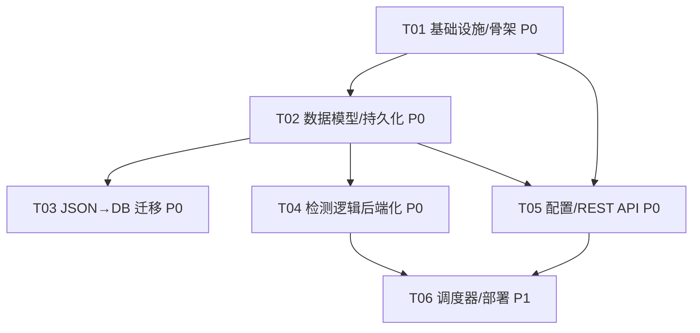

# 阶段四技术设计 + 任务分解（blive-monitor 后端 + 持久化 DB）

> 架构师：高见远（Bob）｜ 关联：`docs/phase34_prd.md`、`docs/system_design.md`、`docs/a2a4_ci_design.md`
> 范围：**仅阶段四（后端地基）**。阶段三（多平台适配器）作为依赖项在文末 §10 给轮廓，不展开实现。
> 语言：中文（与需求一致）。本文**只产出设计 + mermaid，不含任何代码**。

---

## 0. 设计总览与核心决策

| 决策点 | 采用方案 | 理由 |
|--------|----------|------|
| 后端框架 | **FastAPI**（sync 路由 + `def` 处理器，FastAPI 自动丢线程池） | 与现有 Python 检测逻辑同语言零成本迁移；不引入 async ORM 复杂度，避免与同步的 `urllib`/`playwright` sync 冲突。 |
| 数据库 | **SQLite**（文件库）+ SQLAlchemy 2.0（sync ORM） | 零依赖、单机够用；Postgres 作为 P2 可切换点（SQLAlchemy 抽象层已隔离方言）。 |
| 并发写 | **WAL 模式 + 全局 writer `threading.Lock`** 串行化所有 DB 写 | SQLite 单写者限制；scheduler 后台线程 + API 请求并发写时防 `database is locked`。 |
| 定时检测 | **后端 APScheduler（AsyncIOScheduler）自驱** | 彻底替代 CI 抢推；过渡期 CI 退役（见 §8.3）。 |
| 检测逻辑复用 | **直接 import 现有 `check_status`/`check_new_posts`/`auto_summary` 的纯函数**（`fetch_*`/`should_*`/`compute_*`/`format_*`/`render_body`），仅把「编排循环 + 持久化」抽到后端 | 抓取/解析/路由/模板逻辑**一字不改**；行为不降级。 |
| 推送 | **复用 `push_utils.dispatch_event`**（不变） | 现有 A2/A4 多通道路由 + 重试不变。 |
| 时间 | **统一北京时间**（`common.bjnow`/`parse_beijing`），DB 存 `"YYYY-MM-DD HH:MM:SS"` 字符串 | 与 `history.json`/`state.json` 逐字节一致，前端无需改。 |
| 配置 | `BLIVE_CONFIG` 整段存 `config` 表（`key='blive_config'`, `value=JSON`） | 语义 100% 兼容；`dispatch_event(cfg_all, …)` 直接传该 dict。 |

---

## 1. 实现方案 + 框架选型

### 1.1 FastAPI 应用结构

- **入口**：`backend/app.py` 用 `FastAPI(...)` 工厂，通过 `lifespan` 完成两件事：① `init_db()` 建表（SQLAlchemy `Base.metadata.create_all`）；② 启动 `Scheduler`（注册 live/post/summary/transcode 四类 job）。挂载 8 个 router 到 `/api/v1` 前缀，外加 `/healthz`。
- **路由处理器用 `def`（同步）**：FastAPI 会把同步 `def` 路由丢进线程池执行，与 sync SQLAlchemy 天然契合；不阻塞事件循环。APScheduler 的 job 回调为 `async`，内部用 `await asyncio.to_thread(run_live_check, …)` 跑同步检测逻辑，同样不阻塞 loop。
- **依赖注入**：`db.get_db` 以 `Depends` 形式每次请求给一个 `Session`（session per request），用完 `close()`。写操作外层包 `with WRITER_LOCK:`。

### 1.2 SQLite 访问层

- `backend/db.py`：
  - `engine = create_engine("sqlite:///{DB_PATH}", connect_args={"check_same_thread": False})`（配合锁，允许跨线程）。
  - 启动时执行 `PRAGMA journal_mode=WAL; PRAGMA synchronous=NORMAL; PRAGMA foreign_keys=ON;`。
  - `SessionLocal = sessionmaker(bind=engine, expire_on_commit=False)`。
  - `WRITER_LOCK = threading.Lock()` 模块级全局锁，所有 `INSERT/UPDATE/DELETE` 必须持锁。
  - `init_db()` 调用 `Base.metadata.create_all(engine)`。
  - `get_db()` 生成器 yield `SessionLocal()`。
- **为何不用 async SQLAlchemy**：现有检测代码（`check_status.fetch_douyin`、`check_new_posts` 的 Playwright sync、`push_utils` 的 `urllib`）全是同步阻塞 I/O；async ORM 需全链路 `await`，反而要改写现有逻辑。Sync + 线程池是零冲突、行为保真的选择。

### 1.3 Scheduler 方案

- `backend/jobs/scheduler.py`：`AsyncIOScheduler(timezone="Asia/Shanghai")`，注册：
  - `live_check`：`IntervalTrigger(minutes=5)`（对齐原 CI 5min）。
  - `post_check`：`IntervalTrigger(minutes=10)`，**仅当 `ENABLE_POST_CHECK=true`** 注册（延续原开关语义）；且依赖 Playwright（Docker 镜像内已装）。
  - `summary`：`CronTrigger(hour=sendTime 的小时, minute=分)` —— 但 sendTime 来自 `config.summary`，故 scheduler 启动时读一次并注册，config 变更后通过 `/config` PUT 触发 scheduler 重排（或下一轮惰性重算）；为简单起见，**summary 改为「每轮检查 should_deliver」**而非硬 cron（见 §3.4）——即把 summary 也挂到 5min 的 live_check 之后顺带评估，避免动态 cron 复杂度。
  - `transcode`（P1）：post_check 完成后在同一 job 内顺带执行，无需独立触发器。
  - **重叠保护**：每个 job 入口先 `if RUNNING_FLAGS[name]: return`（asyncio 任务级重入锁），`misfire_grace_time=60`，`coalesce=True`，避免上轮未完又起一轮。
- **手动触发（P1）**：`POST /api/v1/jobs/check?type=live|post|all` → 直接 `asyncio.create_task(run_*())` 或同步 `run_in_executor`，返回 `202 Accepted` + `job_id`。

### 1.4 现有检测逻辑如何「搬进后端而不降级」

核心策略：**不复制逻辑，只重排编排 + 换持久化后端**。

- 对 `check_status.py`：保留全部 `fetch_*`/`should_push`/`bili_status_on_batch_failure`/`format_push_*`/`render_body`/`calculate_duration` **原样不动**。新增一个 `run_live_check(*, cfg_all, persist, now=None) -> None`（纯新增，不改 `main()`），把原 `main()` 里的「循环每个 room → 状态判定 → should_push → format/render → dispatch_event → 写 state/history」抽出来，但把「写 `state.json`/`status.json`/`history.json`」改为调用 `persist` 回调（`persist.set_room_status`、`persist.append_event`、`persist.record_notify`）。原 `main()` 改为用「JSON 文件版 persist」适配，保证 **CI 过渡期仍可跑**（§8.3）。
- `check_new_posts.py`：`run_post_check(*, cfg_all, persist, now=None)` 同理，复用 `get_latest_aweme`/`should_notify_new_post`/`should_update_baseline` 等，把「写 `post_tracking.json`/`history.json`/`notify_dedup.json`」改为 `persist` 回调。
- `auto_summary.py`：`run_summary(*, cfg_all, persist, now=None)` 复用 `compute_since`/`compute_summary`/`format_summary`/`should_deliver`，把「读 `history.json` / 写 `summary_state.json`」改为 `persist`。
- **后端 `jobs/*.py`** 持有真正的 `persist` 实现：`Persistence` 类（§2/§3）把回调落到 DB（rooms 状态列、`events_history`、`notify_log`、`notify_dedup`、`posts` 基线存 `rooms.meta`）。
- 这样前端 `monitor.html` 过渡期若仍读 JSON，后端可经 `GET /export/status.json` 从 DB 现生成等价 `status.json`（P2 兜底，§8.5），**后端化零降级**。

---

## 2. 文件列表及相对路径

### 2.1 新增后端源码（`backend/`）

```
backend/
  __init__.py
  app.py                 # FastAPI 工厂 + lifespan(init_db / 启停 scheduler) + 挂载 router + /healthz
  config.py              # 配置(settings): DB_PATH, AUTH_TOKEN, ENABLE_POST_CHECK, TZ, 默认轮询间隔
  db.py                  # engine / SessionLocal / WRITER_LOCK / init_db() / get_db() / PRAGMA WAL
  models.py              # SQLAlchemy ORM 模型（见 §3.1 八张表 + rooms 扩展）
  schemas.py             # Pydantic 请求/响应模型（API 契约，见 §3.3）
  config_store.py        # ConfigStore: 读/写 BLIVE_CONFIG（封装 config 表 key='blive_config'），兼容 legacy push
  core/
    __init__.py
    persistence.py        # Persistence: set_room_status / append_event / record_notify / upsert_post_baseline 等（DB 落库实现）
    dedup.py             # DedupService: should_notify / record / prune（替代 notify_dedup.json，落 notify_dedup 表）
    history_store.py      # HistoryStore: append_event 写 events_history（替代 log_utils.append_history 的 JSON 版，节流逻辑复用 log_utils.should_suppress）
    notify_log_store.py   # NotifyLogStore: 每次推送尝试落 notify_log（ok/fail + content_hash）
  jobs/
    __init__.py
    scheduler.py         # APScheduler 注册/启停；RUNNING_FLAGS 防重叠；手动触发入口
    detection_service.py  # DetectionService: 一轮检测编排（读 config -> 调 live/post/summary -> persist）
    live_check.py         # run_live_check 后端版 persist 装配（import check_status 的纯函数）
    post_check.py         # run_post_check 后端版 persist 装配（import check_new_posts）
    summary_job.py        # run_summary 后端版 persist 装配（import auto_summary）
    transcode_job.py     # 后端版封面转存（import/复用 transcode_covers 逻辑，P1）
  api/
    __init__.py
    rooms.py             # /rooms CRUD + /rooms/{id}/status
    posts.py             # /posts 列表 + 写入
    events.py            # /events 历史查询
    notify.py            # /notify/log + /notify/dedup
    config.py            # /config GET/PUT
    summary.py           # /summary/state
    silence.py           # /silence/state
    jobs_api.py          # /jobs/check(P1) + /healthz 转发
```

### 2.2 迁移脚本（`tools/`）

```
tools/import_json_to_db.py   # 一次性 JSON→DB 导入；幂等可重跑；字段映射见 §7.3
```

### 2.3 部署文件（仓库根）

```
Dockerfile            # python:3.11-slim + 装 playwright chromium + 暴露 8000 + CMD uvicorn
docker-compose.yml    # 挂载 ./data(放 blive.db) 与 ./assets/covers(封面) + 环境变量
.dockerignore
requirements.txt      # 后端依赖（见 §6）
```

### 2.4 需改造的现有文件（保持逻辑不变，仅加可调用入口）

| 文件 | 改造内容 | 行为影响 |
|------|----------|-----------|
| `check_status.py` | **新增** `run_live_check(*, cfg_all, persist, now=None)`，原 `main()` 改为用 JSON 文件版 `persist` 调用它（不删不改原抓取函数） | 无降级；`main()` 仍可独立跑（过渡期 CI） |
| `check_new_posts.py` | **新增** `run_post_check(*, cfg_all, persist, now=None)`，原 `main()` 委托之 | 同上 |
| `auto_summary.py` | **新增** `run_summary(*, cfg_all, persist, now=None)`，原 `main()` 委托之 | 同上 |
| `.github/workflows/check.yml` | 后端上线后**退役**（或改为仅 `curl -X POST /jobs/check`）；详见 §8.3 | 从「抢推 JSON」转为「调后端 API」（可选） |
| `requirements.txt` | 追加后端依赖（fastapi/uvicorn/sqlalchemy/apscheduler）；保留 `playwright` | 无冲突 |

> **前端 `monitor.html` 本阶段不动**（PRD P1 单列）。过渡期它仍可直连 GitHub 读 JSON；后端提供 `GET /export/status.json`（P2 兜底，§8.5）维持兼容。

---

## 3. 数据结构和接口（类图见 `docs/phase4_class.mermaid`）

### 3.1 ORM 模型（`backend/models.py`）

基于 PRD §2.5 的八张表；对 `rooms`/`events_history` 做了**最小必要扩展**（标注 ★），理由在 §7 共享知识。

```text
Room(id PK, kind★, platform, external_id, name, title, url, tags JSON,
      enabled, meta★ JSON,
      live_status★, current_title★, online★ INT, area★, cover★,
      last_live_at★ TEXT, live_started_at★ TEXT, live_duration★ TEXT,
      last_checked_at★ TEXT,
      created_at, updated_at,
      UNIQUE(platform, external_id, kind))

Post(id PK, platform, post_id, author, url, cover, published_at, created_at,
     UNIQUE(platform, post_id))

EventHistory(id PK, room_id FK→Room.id NULLABLE, raw_rid★ TEXT, account★ TEXT,
             platform, event_type, name★, title★, detail★, level★,
             changed★ BOOL, prev★, push★, payload★ JSON, occurred_at TEXT,
             occurred_ts★ INT)            # occurred_ts 供范围查询；occurred_at 为北京时间字符串( parity)

NotifyLog(id PK, channel_id, event_type, target, content_hash, sent_at, status)

NotifyDedup(key PK, last_sent_at REAL, meta JSON)

ConfigKV(key PK, value JSON, updated_at)

SummaryState(key PK, value JSON, updated_at)
SilenceState(key PK, value JSON, updated_at)
```

- **`kind` ★**：`'live'`（直播监控，等价 `rooms.json`）或 `'post'`（新作监控，等价 `post_rooms.json`）。因同一抖音号可**同时**被直播监控和作品监控（如 `douyin_601914453` 在 `tracking.json` 与 `post_tracking.json` 均出现），需用 `kind` 区分，否则 UNIQUE 冲突。
- **`meta` ★**：平台/维度专属运行时基线（JSON），承载原 `tracking.json`/`post_tracking.json` 的全部字段：`last_live/live_start/live_duration/last_duration`（live 基线）、`sec_uid/nickname/latest_aweme_id/latest_ct/mode/latest_desc/latest_type/latest_url/latest_cover/latest_count/need_cookie`（post 基线）。避免新增表，且字段可演进。
- **`live_status` 等状态列 ★**：原 `state.json`/`status.json` 的「当前直播间状态」直接落在 `rooms` 行上 → `GET /rooms/{id}/status` 直接读，无需再算。
- **`EventHistory` 的 `raw_rid`/`account` ★**：历史 JSON 用字符串 key（`dy571881`），迁移时尽量解析成 `room_id` FK；解析不到的（如已删账号的历史）落 `raw_rid` 保真，绝不丢历史。
- **`NotifyLog`**：PRD §2.5 无此表，但 §2.4 `POST /notify/log` 与 P4-0.6 要求「通知记录」。新增，记录**每次**推送尝试（成功/失败），`content_hash` = `hash(channel_id|event_type|content)`，供去重与审计。

### 3.2 关键服务类（非 ORM）

```text
ConfigStore        { get_config()->dict; put_config(dict); get_push_cfg(); }   # 封装 config 表
Persistence       { set_room_status; append_event; record_notify;
                   upsert_post_baseline; get_room; list_rooms; }            # DB 落库，供 jobs 调
DedupService      { should_notify(key,cooldown); record(key); prune(); }     # 替代 notify_dedup.json
HistoryStore      { append_event(entry); }                                    # 写 events_history + 节流
NotifyLogStore    { log(channel_id,event_type,target,content_hash,status); }
DetectionService  { run_live(); run_post(); run_summary(); run_transcode(); } # 编排一轮
Scheduler         { start(); shutdown(); trigger(type); }                     # APScheduler 封装
```

### 3.3 REST API 清单（`/api/v1`，对齐 PRD §2.4 并细化）

> 时间字段统一 `"YYYY-MM-DD HH:MM:SS"`（北京）。分页用 `limit`/`offset`。

| Method & Path | 请求 | 响应 | 说明 |
|---|---|---|---|
| `GET /healthz` | — | `{status:"ok", db:bool}` | 健康检查 |
| `GET /rooms` | `?kind=&platform=&enabled=&q=&limit=&offset=` | `RoomOut[]` + `total` | 列表（合并直播+作品视图） |
| `POST /rooms` | `RoomCreate{platform,external_id,kind,name?,...}` | `RoomOut` | 新增监控目标（自动 `UNIQUE` 冲突校验） |
| `GET /rooms/{id}` | — | `RoomOut` | 单目标详情 |
| `PUT /rooms/{id}` | `RoomUpdate{name?,title?,tags?,enabled?,...}` | `RoomOut` | 改名称/标签/启用态 |
| `DELETE /rooms/{id}` | — | `204` | 移除监控 |
| `GET /rooms/{id}/status` | — | `RoomStatusOut{live_status,current_title,online,area,cover,last_live_at,live_started_at,live_duration,last_checked_at}` | 等价 `status.json` 单间 |
| `PUT /rooms/{id}/status` | `RoomStatusUpdate{live_status,title,cover,online,area}` | `RoomStatusOut` | 写入当前状态 |
| `GET /posts` | `?platform=&author=&since=&limit=&offset=` | `PostOut[]` | 新作列表（等价 `post_tracking.json` 视图，可查） |
| `POST /posts` | `PostCreate{platform,post_id,author,url,cover,published_at}` | `PostOut` | 记录新作（幂等 upsert） |
| `GET /events` | `?room_id=&platform=&event_type=&from=&to=&limit=&offset=` | `EventOut[]` + `total` | 历史查询（时间范围/平台/房间） |
| `POST /notify/log` | `NotifyLogIn{channel_id,event_type,target,content_hash,status}` | `NotifyLogOut` | 通知记录 |
| `GET /notify/dedup?key=` | — | `{exists:bool, last_sent_at}` | 去重查询 |
| `POST /notify/dedup` | `DedupUpsert{key,meta?}` | `{recorded:bool}` | 去重标记（upsert，仅推送成功后调） |
| `GET /config` | — | `BLIVE_CONFIG` 完整 dict | 读配置 |
| `PUT /config` | `BLIVE_CONFIG` dict | `{updated_at}` | 写配置（校验 channels/routes/templates/silence/summary 段） |
| `GET /summary/state` | — | `SummaryStateOut{enabled,freq,sendTime,lastSent,...}` | 摘要状态 |
| `PUT /summary/state` | partial dict | `SummaryStateOut` | 写摘要状态 |
| `GET /silence/state` | — | `SilenceStateOut{enabled,start,end}` | 静默状态 |
| `PUT /silence/state` | partial dict | `SilenceStateOut` | 写静默状态 |
| `POST /jobs/check?type=live\|post\|all` ★P1 | — | `202 {job_id,type}` | 手动触发一轮检测 |

> `RoomOut` 含全部 `rooms` 列（含 `meta`/`live_status` 等）。`EventOut` 含 `events_history` 全部列。
> 鉴权（P1）：`X-Bearer-Token` 头；`AUTH_TOKEN` 为空时放行（内网默认无鉴权）。`/healthz` 与 `GET` 读接口可豁免。

### 3.4 时序图（见 `docs/phase4_sequence.mermaid`）

含四段：① 一轮直播检测（scheduler→config→live_check→persist→route→dispatch_event→notify_log/dedup）；② 配置读写；③ 手动触发；④ 迁移脚本。

---

## 4. 程序调用流程（时序图）

完整 mermaid 见 `docs/phase4_sequence.mermaid`，要点如下。

**一轮直播检测主链路**：
1. `Scheduler.live_check`（每 5min）→ `asyncio.to_thread(DetectionService.run_live)`。
2. `run_live`：`ConfigStore.get_config()` 取 `BLIVE_CONFIG`；`Persistence.list_rooms(kind='live')` 取监控列表（带 `enabled` 过滤，复用 `common.room_enabled`）。
3. 对每个 room 调 `check_status.fetch_bilibili_batch` / `fetch_douyin`（**原函數直接复用**）→ 得 `result{status,title,online,area}`。
4. `should_push(prev, curr)` 判定是否推送（逻辑不变）→ 若推送：`common.render_template`/`format_push_desp` 生成 title/desp → `push_utils.dispatch_event(cfg_all, ctx, title, desp)`（**不变**）。
5. 落库（持 `WRITER_LOCK`）：`Persistence.set_room_status`（写 `rooms.live_status` 等状态列 + `meta` 基线）+ `HistoryStore.append_event`（写 `events_history`）+ 推送成功后 `NotifyLogStore.log(...)` + `DedupService.record(key)`（`key="live:{platform}_{external_id}"`，冷却 2h）。
6. 静默拦截（`common.should_skip_by_silence`）在 `dispatch_event` 之前判定，仅跳过推送、不影响状态抓取（与原行为一致）。

**配置读写**：`GET/PUT /config` → `ConfigStore` → `ConfigKV` 表；`PUT` 后触发 `Scheduler` 重算 summary 触发条件（惰性，下一轮评估）。

**手动触发（P1）**：`POST /jobs/check?type=post` → `JobsApi` → `Scheduler.trigger('post')` → `run_post`。

**迁移脚本**：`tools/import_json_to_db.py` 读 8 个 JSON → 经 `Persistence`/`DedupService`/`ConfigStore` 幂等写入 DB（映射见 §7.3）。

---

## 5. 任务列表（有序、含依赖、按实现顺序）

> 注：系统 SOP 默认「≤5 任务」，但本阶段四按用户明确要求拆为**骨架→DB→迁移→检测后端化→API→调度部署**六段可追踪步骤，每段 ≥3 文件、按层分组、首段为基础设施，符合 SOP 的精神（不拆单文件任务、不超 5 若可合）。依赖图见 §9。

| Task | 名称 | 源文件（≥3） | 依赖 | 优先级 |
|------|------|---------------|------|--------|
| **T01** | 项目基础设施与骨架 | `backend/__init__.py`, `backend/app.py`, `backend/config.py`, `backend/db.py`, `requirements.txt`, `Dockerfile`, `docker-compose.yml`, `.dockerignore` | — | **P0** |
| **T02** | 数据模型与持久化层 | `backend/models.py`, `backend/schemas.py`, `backend/core/persistence.py`（含 `db.init_db` 落库实现） | T01 | **P0** |
| **T03** | JSON→DB 迁移脚本 | `tools/import_json_to_db.py` + 字段映射（依赖 T02 模型） | T02 | **P0** |
| **T04** | 检测逻辑后端化（核心不降级） | 改造 `check_status.py`/`check_new_posts.py`/`auto_summary.py`（加 `run_*` 入口）、`backend/jobs/detection_service.py`、`backend/jobs/live_check.py`、`backend/jobs/post_check.py`、`backend/jobs/summary_job.py`、`backend/core/dedup.py`、`backend/core/history_store.py`、`backend/core/notify_log_store.py` | T02 | **P0** |
| **T05** | 配置与 REST API | `backend/config_store.py`、`backend/api/*.py`（8 个 router）、`backend/app.py`（挂载） | T01, T02 | **P0** |
| **T06** | 调度器自驱与部署收尾 | `backend/jobs/scheduler.py`、`backend/app.py`（lifespan 启停 scheduler）、`backend/jobs/transcode_job.py`（P1）、`Dockerfile`（完善）、`.github/workflows/check.yml`（退役/改调 API） | T04, T05 | **P1** |

> 阶段三（多平台适配器）作为 T04 的**后续依赖项**在 §10 给轮廓，不在此展开。

---

## 6. 依赖包列表（`requirements.txt`）

| 包 | 版本 | 用途 | 冲突风险 |
|----|------|------|----------|
| `fastapi` | `>=0.110` | Web 框架（sync `def` 路由 + 线程池） | 无（新引入） |
| `uvicorn[standard]` | `>=0.29` | ASGI 服务器 | 无 |
| `sqlalchemy` | `>=2.0` | ORM / DB 访问层（sync） | 无（新引入，隔离方言便于 P2 切 Postgres） |
| `apscheduler` | `>=3.10` | 后端自驱 scheduler（AsyncIOScheduler） | 无 |
| `pydantic` | `>=2.6`（FastAPI 自带） | 请求/响应模型 | 无 |
| `python-multipart` | `>=0.0.9` | 备选表单/文件导入端点（可选，低耦合） | 无 |
| `playwright` | `==1.58.0` | **沿用现有** 抖音新作检测无头浏览器 | 已存在，不变 |
| *stdlib* | — | `common`/`push_utils`/`check_*` 的 `urllib`/`json`/`datetime` 等 | 无 |

**P2 可选扩展**：`aiosqlite`（若改 async）、`psycopg2-binary`（Postgres）、`prometheus-client`（指标）。
**明确不引入**：`requests`（与现有 `urllib` 重复，且 `push_utils` 已用 `urllib`，引入反而冲突/冗余）；除 playwright 外不引入其他浏览器/HTTP 客户端库。

---

## 7. 共享知识（跨文件约定）

1. **config 在 DB 中的存储形态**：`ConfigKV(key='blive_config', value=<BLIVE_CONFIG 完整 dict>)`。`BLIVE_CONFIG` 的 `channels`/`routes`/`templates`/`silence`/`summary` 字段**语义不变**；legacy 单通道 `push` 仍退化兼容（`common.resolve_channel` 兜底）。`dispatch_event(cfg_all, ctx, title, desp)` 直接传该 dict —— 推送逻辑零改动。

2. **时间统一北京时**：所有写入 DB 的时间列（`occurred_at`/`last_live_at`/`last_checked_at`/`sent_at`）均为 `"YYYY-MM-DD HH:MM:SS"` 字符串，由 `common.bjnow()`/`parse_beijing()` 产出，与 `history.json`/`state.json` 逐字节一致；`occurred_ts` 额外存 epoch（INT）仅用于范围查询。前端 `monitor.html` 的 JS `parseBeijing` 不受影响。

3. **推送仍走 `push_utils.dispatch_event`（不变）**：后端检测步骤在「应推送」判定后直接调用；`dispatch_event` 内部 `resolve_channel`→`channel_to_push_cfg`→`dispatch_push`（含重试）全部复用。后端**不重写**任何推送代码。

4. **去重账本 DB 化**：`DedupService` 完全等价 `notify_dedup.py` 的 `should_notify`/`record`/`prune` 语义（`live:` 键冷却 2h、`post:` 键永久、TTL 7d、上限 5000），只是存储从 JSON 文件换为 `notify_dedup` 表。`record` **仅在推送成功（`res.ok`）后**调用，避免「标记去重却推送失败」导致漏报（与原 `dispatch_event` 约定一致）。

5. **历史写入节流复用 `log_utils`**：`HistoryStore.append_event` 仍用 `log_utils.should_suppress`/`dedupe_by_throttle`（error/cookie_warn 30min 窗口节流），仅把最终落盘目标从 `history.json` 改为 `events_history` 表。

6. **状态模型 ↔ 现有 JSON 字段映射**（核心，迁移与实时落库共用）：

| 现有产物 | 后端归属 | 关键字段映射 |
|----------|----------|--------------|
| `rooms.json`（`[{platform,id,name}]`） | `Room(kind='live')` | platform, external_id=id, name |
| `post_rooms.json`（`[{id,name,sec_uid}]`） | `Room(kind='post')` | external_id=id, name, meta.sec_uid |
| `state.json`（`{key:status}`） | `Room.live_status` | key=`{platform}_{external_id}` |
| `status.json`（`{updated,rooms:[...]}`） | `Room` 状态列 | status→live_status, title→current_title, online, area, sec_uid→meta, last_live→last_live_at, live_duration, time→last_checked_at |
| `tracking.json` | `Room(kind='live').meta` | last_live/live_start/live_duration/last_duration + sec_uid（douyin） |
| `post_tracking.json` | `Room(kind='post').meta` + `Post` 表 | sec_uid/latest_aweme_id/latest_ct/mode/latest_desc/latest_type/latest_url/latest_cover/latest_count/need_cookie → meta；latest_aweme_id 同时作为首条 `Post` 种子 |
| `history.json` | `EventHistory` | time→occurred_at(+ts), name, platform, status, title, changed, prev, push, rid→raw_rid(+尽量解析 room_id), type→event_type, level, detail, account |
| `notify_dedup.json` | `NotifyDedup` | key, ts→last_sent_at |
| `summary_state.json` | `SummaryState(key='summary')` | 整 dict 存 value |
| `silence_state.json` | `SilenceState(key='silence')` | 整 dict 存 value |

7. **`posts` 表语义决策（judgment call）**：PRD §2.5 将 `posts` 描述为「等价 `post_tracking.json`」。本设计将 `posts` 定义为**可查询的新作列表（每条作品一行）**，而把「已见最新作品基线」存于 `Room(kind='post').meta`（原 `post_tracking.json` 语义）。这样：① 真正获得 PRD §2.4「`GET /posts` 按 author/since 查询」能力（旧系统无）；② 变更检测仍用 `meta` 基线，行为不降级。此决策在 §8 列为待确认点。

8. **writer 锁约定**：所有 `INSERT/UPDATE/DELETE` 必须 `with db.WRITER_LOCK:`；`SELECT` 不加锁（WAL 下读写可并发）。scheduler 与 API 共享同一锁，杜绝 SQLite 写竞争。

9. **`kind` + `UNIQUE(platform, external_id, kind)`**：同一抖音号可同时是直播监控目标与作品监控目标，必须用 `kind` 区分两行（见 §3.1）。

---

## 8. 待明确事项（遗留工程决策 + 推荐处理）

| # | 遗留事项 | 推荐处理 |
|---|----------|----------|
| 8.1 | **SQLite 写并发上限**：scheduler 多线程 + API 并发写，单写者易 `database is locked` | 已采用 WAL + 全局 `WRITER_LOCK` 串行化写；检测批处理内合并事务。多实例/高并发场景直接切 Postgres（P2，SQLAlchemy 已隔离方言）。 |
| 8.2 | **scheduler 精度与重叠**：检测可能超过轮询间隔（尤其 Playwright 抓抖音） | `RUNNING_FLAGS` 防重入 + `coalesce=True` + `misfire_grace_time=60`；post_check 单独间隔（10min）避免与 live 抢资源。 |
| 8.3 | **与现有 CI 的过渡共存期**：后端上线后 `.github/workflows/check.yml` 仍在跑会抢推 JSON，与 DB 状态分叉 | 后端里程碑 T06 一并**退役 check.yml**（或改为仅 `curl -X POST /jobs/check` 触发后端）。保留一个「双写过渡开关」：上线首周后端可同时写 DB 与生成 `status.json`（经 `Persistence` 适配），验证一致后再关 CI。 |
| 8.4 | **`posts` 表语义**（§7.7） | 按「列表 + meta 基线」落地；若主理人坚持「posts=post_tracking 逐字」，改为 `posts` 单行长 baseline（UNIQUE(platform, author)），其余不变。 |
| 8.5 | **迁移后仓库 JSON 兼容**：前端 `monitor.html` 过渡期仍读 GitHub JSON | 默认退役仓库 JSON；提供 `GET /export/status.json`（P2 兜底）从 DB 现生成等价 `status.json`，使前端零改动过渡；彻底前端改造单列 P1。 |
| 8.6 | **封面转存存储位置（transcode）**：后端化后 `assets/covers/*.jpg` 放哪 | Docker 挂载卷 `./assets/covers` 持久化；`transcode_job.py` 复用 `transcode_covers.download_cover`/`transcode_all`，仅把「读 post_tracking.json / 写 manifest」改为读 `Room.meta` + 落 `Post.cover`。 |
| 8.7 | **鉴权粒度（P1）**：内网无鉴权 vs Bearer token | `AUTH_TOKEN` 环境变量空=放行；非空=`X-Bearer-Token` 校验。`/healthz` 与读接口豁免。推荐内网先空、暴露公网再填。 |
| 8.8 | **history 容量上限**：原 `HISTORY_MAX=500` 裁剪 | DB 不硬裁剪，但 `GET /events` 默认 `limit=200`；另设定时 `prune`（保留最近 N 行，P2 指标）。 |
| 8.9 | **GitHub 兜底（P2）**：DB 不可用时回退写 JSON？ | 不默认实现；若需，仅 `GET /export` 兜底，不双向同步（避免状态分叉）。 |
| 8.10 | **summary 触发方式**：动态 cron vs 每轮评估 | 采用「每轮 live_check 后惰性 `should_deliver` 评估」（无需动态重排 scheduler），简单且等价。 |

---

## 9. 任务依赖图（mermaid）



---

## 10. 与阶段三（多平台适配器）的依赖边界（轮廓，不展开）

- **依赖方向**：阶段三 **依赖** 阶段四；阶段四不依赖阶段三。阶段三的 `PlatformAdapter`（PRD §3.3）输出 `RoomModel`/`PostModel` 归一化模型后，**交给本阶段 T04 的 `DetectionService` 落库 + 触发 `dispatch_event`**，绝不直接写仓库 JSON。
- **后端需为阶段三预留的契约**（本阶段落地、阶段三消费）：
  1. `Room(kind='live')` 的 `platform` 字段放开为枚举（`bilibili`/`douyin`/`kuaishou`/`channels`/`xhs`/...），`meta` JSON 承载平台专属字段（如抖音橱窗、B站分区）。
  2. `ConfigStore` 的 `BLIVE_CONFIG` 增加 `platforms` 段（PRD §3.4：`{kuaishou:{enabled,credentials,poll_interval,rate_limit}, ...}`），阶段三适配器读取各自凭证与轮询参数。
  3. `DetectionService.run_live`/`run_post` 的检测循环**抽象为「对每个 adapter 调 `fetch_room_status`/`fetch_new_posts`」**，本阶段先用 B站/抖音两个内联实现，阶段三替换为可插拔 adapter 列表（接口不变）。
  4. 阶段三 P3-0.1（`PlatformAdapter` 契约 + `RoomModel`/`PostModel`）应直接复用本阶段 §3.1 的 `Room`/`Post` ORM 字段语义，保证归一化模型与 DB 模型逐字段对齐。
- **不在本阶段做**：任何新平台适配器实现、小红书直播检测重评估（见 PRD §3.2 风险）、前端改造。
```
