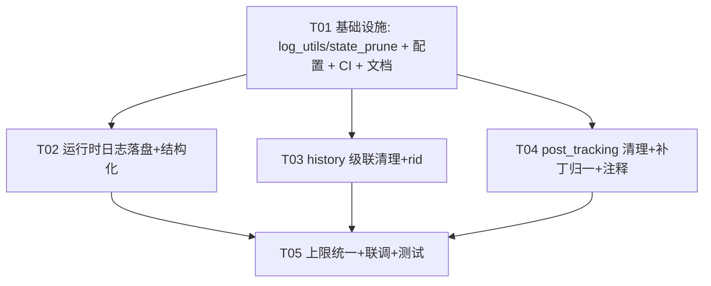

# blive-monitor「日志模块」重构设计（SOP 架构交付物）

> 架构师：高见远（Bob）｜ 范围：运行时日志 + 监控日志（history.json）+ 状态合并中的级联清理
> 约束：纯 Python 标准库、保持 `monitor.html` 等前端向后兼容、不破坏 `check.yml` CI 流程、pytest 测试可扩展。

---

## 0. 现状侦察结论（与原始简报的偏差已标注）

| # | 侦察结论 | 与简报差异 |
|---|---------|-----------|
| 1 | **`history.json` 由 `check_status.py`（直播监控）写入**，不是 `check_new_posts.py` | 简报误归属；新作品监控只写 `post_tracking.json` |
| 2 | history 条目字段：`time/name/platform/status/title/changed/prev/push`，**无 `rid`/`id`**（当前 398 条） | 简报列的 `aweme_id/desc/type/url` 实际是 `post_tracking.json` 的字段，非 history |
| 3 | 上限不一致：`check_status.py` `HISTORY_MAX_ENTRIES=200` vs `merge_state.py` `HISTORY_MAX=500` | 这就是"长到 ~500 条"的根因（合并时 500 胜出） |
| 4 | `check_new_posts.py` 头部注释写"两层策略"，但 `get_latest_aweme` 文档明确是**三层**（策略0 移动端 m.douyin.com 免 Cookie / 策略1 桌面端 aweme/v1/web 需 Cookie / 策略2 count 退化） | 简报第3点正确，需修正注释 |
| 5 | 应急补丁（`check_new_posts.py` ~772-801）已能清理 `post_tracking` 孤儿，但逻辑内联、未归一为函数 | 需抽成正式函数 |
| 6 | 前端删除：`apiRemoveRoom`→改 `rooms.json`；`apiRemovePostRoom`→改 `post_rooms.json`；**二者都不碰 `history.json`/`post_tracking.json`** | 孤儿残留根因 |
| 7 | `logging.basicConfig(level=INFO)` 仅控制台，无文件、无轮转、无结构化上下文 | 简报第4点正确 |

---

## Part A：系统设计

### 1. 实现方案（Implementation Approach）

**技术难点**
- 孤儿记录可靠识别：history 无稳定 `rid`，纯靠 `name+platform` 匹配会误伤（昵称可变 / 重名）。
- 级联清理时机：删除发生在前端（GitHub API 直写 JSON），后端仅在 CI 下次运行时才知道，故清理必须落在后端**固化阶段**。
- 不能与前端增删竞态：必须"重读磁盘 + 原地更新"，绝不整体覆盖写回（否则复活已删账号）。
- 上限统一：运行时（200）与合并时（500）必须收敛到单一常量。

**框架选型（保持纯标准库）**
- 运行时日志：`logging` + `logging.handlers.RotatingFileHandler`（标准库，零新增依赖）。
- 结构化上下文：用 `LoggerAdapter` 注入 `account`/`module` 可选字段，未提供时留空，**完全兼容现有 `logger.info(...)` 调用**。
- 级联清理：纯函数 + `common.save_json_file` 原子写，不引入 ORM/数据库。
- 架构模式：保持现有「脚本 + JSON 状态文件」模式，引入 **2 个横切收口模块**（`log_utils.py`、`state_prune.py`），消除散落各处的日志配置/补丁逻辑。

### 2. 文件列表（相对仓库根）

**新增**
- `log_utils.py` — 运行时日志初始化 + history 读写/上限（单一常量来源）
- `state_prune.py` — 级联清理（history 孤儿 / tracking 孤儿 / post_rooms 字段合并）
- `tests/test_log_utils.py` — 日志与 history 读写单测
- `tests/test_state_prune.py` — 级联清理单测
- `docs/system_design.md` / `docs/class-diagram.mermaid` / `docs/sequence-diagram.mermaid` — 本交付物

**修改**
- `check_status.py` — 日志初始化改调 `log_utils`；history 写收口 + 条目**新增 `rid`**；固化阶段调用 `prune_history_orphans`；删除重复的 `HISTORY_MAX_ENTRIES`，改用 `log_utils.HISTORY_MAX`
- `check_new_posts.py` — 日志初始化改调 `log_utils`；~772-801 补丁替换为 `state_prune.merge_post_rooms_fields` + `prune_tracking_orphans`；头部"两层策略"注释改"三层"
- `merge_state.py` — `HISTORY_MAX` 改为从 `log_utils` 导入（单一来源）；`merge_history` 透传 `rid` 字段
- `requirements.txt` / `requirements-dev.txt` — **无新增依赖**（纯标准库），仅补注释说明
- `.github/workflows/check.yml` — 校验 `python3 check_status.py` / `python3 check_new_posts.py` 调用不变；可选：将 `logs/` 作为 artifact 上传便于排障
- `.gitignore` — 追加 `logs/`
- `tests/test_check_new_posts.py` / `tests/test_check_status.py` / `tests/test_merge_state.py` — 扩展用例

### 3. 数据结构与接口（classDiagram，见 `docs/class-diagram.mermaid`）

要点（函数签名级，不写实现体）：
- `log_utils.HISTORY_MAX: int = 500`（**唯一来源**，check_status / merge_state 均引用）
- `log_utils.LOG_DIR = "logs"`
- `init_runtime_logging(level=logging.INFO, log_dir=LOG_DIR) -> None`：建立 `RotatingFileHandler(logs/runtime.log, maxBytes=5MB, backupCount=5)` + 控制台 `StreamHandler`；格式化串含 `%(name)s` 与可选 `%(account)s`。
- `get_logger(name, account=None) -> Logger`：返回带上下文的 `LoggerAdapter`。
- `load_history(path) -> List[HistoryEntry]` / `append_history(path, new_entries, max_n) -> int` / `cap_history(entries, max_n) -> List[HistoryEntry]`。
- `state_prune.prune_history_orphans(history, active_keys: Set[str]) -> List[HistoryEntry]`：保留 `f"{platform}|{rid}" ∈ active_keys` 的条目。
- `state_prune.prune_tracking_orphans(tracking: Dict, active_keys: Set[str]) -> Dict`：删除 `key ∉ active_keys` 的孤儿。
- `state_prune.merge_post_rooms_fields(config_file, resolved: Dict[str, dict]) -> bool`：重读磁盘 `post_rooms.json`，仅对仍存在的账号原地更新 `sec_uid/name`，返回是否变更（**替代原 772-801 补丁**）。
- 数据形态：`HistoryEntry{time,name,platform,status,title,changed,prev,push,rid}`（**`rid` 为新增、向后兼容**）；`RoomEntry{platform,id,name,sec_uid}`；`TrackingEntry{latest_aweme_id,latest_ct,mode,latest_count,nickname,sec_uid,need_cookie,latest_desc,latest_type,latest_url}`。

### 4. 程序调用流程（sequenceDiagram，见 `docs/sequence-diagram.mermaid`）

含 3 条时序：① 运行时日志初始化；② `check_status` 固化阶段 history 级联清理（带 `rid`）；③ `check_new_posts` 固化阶段 tracking 级联清理（应急补丁归一）。

### 5. 待明确 / 假设（Anything UNCLEAR）

1. **history 孤儿匹配主键**：强烈建议给 history 条目**新增 `rid` 字段**（写入时取 `r["id"]`），以实现精确匹配。前端只读 `name/platform/time/title`，新增 `rid` 完全向后兼容（前端忽略未知字段）。**若团队拒绝改 history 结构**，则退化为 `name+platform` 近似匹配（接受重名/改名风险）—— 默认采用"新增 `rid`"方案，需主理人确认。
2. **上限取值**：建议统一为 `HISTORY_MAX=500`（与现有合并上限一致，避免回退到 200 丢数据）；若希望更激进可设 300。默认 500。
3. **轮转策略**：采用"保留最近 N 条"（与现状一致、最简单）。"按天归档 / 旧档 gzip"作为未来可选扩展，本次不做（避免过度设计）。
4. **history 是否也清理 post 账号**：history 仅由 `check_status`（直播）写入，故只含直播房间；post 账号（如 D.my）的残留走 `post_tracking` 清理即可。若 D.my 同时也是直播房间，则 `rid` 方案一并覆盖。
5. **`notify_dedup.json` 不清理**：`post:` 键本就永久保留（防重复推送），删除账号后残留无副作用，本次不动。
6. **CI 日志可见性**：`logs/runtime.log` 默认被 `.gitignore` 忽略；建议 `check.yml` 把 `logs/` 作为 artifact 上传，便于排障（可选，不阻塞）。

---

## Part B：该加什么 / 该删什么（明确结论）

### ✅ 该加（ADD）
| 项 | 落点 | 说明 |
|----|------|------|
| A1 统一日志模块 | `log_utils.py` | 收口 `init_runtime_logging` / `get_logger`，消除两脚本重复的 `basicConfig` |
| A2 运行时日志落盘 + 轮转 + 结构化 | `log_utils.py` + `check_status.py` + `check_new_posts.py` | `RotatingFileHandler` 写 `logs/runtime.log`；日志含 `name` + 可选 `account` 上下文 |
| A3 history 条目新增 `rid` | `check_status.py` | 为可靠级联清理提供稳定主键（向后兼容） |
| A4 history 级联清理 | `state_prune.prune_history_orphans` | 删除 `rooms.json` 已移除账号的 history 孤儿 |
| A5 post_tracking 级联清理 | `state_prune.prune_tracking_orphans` | 删除 `post_rooms.json` 已移除账号的 tracking 孤儿（归一原补丁） |
| A6 应急补丁归一为函数 | `state_prune.merge_post_rooms_fields` | 替代 `check_new_posts.py` ~772-801 内联补丁 |
| A7 history 上限单一来源 | `log_utils.HISTORY_MAX` | `check_status` / `merge_state` 均引用，消除 200/500 不一致 |
| A8 单测扩展 | `tests/*` | 覆盖 A1–A7 各纯函数 |

### ❌ 该删（DELETE / 修）
| 项 | 落点 | 说明 |
|----|------|------|
| D1 过时"两层策略"注释 | `check_new_posts.py` 头部 + ~line 616 内联注释 | 改为"三层策略"并补全策略0 说明 |
| D2 history 孤儿记录 | `history.json`（运行时经 A4 清理） | 已删直播房间的残留日志 |
| D3 post_tracking 孤儿记录 | `post_tracking.json`（运行时经 A5 清理） | 已删抖音号的残留状态（"假活着"错觉） |
| D4 应急补丁临时逻辑 | `check_new_posts.py` ~772-801 | 被 A6 正式函数替代，删除内联代码 |
| D5 重复的 `HISTORY_MAX_ENTRIES` | `check_status.py` | 删除，改用 `log_utils.HISTORY_MAX` |
| D6 可能的重复/冗余日志语句 | `check_status.py` / `check_new_posts.py` | 重构时顺带审查合并语义重复、刷屏的 `logger.info`（如多处"取到最新作品"） |

---

## 6. 依赖包列表（Required Packages）

> **无新增第三方依赖**，全部使用 Python 标准库。

```
- logging            (stdlib) : 运行时日志框架
- logging.handlers.RotatingFileHandler (stdlib) : 日志文件轮转
- json / os / subprocess (stdlib) : 状态文件读写与 git 操作
# 既有依赖（不变）：
- playwright==1.58.0 (requirements.txt) : 抖音作品抓取（非本模块新增）
- pytest>=8.0       (requirements-dev.txt) : 测试
```

## 7. 有序任务列表（≤5 个，按依赖分组，每任务 ≥3 文件）

> 遵循：T01 必须为基础设施（配置+入口+依赖+文档）；T02–T04 仅依赖 T01 且相互独立；T05 为联调集成。

### T01 — 基础设施：新增共享模块 + 配置 + CI 校验 + 设计文档（P0）
- **Source Files**：`log_utils.py`(NEW)、`state_prune.py`(NEW)、`requirements.txt`(MODIFY-注释)、`.github/workflows/check.yml`(MODIFY-校验)、`.gitignore`(MODIFY-加 logs/)、`docs/system_design.md` + `docs/class-diagram.mermaid` + `docs/sequence-diagram.mermaid`(NEW)
- **Dependencies**：无
- **Priority**：P0
- **说明**：搭好两个横切模块骨架与统一常量（`HISTORY_MAX=500`、`LOG_DIR`），确认 CI 调用不变。

### T02 — 运行时日志落盘 + 结构化（收口到 log_utils）（P0）
- **Source Files**：`log_utils.py`(实现 init_runtime_logging/get_logger + RotatingFileHandler)、`check_status.py`(替换 basicConfig)、`check_new_posts.py`(替换 basicConfig)、`tests/test_log_utils.py`(NEW)
- **Dependencies**：T01
- **Priority**：P0
- **说明**：实现 A1/A2；两脚本顶部改调 `init_runtime_logging()`，其余 `logger.info` 调用零改动。

### T03 — history.json 级联清理 + 字段增强（加 `rid` + 按 active_keys 裁剪）（P0）
- **Source Files**：`state_prune.py`(prune_history_orphans)、`check_status.py`(条目加 `rid`、固化阶段调用 prune、引用 HISTORY_MAX)、`merge_state.py`(导入 HISTORY_MAX、透传 `rid`)、`tests/test_state_prune.py`(NEW)
- **Dependencies**：T01
- **Priority**：P0
- **说明**：实现 A3/A4/A7；删除 D2/D5。

### T04 — post_tracking 级联清理 + 应急补丁归一 + 注释修正（P0）
- **Source Files**：`state_prune.py`(prune_tracking_orphans、merge_post_rooms_fields)、`check_new_posts.py`(替换 772-801 补丁、修正"两层→三层"注释)、`tests/test_check_new_posts.py`(扩展)
- **Dependencies**：T01
- **Priority**：P0
- **说明**：实现 A5/A6；删除 D1/D3/D4。

### T05 — history 上限/轮转统一 + 整体联调与测试扩展（P1）
- **Source Files**：`merge_state.py`(最终 cap 对齐)、`tests/test_merge_state.py`(扩展 history 合并带 `rid`/上限)、`tests/test_check_status.py`(扩展 history 裁剪)、`check.yml`(可选 logs artifact)
- **Dependencies**：T02、T03、T04
- **Priority**：P1
- **说明**：集成验证；确保 CI `check.yml` 仍 `python3 check_status.py` / `python3 check_new_posts.py` 正常；跑全量 `pytest`。

## 8. 跨文件共享约定（Shared Knowledge）

- **`HISTORY_MAX` 单一来源**：仅在 `log_utils.py` 定义，`check_status.py` 与 `merge_state.py` 一律 `from log_utils import HISTORY_MAX`，禁止各自再定义。
- **history 条目结构契约**：`{time,name,platform,status,title,changed,prev,push,rid}`；**新增 `rid` 必须写入**（取值 `r["id"]`），前端向后兼容（忽略未知字段）。
- **级联清理触发点**：统一在各自脚本**固化阶段（save 之前）**调用 `state_prune` 函数；合并阶段（`merge_state.py`）只做并集、不做删除，避免与固化阶段冲突。
- **孤儿识别键**：history 用 `f"{platform}|{rid}"`；post_tracking 用 `f"douyin_{rid}"`；二者 `active_keys` 分别来自 `rooms.json` / `post_rooms.json` 的当前磁盘内容（必须重读磁盘，不得用启动内存副本）。
- **日志格式约定**：`%(asctime)s [%(levelname)s] %(name)s %(account)s %(message)s`；`account` 缺省为空串，不破坏既有输出解析。
- **原子写**：所有状态文件统一走 `common.save_json_file`（`.tmp` + `os.replace`），不自行 `open().write`。
- **不破坏前端**：`monitor.html`/`monitor-dashboard.html`/`monitor-feed.html`/`monitor-hero.html` 继续读取 `history.json`，字段名/顺序不变，仅多了可选 `rid`。

## 9. 任务依赖图（Task Dependency Graph）



---

### 交付物清单
- `docs/system_design.md`（本文）
- `docs/class-diagram.mermaid`
- `docs/sequence-diagram.mermaid`
