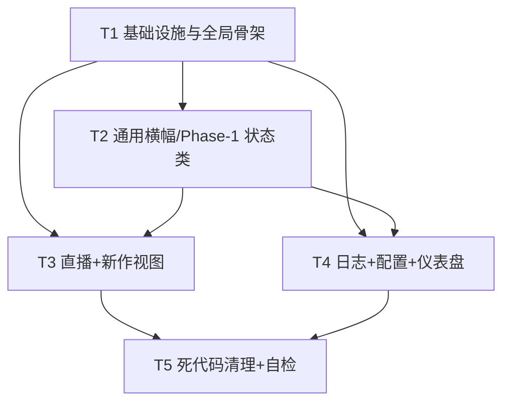

# 集成设计文档：blive-monitor 前端换肤 + 视图层重构

> 文档角色：架构师（高见远）  
> 目标：在**不破坏 315 个测试 + 不改动既有 JS 数据层逻辑** 的前提下，把用户 5 份独立 HTML 原型的新暗色移动端设计系统（「皮」）集成进现有单文件 `monitor.html`（「脑」）。  
> 交付物：本文档（设计 + 任务分解）。**不含任何实现代码**，仅给出结构、类名映射、约束与步骤。

---

## 0. 范围与基本约定

- **单文件 SPA 不变**：`monitor.html` 仍是唯一入口，前端直连 GitHub Contents API，无构建步骤。
- **脑（JS）原样保留**：`ld / ghGetFile / ghPutFile / ghWriteWithRetry / getGhToken / parseBeijing / bjNow / calcFreshness / todayBJ / computeStatsJS / matchQ / matchPostQ / onLiveSearch / onPostsSearch / renderLive / renderPosts / renderLog / renderDashboard / show / fil / renderConfig` 等函数**名称、签名、内部逻辑一律不动**。
- **皮（CSS/HTML 骨架）采用用户原型**：5 份原型的 `<style>` 设计系统完全相同（约 1400 行），合并为 1 份作为 `monitor.html` 唯一 `<style>`；`<body>` 骨架改为 `.mobile-container / .blm-header / .blm-content / .blm-tab-bar` 移动端结构。
- **唯一的改动面**：各 `render*` 函数**只改它们生成的 HTML 标记字符串与容器 ID 映射**，静态骨架中**仅替换 class 名称（旧 → `.blm-*`）并保留全部元素 id 与 `onclick` 处理器**。

### 0.1 双坐标系（本设计的核心约束）

集成后 CSS 存在两套命名但必须共存：

1. **新设计系统 `.blm-*`**：来自用户 5 份原型，控制整体外观（头部、内容区、卡片、tab、统计、日志、配置、仪表盘、freshness）。
2. **遗留变量别名 + Phase-1 保留类**：现有 `monitor.html` 的 JS 通过**内联 `var(--legacy)`** 与**特定 class** 引用了一批样式，这些**不能删**，否则渲染异常或测试失败。

> ⚠️ 关键认知：现有 `render*` 的输出字符串与若干内联样式深度耦合旧 class / 旧变量；换肤 = 重写这些输出字符串与新 class，同时把旧变量以**别名**形式保留在 `:root`，把 Phase-1 依赖类**原样保留**。

---

## 1. 集成策略总述

| 维度 | 策略 |
|------|------|
| 文件形态 | 仍是单文件 `monitor.html`，无新增文件、无构建 |
| `<style>` | 删除现有旧 `<style>`，替换为「用户设计系统 1 份 + 遗留别名/Phase-1 保留规则」合并后的单一 `<style>` |
| `<body>` 骨架 | 改为 `.mobile-container` 移动端结构；5 个 `section.view`（id 保留）作为视图容器 |
| 视图切换 | 保留 `show(view)` 机制；tab 用 `onclick="show('KEY')"`，**不**改成多文件 `<a href>` 跳转 |
| render 函数 | 仅重写其 `innerHTML` 模板字符串（旧 class → `.blm-*`），函数体逻辑不变 |
| 数据层 | `ld()` 拉取的全局 `stat/rooms/hist/postRooms/postTrack` 完全不变 |
| 测试保护 | 所有被测试 grep 的符号（函数名、常量、`#healthBar`、`kpi*`、`supportedPlatforms`），以及 `ld()` 未判空直写的元素 id，全部保留 |

---

## 2. CSS 移植与合并规则

### 2.1 采用用户设计系统

- 复制**任一份**原型（5 份 CSS 字节级相同）的 `<style id="theme-vars">` 全量内容作为新 `<style>` 主体。
- 该设计系统的 `:root` 变量命名为 `--brand-primary / --color-bg-* / --color-text-* / --color-bilibili / --color-douyin / --state-*` 等。

### 2.2 必须保留并合并的「遗留变量别名」（关键！）

现有 JS 在多处用**内联 `var(--xxx)`** 引用旧变量，新设计系统**未定义**这些名字。必须在合并后的 `:root` 中追加以下别名，确保内联样式继续解析：

| 遗留变量 | 必须保留的原因 | 建议取值（对齐新系统） |
|----------|----------------|------------------------|
| `--green` | `renderDashboard` 设 `kFresh.style.color`；`.pt-ok`/`.pf.ok` | `#30D158`（= `--state-success`） |
| `--yellow` | `renderDashboard` `kFresh` warn 态；`.s-replay`/`.chg`/`.pt` | `#FF9F0A`（= `--state-warning`） |
| `--live` | `renderDashboard` stale/fail 态；`.s-live`/`.pt-fail`/`.log-dot.err` | `#FF3B30`（= `--state-live`） |
| `--bili` | `.pf.bili`、`.ostat.rooms`、`.chip.active`、`.tab.active` | `#00D4F5`（= `--color-bilibili`） |
| `--dy` | `.pf.dy`、`.ostat.posts`、`.act.dy`、`.type` | `#FE2C55`（= `--color-douyin`） |
| `--text` | `.room-title`/`.log-txt b`/`.stat-b`/`.ainput` 等 | `#F5F5F7`（= `--color-text-primary`） |
| `--text2` | `.ostat .l`/`.chip`/`.room-meta`/`.post-desc` | `rgba(245,245,247,.7)`（= `--color-text-secondary`） |
| `--text3` | `.sub`/`.room-meta`/`.time`/`.log-time`/`.empty` | `rgba(245,245,247,.45)`（= `--color-text-tertiary`） |
| `--card` | `.room`/`.post`/`.stat-card`/`.tabbar` | `#141419`（= `--color-bg-surface`） |
| `--card2` | `.topbar`/`.status-pill`/`.addform`/`.log-detail` | `#1A1A21`（= `--color-bg-surface-raised`） |
| `--line` | 全局边框 | `rgba(255,255,255,.07)`（≈ `--color-border-subtle`，保留旧值以免视觉偏移） |
| `--shadow` | `.room`/`.post`/`.toast` | `0 8px 24px rgba(0,0,0,.38)` |
| `--bili-soft` | `.pf.bili`/`.addbtn:hover` | `rgba(0,212,245,.14)` |
| `--dy-soft` | `.pf.dy`/`.type.note` | `rgba(254,44,85,.13)` |
| `--bg` | `body` 背景 | `#0A0A0F`（= `--color-bg-body`） |
| `--radius` | 若干圆角 | `16px` |

> 这些别名以纯 `:root { ... }` 追加块形式存在，不与新系统冲突（名字不同）。

### 2.3 必须保留并合并的「Phase-1 依赖类」

| 类 / id | 依赖来源 | 处理 |
|---------|----------|------|
| `#healthBar` + `.health.ok/.warn/.stale/.fail` | P0-1 `renderHealthBar` | 新 `.blm-freshness` 元素**同时挂 `id="healthBar"`**；状态类**叠加**在 `.blm-freshness` 上（即 `class="blm-freshness ok"`）。保留 `.health.ok/.warn/.stale/.fail` 旧规则并**额外**补 `.blm-freshness.ok/.warn/.stale/.fail`（见 §4 通用横幅）。 |
| `.pf.ok` / `.pf.bad` | P0-5 `supportedPlatforms` 平台定位 | 原样保留；`supportedPlatforms` 区块可包进 `.blm-config-group/.blm-config-card` 外观，但状态徽标继续用 `.pf.ok/.pf.bad`（或并存 `.blm-config-status`） |
| `.pt-ok` / `.pt-fail` / `.pt-skip` | `renderLogItem` 推送标记 | 保留（内联用到 `--green/--live`） |
| `.toast` / `.toast.ok` / `.toast.err` / `.toast.show` | `toast()` | 保留 |
| `.empty` | 各 render 空态 | 保留 |
| `.view` / `.view.active` | `show()` 的显示/隐藏 | 保留（控制 5 个 section 显隐） |
| `.ld-row` / `.ld-k` / `.ld-v` / `.log-detail` / `.chev` | `renderLogItem` 详情展开 | 保留（日志详情按下展开） |
| `.s-live` / `.s-replay` / `.s-offline` / `.s-error` / `.pulse` | 仅旧 `renderLive` 用；改写后不再需要 | **可删除**（见 §2.4） |
| `.stat-card` / `.stat-t` / `.stat-b` / `.bar` / `.spark` | 仅旧 `renderDashboard`/`renderStats` 用 | **改写后删除**（见 §2.4） |

### 2.4 清理死代码（死代码 = 改写 render 后不再被任何标记引用 + 明确无用）

1. **删除两个 CDN `<script>`**：`@tailwindcss/browser` 与 `lucide`（标记里从未使用 Tailwind 类或 lucide 图标）。
2. **删除 `<style type="text/tailwindcss">` 块**：其中 `body { background: var(--brand-background); color: var(--brand-foreground); }` 引用了**未定义变量**，且 `@apply break-words` 等无意义。
3. **删除 `[data-icon]` mask 样式**：标记里无任何 `data-icon` 元素。
4. **删除旧骨架/视图类**（改写 render 后无人引用）：`.topbar .brand .logo .sub .refresh .status-pill .overview .ostat .tabbar .tab .panel-head .chips .chip（若已全改 `.blm-filter-chip` 且 `fil()` 同步调整）.searchbar .searchbox .rmbtn .addbtn .addform .addok .addcancel .ainput .room .pf.bili/.pf.dy .s-live/.s-replay/.s-offline/.s-error .pulse .room-title .room-meta .act .post .avatar .post-top .post-desc .post-foot .type .log-item .log-dot .log-txt .lchip .stat-card .stat-t .stat-b .bar .spark .dash-kpis .dash-block .dash-row .dash-block-title .dash-trend-labs` 等。
   - ⚠️ 删除前**逐条核对**：凡 §2.3 标注「保留」的类不可删；`.chip` 因 `fil()` 用 `querySelectorAll('.chip')` 按索引设 active，**要么保留 `.chip` 类、要么同步改 `fil()`**（见 §4.1）。
5. **新设计系统中「无用装饰」可酌情精简**：如 `.blm-display/.blm-h1/.blm-h2/.blm-body/.blm-caption/.blm-tiny` 等排版类若未被采用可保留（无害）或删。

---

## 3. Body 骨架映射

### 3.1 总体结构（单文件 SPA）

```
<body>
  <div class="mobile-container">
    <header class="blm-header">                 <!-- 新头部 -->
      logo + 标题「直播 & 新作监控」+ #stime(时钟) + #sdot(状态pill) + 刷新按钮(onclick=ld())
    </header>

    <div class="blm-freshness" id="healthBar">     <!-- P0-1 常驻横幅，接 calcFreshness/renderHealthBar -->
      ...状态点 + 文本 + 时间
    </div>

    <main class="blm-content">
      <section class="view active" id="view-live">      ...直播（#liveBody 等容器内聚） </section>
      <section class="view"        id="view-posts">     ...新作（#postsBody） </section>
      <section class="view"        id="view-log">       ...日志（#logBody/#logStats 等） </section>
      <section class="view"        id="view-config">    ...配置（#tokenInput/#pushChannel 等） </section>
      <section class="view"        id="view-dashboard"> ...仪表盘（#kpi*/#dash*） </section>
    </main>

    <nav class="blm-tab-bar">                         <!-- 5 个 tab，onclick=show('KEY') -->
      <a class="blm-tab-item" onclick="show('live')">直播</a>
      <a class="blm-tab-item" onclick="show('posts')">新作</a>
      <a class="blm-tab-item" onclick="show('log')">日志</a>
      <a class="blm-tab-item" onclick="show('config')">配置</a>
      <a class="blm-tab-item" onclick="show('dashboard')">仪表盘</a>
    </nav>
  </div>
</body>
```

### 3.2 必须保留的「未判空直写」id（高危）

`ld()` 对以下 id **不做 null 判断直接写**，缺失即抛错中断整个加载链路：

- `#stime` —— 头部时钟（`ld()` line ~1392）。新头部时钟元素**必须保留 `id="stime"`**；若想同时用 `id="clock"` 展示，可让时钟脚本两处都写，或统一用 `stime`。
- `#sdot` —— 状态 pill（`ld()` line ~1397）。给新 `.blm-status-pill` 容器加 `id="sdot"`。
- `#statLive` / `#statRooms` / `#statPosts` —— 概览三卡（`ld()` line ~1402-1404）。保留在**直播视图的 `.blm-stats-bar`** 三卡上（见 §4.1）。
- `#liveBody` / `#postsBody` / `#logBody` —— 各 render 写入容器，保留。

### 3.3 视图切换机制

- 保留 `show(t)`。其当前实现通过 `views` 字典（key→`#view-*`）+ `querySelectorAll('.tab')` 按索引 toggle `active`。
- 集成后 tab 类变为 `.blm-tab-item`，故 **`show()` 内部需将 `.tab` 选择器改为 `.blm-tab-item`，并按 `data-tab-key` 与 `t` 匹配**（函数名/签名不变，仅内部选择器微调）。`show()` 仍负责：切换 5 个 `section.view` 的 `active`、同步 `#liveSearch`/`#postsSearch` 显示值。
- **不用 `<a href="xxx.html">`**：规避用户原型里「监控日志.html 把仪表盘 tab 误写成 `dash.html`（其余为 `dashboard.html`）」的 bug——单文件下统一 `onclick="show('dashboard')"`。
- tab 顺序/key 与现有一致：`live / posts / log / config / dashboard`。
  - ⚠️ 命名提示：现有容器 id 为 `view-posts`（非 `view-works`）。**建议保留 `id="view-posts"` 与 `show('posts')` 不动**，避免改 `views` 字典；若团队坚持用 `view-works`，需同步改 `views` 字典一行（测试不 grep 此 id，影响极小）。

### 3.4 时钟

- 头部时钟沿用现有 `setInterval` 逻辑写 `#stime`；可保留原型里的 `updateClock` 片段，但目标元素改为 `#stime`（或 `#clock` 别名）。

---

## 4. 5 个视图逐视图映射表

> 每张表说明：**旧结构/旧类 → 新 `.blm-*` 结构**；**必须保留的 id/处理器**；**render 函数改什么**。

### 4.1 直播视图（容器 `#view-live`，render=`renderLive`）

| 区块 | 旧（monitor.html） | 新（`.blm-*`） | 保留约束 |
|------|---------------------|----------------|----------|
| 概览三卡 | `.overview > .ostat*`（id `statLive/statRooms/statPosts`） | `.blm-stats-bar` 内含 3×`.blm-stat-card`（直播中/监控房间/新作品号），**id 原样保留** | `ld()` 未判空直写，必留 |
| 标题+筛选 | `.panel-head > h2` + `.chips > .chip`（onclick=`fil`） | `.blm-section-header` 标题「直播监控」+ `.blm-filter-bar > .blm-filter-chip` | `fil()` 用 `querySelectorAll('.chip')` 按索引设 active → **保留 `.chip` 类**（叠加 `.blm-filter-chip` 外观）或同步改 `fil()` |
| 搜索 | `.searchbar > #liveSearch`（oninput=`onLiveSearch`） | `.blm-search-bar > input#liveSearch` | id + handler 保留 |
| 添加监控 | `#addWrap/#addForm/#addPlatform/#addId/#addName` + `toggleAddForm/submitAdd/onAddPlatformChange` | 包进 `.blm-section`，按钮用 `.blm-add-room-btn`，表单用 `.blm-input` | 全部 id/handler 保留 |
| 房间列表 | `#liveBody`（render 生成 `.room`…） | `#liveBody`（render 生成 `.blm-room-list > .blm-room-card`） | 容器 id 保留 |

**`renderLive` 输出改写（关键映射）**：

| 旧标记 | 新标记 |
|--------|--------|
| `<div class="room">` | `<div class="blm-room-card{LIVE}">`（直播态加 `.live`） |
| `<span class="pf bili">B站</span>` / `<span class="pf dy">抖音</span>` | `<span class="blm-platform-badge bilibili">B站</span>` / `<span class="blm-platform-badge douyin">抖音</span>` |
| `<span class="name">…</span>` | `<span class="blm-room-name">…</span>` |
| `<span class="status s-live"><span class="pulse">…</span>直播中</span>` | `<span class="blm-live-badge"><span class="blm-status-dot live"></span>LIVE</span>`（直播）/ `<span class="blm-offline-badge">未开播</span>` |
| `<div class="room-title">…</div>` | `<div class="blm-room-title">…</div>` |
| `<div class="room-meta">人气… · 上次…</div>` | `<div class="blm-room-meta"><span class="blm-room-meta-item">…</span></div>` |
| `<a class="act" href="房间URL" target="_blank">进入/查看直播间</a>` | `<a class="blm-room-link" href="房间URL" target="_blank">…</a>`（接 `r.platform` URL） |
| `<button class="rmbtn" onclick="removeRoom(...)">✕</button>` | `<button class="blm-room-remove" onclick="removeRoom(...)">✕</button>` |
| 更新时间行 | `<div class="blm-update-time blm-mono">更新于 …</div>` |

> `renderLive` 的排序/过滤/`matchQ` 逻辑**不改**；只换上述 HTML 模板字符串。

### 4.2 新作视图（容器 `#view-posts`，render=`renderPosts`）

| 区块 | 旧 | 新 `.blm-*` | 保留约束 |
|------|----|-------------|----------|
| 标题+计数 | `.panel-head > h2` + `#postsCount` | `.blm-section-header` 标题「新作监控」+ `.blm-section-action`/`#postsCount` | `#postsCount` 保留（`renderPosts` 写） |
| 搜索 | `#postsSearch`（oninput=`onPostsSearch`） | `.blm-search-bar > #postsSearch` | id + handler 保留 |
| 添加抖音号 | `#postAddWrap/#postAddForm/#postAddId/#postAddName` + `togglePostAddForm/submitPostAdd` | 同上包 `.blm-section`，用 `.blm-input` | 全部保留 |
| 作品网格 | `#postsBody`（render 生成 `.post`…） | `#postsBody`（render 生成 `.blm-works-grid > .blm-work-card`） | 容器 id 保留 |
| 本视图统计 | （旧无独立统计） | 可加 `.blm-stats-bar`（新作品/监控房间/直播中），值由 `renderPosts` 内计算写入 | `renderPosts` 自行更新，不依赖 `ld()` |

**`renderPosts` 输出改写**：

| 旧标记 | 新标记 |
|--------|--------|
| `<div class="post"><div class="avatar">首字</div><div class="post-main">…</div></div>` | `<a class="blm-work-card" href="作品URL" target="_blank">` 含 `.blm-work-thumb`（`.blm-work-platform-tag.bilibili/.douyin` + 占位 svg）+ `.blm-work-info`（`.blm-work-author` + `.blm-work-time`） |
| `post-top` 内 `<span class="name">` / `<span class="pf dy">抖音</span>` / `<span class="type">` | 映射为 `.blm-work-platform-tag` + 作者名 |
| `post-desc`（描述 / 风控 hint） | 可放入 `.blm-work-info` 第二行或保留为副标题（无强制对应类，建议用 `.blm-caption` 风格） |
| `post-foot` 的 `.time`（相对时间 `ago()`）/ `.act.dy` 作品链接 | `.blm-work-time`（复用 `ago()` 输出「2小时前」等相对时间，**逻辑复用现有 `ago()`**） |
| 移除按钮 `.rmbtn onclick="removePostRoom(...)"` | `.blm-room-remove onclick="removePostRoom(...)"`（或卡片内小角标） |

> **缩略图占位**：抖音无真实图时用 `.blm-work-thumb` 内的占位 svg（播放图标），真实图可接 `post_tracking.latest_cover`（若有）；无图则占位。

### 4.3 日志视图（容器 `#view-log`，render=`renderLog`→`renderStats`/`renderLogList`/`renderLogItem`）

| 区块 | 旧 | 新 `.blm-*` | 保留约束 |
|------|----|-------------|----------|
| 标题+计数 | `.panel-head > h2` + `#logCount` | `.blm-section-header` 标题「监控日志」+ `(N)` 计数（`#logCount`） | `#logCount` 保留 |
| 统计三卡 | `#logStats`（renderStats 生成 `.stat-card×3`） | `#logStats`（生成 `.blm-log-summary > .blm-log-summary-item×3`：近7天新作品/开播/异常风控） | 容器 id 保留；`renderStats` 仅改模板 |
| 筛选栏 | `#logFilter`：`#logSearch` + `#logTypeChips/.lchip×7` + `#logPfChips/.lchip×3` + `#logAccount` + `#logDate` + `#logSort` | 包进 `.blm-filter-bar`/`.blm-search-bar`；chip 用 `.blm-filter-chip`（同时保留 `.lchip` 类以便 `onLogType/onLogPlatform/setChipActive` 按 `data-type/data-pf` 选中和 `querySelectorAll('.lchip')` 工作） | 全部 id/handler 保留；`setChipActive` 用 `.lchip` 与 `data-type`/`data-pf`，**保留 `.lchip` 类** |
| 时间线 | `#logBody`（renderLogItem 生成 `.log-item`） | `#logBody`（生成 `.blm-log-item`） | 容器 id 保留 |

**`renderLogItem` 输出改写**：

| 旧标记 | 新标记 |
|--------|--------|
| `<span class="log-time">HH:MM</span>` | `<span class="blm-log-time">HH:MM</span>` |
| `<span class="log-dot live/off/err/warn/dy/bili">` | `<span class="blm-log-dot live/offline/newwork/error/system">`（类型映射见下） |
| `<span class="log-txt"><b>名称</b> 标题</span>` | `<div class="blm-log-content"><span class="blm-log-room">名称</span><span class="blm-log-stream-title">标题</span></div>` |
| `<span class="chg">[变化]</span>` / `.pt-*` 推送标记 | 并入 `.blm-log-meta`（`.blm-log-meta-tag`）；`.pt-*` 类保留 |
| `<span class="chev">▾</span>` + 详情 `#ld_*` | `.blm-log-detail-btn`（「详情」）+ 展开区 `.log-detail`（保留 `.ld-row/.ld-k/.ld-v`）；`toggleExpand(idx)` 不变 |
| 类型→配色 | `typeMeta()` 的 `c` 字段映射到 `.blm-log-dot` 的 `live/offline/newwork/error/system`（`renderLogItem` 仅改 `cls` 计算与最终类名） |

> `renderLogItem` 的 `typeMeta/applyFilters/toggleExpand` **逻辑不改**，仅改最终 HTML 类名与结构。

### 4.4 配置视图（容器 `#view-config`，render=`renderConfig` 实为静态 + Token 逻辑）

- **P0-5 支持平台区块**：保留 `#supportedPlatforms` 整体（B站✅/抖音✅/小红书❌已放弃+根因文案），外面包 `.blm-config-group/.blm-config-card`，状态徽标**保留 `.pf.ok/.pf.bad`**（Phase-1 依赖）。
- **GitHub Token**：`#tokenInput`（placeholder）+ `saveToken()` / `clearToken()` 按钮（`.blm-btn`），保留 id/handler。
- **连接与检测**：`#apiStatus` + `checkApi()` 按钮，保留。
- **手动触发**：`triggerMonitor()` 按钮，保留。
- **推送渠道**：`#pushChannel`（select，`onPushChannelChange`）+ `#pushFields` + `savePushConfig()` / `copyPushJson()` + `#pushStatus`；radios 选项值 `bark/serverchan/wework/pushplus/telegram` 与现有 `<option value>` 完全一致，渲染为 `.blm-radio`（选中态 `.selected`）。
- 外观统一用 `.blm-config-group / .blm-config-group-title / .blm-config-card / .blm-config-item / .blm-config-item-title / .blm-config-item-desc / .blm-input / .blm-btn / .blm-radio`。

> 本视图**几乎不改 JS**，只把静态 HTML 的 class 换成 `.blm-*`，并保留所有 `onclick`/`id`。

### 4.5 仪表盘视图（容器 `#view-dashboard`，render=`renderDashboard`）

| 区块 | 旧 | 新 `.blm-*` | 保留约束 |
|------|----|-------------|----------|
| KPI 网格 | `.logstats.dash-kpis` 5×`.stat-card`（id `kpiRooms/kpiLive/kpiToday/kpiNotify/kpiFresh`） | `.blm-dash-grid`（2×2 四卡 + 1 张 `.full-width` 或把 `kpiFresh` 并入 `.blm-freshness` 文本） | **5 个 id 全部保留**（`test_dashboard` grep） |
| 开播趋势 | `#dashTrend`（`.spark>.bar`） | `#dashTrend`（`.blm-dash-chart > .blm-chart-bars > .blm-chart-bar`，`height` 按 `computeStatsJS(hist,7).live_on` 归一） | 容器 id 保留；数据口径复用 `computeStatsJS` |
| 开播排行 | `#dashRank`（`.log-item`） | `#dashRank`（`.blm-rank-list > .blm-rank-item`，金/银/铜/普通） | 复用 `liveOnRank()` |
| 平台分布 | `#dashPlatform` | `#dashPlatform`（`.blm-platform-dist > .blm-dist-item`，`.blm-dist-fill.bilibili/.douyin`） | 复用 `platformDist()` |
| 通知健康 | `#dashNotify` | `#dashNotify`（`.blm-health-list > .blm-health-item`，`.blm-health-title/.blm-health-desc/.blm-health-time`） | 复用 `recentAnomalies()` + `notifyAnomalyCount()` |

> **数据口径对齐**：`renderDashboard` 调用的纯函数 `liveOnToday / notifyAnomalyCount / liveOnRank / platformDist / recentAnomalies / computeStatsJS` **原样复用**，仅替换写入的 HTML 模板为 `.blm-*`。`kFresh` 的颜色仍用内联 `var(--green/--yellow/--live)`（已在 §2.2 保留别名）。
>
> **`kpiFresh` 第 5 卡处理**：原 5 卡含「数据新鲜度」。新 `.blm-dash-grid` 为 2×2（4 卡），建议把 `kpiFresh` 放在**通用 `.blm-freshness` 横幅右侧时间区**（与 P0-1 同源），或作为第 5 张 `.blm-dash-card.full-width`；无论哪种，**id `kpiFresh` 必须存在且由 `renderDashboard` 写入**。

---

## 5. 必须保留的 JS / 常量 / 容器 ID 清单

### 5.1 函数（全部原样保留，禁止改名/改签名）

`ld, ghGetFile, ghPutFile, ghWriteWithRetry, getGhToken, parseBeijing, bjNow, calcFreshness, todayBJ, computeStatsJS, matchQ, matchPostQ, onLiveSearch, onPostsSearch, renderLive, renderPosts, renderLog, renderDashboard, show, fil, renderConfig`

（含 `renderStats/renderLogItem/renderLogList/renderHealthBar/liveOnToday/notifyAnomalyCount/liveOnRank/platformDist/recentAnomalies/ago/e/ghHeaders/ghFetch/b64encUtf8/b64decUtf8/saveToken/clearToken/checkApi/triggerMonitor/savePushConfig/copyPushJson/onPushChannelChange/submitAdd/submitPostAdd/toggleAddForm/togglePostAddForm/openTokenSettings/removeRoom/removePostRoom/onLogSearch/onLogType/onLogPlatform/onLogAccount/onLogDate/onLogSort/onLoadMore/toggleExpand/readViewParam/populateLogAccounts/setChipActive/applyFilters/typeMeta` 等）

### 5.2 常量

`FRESH_WARN_MIN`（=10）、`FRESH_STALE_MIN`（=30）——`calcFreshness` 阈值，保留。

### 5.3 元素 / ID（**加粗 = `ld()` 未判空直写，缺失即崩**）

- **`#stime`**（头部时钟）、**`#sdot`**（状态 pill）、**`#statLive` / `#statRooms` / `#statPosts`**（概览三卡）
- **`#liveBody` / `#postsBody` / `#logBody`**（render 写入）
- `#healthBar`（P0-1 横幅，renderHealthBar 有判空保护，但 UI 必需）
- `#view-live / #view-posts / #view-log / #view-config / #view-dashboard`（show 切换）
- `#liveSearch / #postsSearch`（搜索，oninput 绑定）
- `#addWrap / #addForm / #addPlatform / #addId / #addName / #postAddWrap / #postAddForm / #postAddId / #postAddName`（添加表单）
- `#supportedPlatforms`（P0-5，test_platform_position）
- `#tokenInput / #apiStatus / #pushChannel / #pushFields / #pushStatus`（配置）
- `#logCount / #logStats / #logFilter / #logSearch / #logTypeChips / #logPfChips / #logAccount / #logDate / #logSort`（日志筛选）
- `#kpiRooms / #kpiLive / #kpiToday / #kpiNotify / #kpiFresh`（test_dashboard）
- `#dashTrend / #dashRank / #dashPlatform / #dashNotify`（仪表盘）
- `#toast`（toast 容器，按需动态创建）

### 5.4 测试钩子对应关系

| 测试 | grep/依赖符号 | 保护措施 |
|------|---------------|----------|
| `test_selfcheck` | `calcFreshness` / `parseBeijing` 函数名 | 函数原样保留 |
| `test_list_search` | `onLiveSearch` / `onPostsSearch` / `matchQ` / `matchPostQ` | 函数原样保留；render 输出换 class 不影响这些函数 |
| `test_platform_position` | `supportedPlatforms` id + 平台定位文案（B站/抖音/小红书） | `#supportedPlatforms` 区块保留，`.pf.ok/.pf.bad` 保留 |
| `test_dashboard` | `kpiRooms/kpiLive/kpiToday/kpiNotify/kpiFresh` | 5 个 id 全部保留并由 `renderDashboard` 写入 |
| `test_live_room_clickable` | `matchQ` 桩 + 房间可点击 | `matchQ` 保留；`renderLive` 输出房间卡仍含 `removeRoom(...)`/`房间URL`，可点击性不变 |

> **若必须改名**（如 `view-posts`→`view-works`），仅影响 `views` 字典一行与 `show()` 索引数组，测试不 grep 这些，但需在 PR 中同步更新 `views` 字典与任何内部引用。

---

## 6. 风险与待明确事项

| # | 风险 / 坑 | 说明与建议 |
|---|-----------|------------|
| R1 | **Phase-1 状态类与 `.blm-*` 冲突** | `.health.ok/.warn/.stale/.fail` 与新 `.blm-freshness` 并存：采用「`.blm-freshness` 元素 + 叠加 `ok/warn/stale/fail` 状态类」，并补 `.blm-freshness.ok{…}` 规则，旧 `.health.*` 规则保留兜底。 |
| R2 | **移动端 `max-width:430px` 影响桌面** | 新 `.mobile-container` 居中限宽 430px，桌面下呈「手机框」外观。这是有意的移动端仪表盘设计；若需宽屏适配，后续再加 `@media(min-width:900px)` 放宽，本期不强制。 |
| R3 | **相对时间「2小时前」复用** | 新作/日志时间直接用现有 `ago()`（秒级时间戳→相对时间），**不要**另写一套；`renderPosts`/`renderLogItem` 仅换外层 class，`ago()` 调用不变。 |
| R4 | **works 缩略图无真实图** | 抖音无封面时用 `.blm-work-thumb` 占位 svg（播放图标）；若 `post_tracking` 含 `latest_cover` 可接真实图。需明确：本期是否要求真实封面（默认占位）。 |
| R5 | **dashboard 数据口径** | `renderDashboard` 必须复用 `computeStatsJS(hist,7).live_on` 等既有聚合，避免与 Python `log_utils.compute_stats` 口径漂移（现有注释已强调北京时间 MM-DD 分桶）。 |
| R6 | **`kpiFresh` 第 5 卡位置** | 新 2×2 网格放不下 5 卡；建议并入 `.blm-freshness` 文本或作 `.full-width` 卡。**id 必须保留**。 |
| R7 | **`view-posts` vs `view-works` 命名** | 现有 `show()` 用 `posts`；用户清单写 `view-works`。建议保留 `view-posts` 不动；若改名需同步 `views` 字典。 |
| R8 | **`ld()` 未判空依赖 id（高危）** | `#stime/#sdot/#statLive/#statRooms/#statPosts` 缺失即抛错中断加载。集成后必须保留这些 id。 |
| R9 | **`fil()` / `setChipActive()` 依赖 `.chip` / `.lchip` 类** | 筛选 chip 若全改成 `.blm-filter-chip`，需同步改 `fil()`（`querySelectorAll('.chip')`）与 `setChipActive`（`querySelectorAll('.lchip')`）；或**保留 `.chip`/`.lchip` 类**作选择器、仅叠加外观类（推荐，零 JS 改动）。 |
| R10 | **死代码清理误删** | 删除旧类前，先用 grep 确认无残留引用（尤其 `.pt-*`/`.ld-*`/`.toast`/`.empty`/`.view` 必须留）。建议「先改写 render→再跑 315 测试→最后删旧类」。 |
| R11 | **`#supportedPlatforms` 用 `.pf` 还是 `.blm-config-status`** | 为稳妥，P0-5 区块状态徽标**保留 `.pf.ok/.pf.bad`**（测试 grep 平台定位），外观可包 `.blm-config-card`。 |
| R12 | **时钟 id `stime`/`clock`** | `ld()` 写 `#stime`；新头部原有 `id="clock"`。统一让时钟元素 `id="stime"`（ld 直写），时钟脚本也写 `stime`；`clock` 仅作展示可省略。 |

**待明确事项（需产品/用户确认）**：
1. 新作缩略图是否必须真实封面，还是占位可接受？（默认占位）
2. 仪表盘 `kpiFresh` 放横幅还是第 5 卡？（默认并入 `.blm-freshness`）
3. 是否需要在桌面宽屏（>900px）放宽 430px 限制？（默认不放开，保持移动端外观）
4. 推送渠道 radios 是否完全照搬现有 5 项（bark/serverchan/wework/pushplus/telegram）？（默认照搬）

---

## 7. 任务分解（有序、含依赖）

> 原则：**先搭骨架与 CSS → 再逐视图改写 render 模板 → 最后清死代码并跑测试**。每步都保证「可独立验证、不破坏 315 测试」。T 编号越小越先；依赖关系见末表。

### T1 · 基础设施与全局骨架（CSS 合并 + body 外壳）
- **源文件**：`monitor.html`
- **动作**：
  1. 用用户任一份原型的 `<style>` 替换现有旧 `<style>`，得到 `.blm-*` 设计系统。
  2. 在 `:root` 末尾**追加 §2.2 遗留变量别名块**。
  3. 保留并追加 §2.3 Phase-1 类（`.health.ok/.warn/.stale/.fail`、`.pf.ok/.pf.bad`、`.pt-*`、`.toast`、`.empty`、`.view/.view.active`、`.ld-*`、`.log-detail`、`.chev`）。
  4. 重建 `<body>` 为 `.mobile-container > .blm-header(#stime,#sdot) + .blm-freshness#healthBar + .blm-content(5×section.view) + .blm-tab-bar`，tab 用 `onclick="show('KEY')"`。
- **保留**：所有 §5.3 列出的 id（尤其 `#stime/#sdot/#statLive/#statRooms/#statPosts`）。
- **依赖**：无。
- **优先级**：P0。

### T2 · 通用横幅与 Phase-1 状态类落地
- **源文件**：`monitor.html`（`<style>` + `renderHealthBar`）
- **动作**：`.blm-freshness` 元素挂 `id="healthBar"`；补 `.blm-freshness.ok/.warn/.stale/.fail` 配色规则（复用 `--state-*`）。`renderHealthBar` 改为输出 `class="blm-freshness {state}"` + 文本/时间（函数体其余不变）。保留 `.health.ok/.warn/.stale/.fail` 旧规则兜底。
- **依赖**：T1。
- **优先级**：P0。

### T3 · 直播 + 新作 视图
- **源文件**：`monitor.html`（`renderLive` / `renderPosts` 的 HTML 模板段）
- **动作**：
  - 直播：静态区换 `.blm-section/.blm-filter-bar(.chip 保留)/.blm-search-bar(#liveSearch)/.blm-add-room-btn`，概览三卡 `.blm-stats-bar`（id 保留）；**改写 `renderLive` 输出为 §4.1 的 `.blm-room-card` 模板**（`.blm-platform-badge/.blm-room-name/.blm-live-badge/.blm-room-title/.blm-room-meta/.blm-room-link/.blm-room-remove/.blm-update-time`）。
  - 新作：静态区换 `.blm-search-bar(#postsSearch)/.blm-input` 表单；**改写 `renderPosts` 输出为 §4.2 的 `.blm-work-card` 模板**（`.blm-work-thumb/.blm-work-platform-tag/.blm-work-author/.blm-work-time`），相对时间沿用 `ago()`。
- **依赖**：T1、T2（freshness 类）。
- **优先级**：P1。

### T4 · 日志 + 配置 + 仪表盘 视图
- **源文件**：`monitor.html`（`renderStats`/`renderLogItem`/`renderLogList`、`renderDashboard`、配置视图静态 HTML）
- **动���**：
  - 日志：统计三卡改 `.blm-log-summary-item`；筛选栏 `.blm-filter-bar`（`.lchip` 类保留）；**改写 `renderLogItem` 为 `.blm-log-item` 模板**（`.blm-log-time/.blm-log-dot.{live,offline,newwork,error,system}/.blm-log-content/.blm-log-room/.blm-log-stream-title/.blm-log-meta/.blm-log-detail-btn`），详情区保留 `.ld-*`/`.log-detail`/`.chev`。
  - 配置：静态 HTML 换 `.blm-config-*` 皮肤，保留全部 `#id` 与 `onclick`（含 `#supportedPlatforms` 用 `.pf.ok/.pf.bad`）。
  - 仪表盘：**改写 `renderDashboard`/内部写入为 `.blm-dash-*` 模板**（`.blm-dash-grid/.blm-dash-card/.blm-dash-chart/.blm-chart-bar/.blm-rank-item/.blm-platform-dist/.blm-dist-fill/.blm-health-item`），5 个 `kpi*` id 保留；数据口径复用 `computeStatsJS` 等纯函数。
- **依赖**：T1、T2。
- **优先级**：P1。

### T5 · 死代码清理 + 自检一致性
- **源文件**：`monitor.html`
- **动作**：
  1. 删除 `@tailwindcss/browser` 与 `lucide` 两个 CDN `<script>`。
  2. 删除 `<style type="text/tailwindcss">` 块与 `[data-icon]` mask 样式。
  3. 删除 §2.4 列出的旧骨架/视图类（`.topbar/.tabbar/.tab/.overview/.ostat/.room/.post/.avatar/.s-live/.stat-card/.bar/.spark/.chip→仅在确认 `fil()` 已适配后/.lchip→仅在确认 `setChipActive` 已适配后` 等），**保留 §2.3 标注保留项**。
  4. 跑全量 315 测试；核对测试 grep 的符号（§5.4）均存在。
  5. 手动验证 5 视图切换、搜索、移除、Token 保存、仪表盘渲染。
- **依赖**：T3、T4（先改完 render 再删旧类，避免误删仍被引用的类）。
- **优先级**：P2。

### 任务依赖图



---

## 附：核心设计决策小结（3-5 句）

1. **换肤不破测试的底线**是「JS 函数与全部元素 id 原样保留，只换 CSS class 与 render 输出模板」——尤其 `ld()` 对 `#stime/#sdot/#statLive/#statRooms/#statPosts` 未判空直写，这些 id 必须留在新骨架上。
2. **两套坐标系共存**是本次集成的命门：新 `.blm-*` 设计系统 + 必须追加的遗留变量别名（`--green/--live/--bili/--dy/--text2`…）与 Phase-1 类（`.health.*`、`.pf.ok/.pf.bad`、`.pt-*`、`.toast`、`.empty`、`.view`），否则内联 `var(--xxx)` 与状态徽标会失效。
3. **视图切换坚持 `show(view)` 单文件机制、tab 用 `onclick` 而非 `href`**，既规避用户原型里 `dash.html` 误写的 bug，又保证 5 个 `section.view` 的显隐逻辑零改动。
4. **逐视图改写聚焦 render 模板字符串**（`.room`→`.blm-room-card`、`.post`→`.blm-work-card`、`.log-item`→`.blm-log-item`、`.stat-card`→`.blm-dash-*`），数据聚合纯函数（`computeStatsJS/liveOnRank/platformDist` 等）完全复用，数据口径与现有 Python 侧对齐。
5. **死代码清理放到最后一步**（删 tailwind/lucide CDN、`type="text/tailwindcss"` 块、`[data-icon]` mask 及改写后无引用的旧类），且必须在 315 测试通过后执行，把「误删」风险降到最低。
