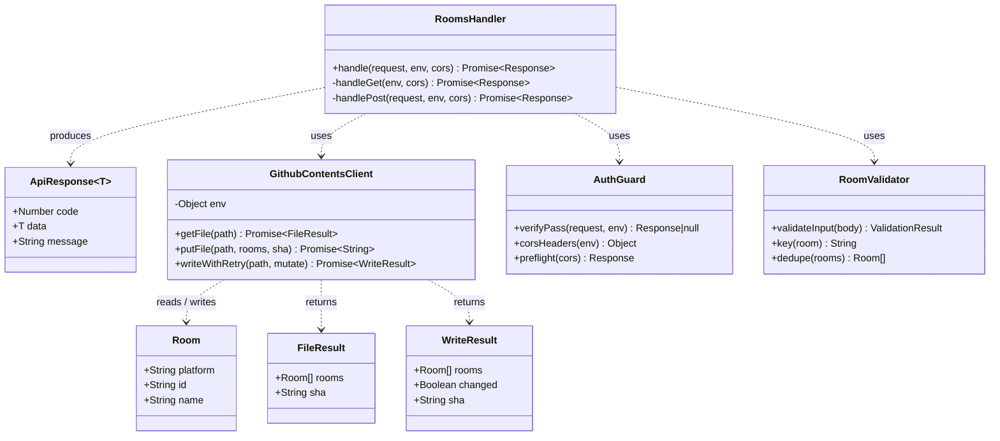
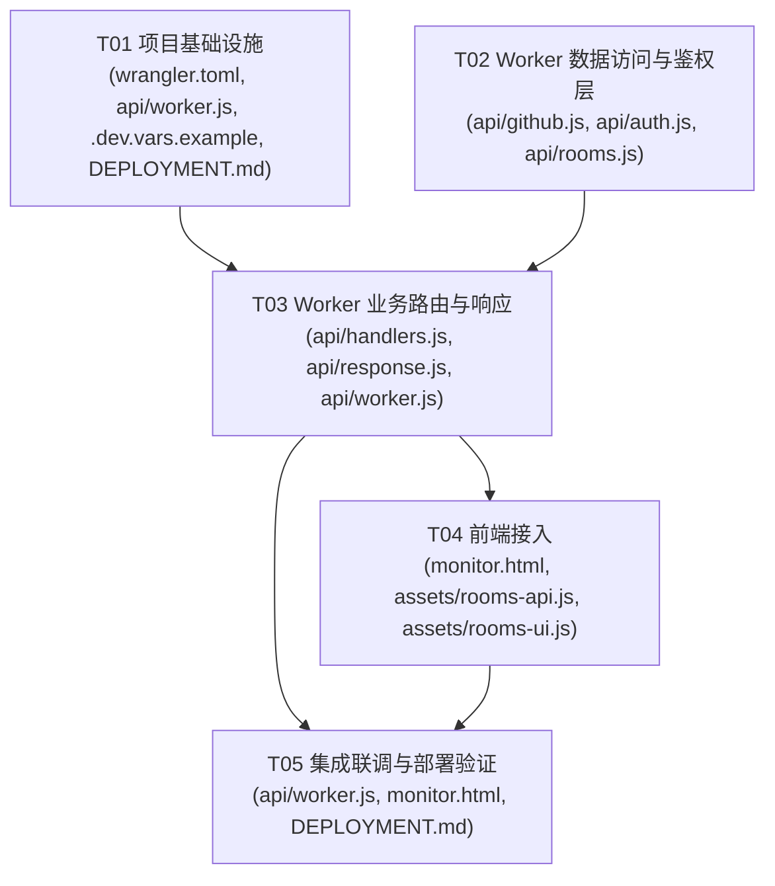

# blive-monitor · 系统设计

> 架构师：高见远（Bob）　|　基于 PRD（许清楚）+ 现有架构约束

> ⚠️ **架构已演进（2026-07 起）**：本文档初版描述的是「Cloudflare Worker 代理（`api/` 目录）」方案。
> 该方案因 `*.workers.dev` 在中国大陆常被屏蔽、导致增删超时，已**弃用并从仓库移除**。
> 当前前端（`monitor.html`）**直接调用 GitHub Contents API** 读写 `rooms.json`，PAT 仅存于浏览器
> `localStorage`；推送配置通过 libsodium 加密后写入仓库 Secret `BLIVE_CONFIG`。下方「Part A」保留
> 初版 Worker 设计的完整细节供回溯，「Part C」描述当前真实架构。最新部署步骤见 `DEPLOYMENT.md`。

---

## Part A：系统设计

### 1. 实现方案（Implementation Approach）

**核心难点**
1. 前端（GitHub Pages，纯静态）不能直接持有 PAT，否则 PAT 泄露即全网可用。
2. rooms.json 是监控真相源，且被 `check.yml` 每 5 分钟消费；写入必须并发安全，避免两人同时改互相覆盖。
3. 前端为无构建步骤的原生 JS，改动必须保持「零构建、可被 Pages 直接托管」。

**技术选型（已定，无需新增运行时依赖）**
| 关注点 | 方案 | 理由 |
|---|---|---|
| 服务端代理 | Cloudflare Worker（现代模块语法 `export default { async fetch(request, env){} }`） | 边缘运行、原生 `fetch`、可藏 PAT 于 Secret |
| GitHub 读写 | GitHub Contents API（REST），经 Worker 服务端调用 | 原生 `fetch` 即可，带 `sha` + `409` 重试保证并发安全 |
| 鉴权 | 共享口令 `x-pass` 请求头（明文存于 Worker vars，已知暴露于前端 JS，仅防随手乱改） | PRD 明确，成本极低 |
| 跨域 | Worker 显式回 `Access-Control-Allow-Origin: https://racheko-lab.github.io` + 响应 `OPTIONS` 预检 | 不用 `*`；前端跨域带自定义头必触发预检 |
| 前端 | 修改 `monitor.html`（原生 JS + 暗色主题），新增配置常量 + fetch 封装 + 表单/按钮/toast | 零构建，兼容 Pages |
| 依赖 | **运行时 0 个 npm 包**；仅 `wrangler`（devDependency）用于本地预览/部署 | 优先 Workers 原生能力，不引不必要依赖 |

**架构模式**：经典「BFF（Backend for Frontend）代理」——前端 → Worker（鉴权 + 文件锁 + 响应规整）→ GitHub Contents API。前端与 GitHub 解耦，PAT 永不出服务端。

---

### 2. 文件列表（相对路径）

```
blive-monitor/
├── api/                         # 新增：Cloudflare Worker 源码（wrangler 入口在此）
│   ├── worker.js                # 入口：router + OPTIONS 预检接线（新建）
│   ├── github.js                # GithubContentsClient：getFile / putFile / writeWithRetry（新建）
│   ├── auth.js                  # AuthGuard：verifyPass / corsHeaders / preflight（新建）
│   ├── rooms.js                 # RoomValidator：校验 / 去重键 / id→string（新建）
│   ├── handlers.js              # RoomsHandler：GET / POST 业务处理（新建）
│   └── response.js              # 统一 {code,data,message} 信封 + OPTIONS 响应（新建）
├── wrangler.toml                # 新增：Worker 配置（compatibility_date + vars）
├── .dev.vars.example            # 新增：本地 Secret 模板（GH_TOKEN 等，.dev.vars 自身 gitignore）
├── DEPLOYMENT.md                # 新增：部署步骤 + Secret 校验清单
├── assets/                      # 新增（可选拆分，见 §7 任务说明）：前端伴生脚本
│   ├── rooms-api.js             # 新增：apiGetRooms / apiAddRoom / apiRemoveRoom（fetch 封装）
│   └── rooms-ui.js              # 新增：添加表单 / 移除按钮 / 二次确认 / toast / refresh
└── monitor.html                 # 修改（非新增）：顶部配置区 + 引入脚本 + 渲染钩子
```

> 备注：Worker 全部逻辑放在 `api/`，保持仓库根整洁；`wrangler.toml` 中 `main = "api/worker.js"`。前端逻辑若用户坚持「全部内联进 monitor.html」，可把 `assets/*.js` 合并回去（不影响功能，仅牺牲可测试性）。

---

### 3. 数据结构与接口（API Schema）

**真相源 rooms.json（GitHub 仓库根）**
```jsonc
// GET 解析后的结构
Room[] = [ { "platform": "bilibili" | "douyin", "id": "String", "name": "String" } ]
```

**类图**（详见 `docs/class-diagram.mermaid`）


**Worker HTTP 接口契约**

所有请求需带 `x-pass` 头。统一响应体：`{ "code": Number, "data": Any|null, "message": String }`，成功 `code: 0`，HTTP 状态码随错误语义变化（见下矩阵）。

#### 3.1 `GET /rooms`
- 请求头：`x-pass: <PASSPHRASE>`
- 成功 `200`：`{ "code": 0, "data": { "rooms": Room[], "sha": "abc123" }, "message": "ok" }`
- 失败：`401`（缺 x-pass）/ `403`（x-pass 错误）/ `502`（GitHub 错误）/ `504`（超时）/ `500`
- **不发起任何 GitHub 调用即可在鉴权失败时返回。**

#### 3.2 `POST /rooms`
- 请求头：`x-pass: <PASSPHRASE>`；`Content-Type: application/json`
- 请求体（JSON）：
  ```jsonc
  // 添加
  { "action": "add",    "platform": "bilibili"|"douyin", "id": "123", "name": "可选名称" }
  // 移除
  { "action": "remove", "platform": "bilibili"|"douyin", "id": "123" }
  ```
- 校验失败：`400`（见矩阵）
- `action=add`：
  - 重复（同 `platform|id` 已存在）：`200` `{ "code":0, "data":{ "rooms":Room[], "duplicate":true }, "message":"already monitored" }`（**幂等，不报错**）
  - 新增成功：`200` `{ "code":0, "data":{ "rooms":Room[], "added":true }, "message":"added" }`
- `action=remove`：
  - 不存在：`404` `{ "code":404, "data":null, "message":"room not monitored" }`
  - 移除成功：`200` `{ "code":0, "data":{ "rooms":Room[], "removed":true }, "message":"removed" }`
- 并发冲突超限：`409 { "code":409, "message":"concurrent edit conflict, retry" }`
- GitHub 错误：`502`；超时：`504`

**错误码矩阵**
| 场景 | HTTP | body.code | message |
|---|---|---|---|
| x-pass 缺失 | 401 | 401 | missing x-pass |
| x-pass 错误 | 403 | 403 | invalid x-pass |
| body 非 JSON | 400 | 400 | invalid json |
| action 非法 | 400 | 400 | action must be 'add' or 'remove' |
| platform 非法 | 400 | 400 | platform must be bilibili\|douyin |
| id 空/缺 | 400 | 400 | id required |
| 移除不存在 | 404 | 404 | room not monitored |
| 409 重试超限 | 409 | 409 | concurrent edit conflict, retry |
| GitHub 5xx/网络 | 502 | 502 | github upstream error |
| Worker 超时 | 504 | 504 | github timeout |
| 其他异常 | 500 | 500 | internal error |

**关键签名（伪代码）**
```js
// api/github.js
class GithubContentsClient {
  constructor(env) {}
  async getFile(path) -> { rooms: Room[], sha: string|null }   // 404 -> {rooms:[], sha:null}
  async putFile(path, rooms, sha) -> string                    // 抛 ConflictError(409)
  async writeWithRetry(path, mutate) -> { rooms, changed, sha } // mutate(rooms)->{rooms,changed}
}

// api/rooms.js
const RoomValidator = {
  validateInput(body) -> { ok:boolean, room?:Room, error?:string },
  key(room) -> `${platform}|${id}`,
  dedupe(rooms) -> Room[],
};

// api/auth.js
verifyPass(request, env) -> Response|null   // null=通过; 否则 401/403
corsHeaders(env) -> { "Access-Control-Allow-Origin": string, ... }
preflight(cors) -> Response                  // 204

// api/handlers.js
RoomsHandler.handle(request, env, cors) -> Promise<Response>
```

---

### 4. 程序调用流程（时序图）

完整时序见 `docs/sequence-diagram.mermaid`（含 GET / POST-add / POST-remove / 409 重试放大四张图）。以下为关键路径文字版：

**GET /rooms**
1. 前端 `GET /rooms` 带 `x-pass` → Worker。
2. `AuthGuard.verifyPass`：缺/错直接 `401`/`403` 返回，**不调 GitHub**。
3. 通过 → `GithubContentsClient.getFile("rooms.json")` → `GET api.github.com/repos/{GH_REPO}/contents/rooms.json?ref={BRANCH}`（Bearer PAT）。
4. 解码 base64→UTF-8→JSON → 返回 `{rooms, sha}`。

**POST /rooms (add)**
1. 鉴权 → 校验 `validateInput`（非法 `400`）。
2. `writeWithRetry`：`getFile` 取最新 `rooms+sha`；若 `platform|id` 已存在 → `changed:false` → 返回 `duplicate:true`（幂等）。
3. 否则追加，带 `sha` `PUT`；遇 `409` 重新 `getFile` 后重试，最多 2 次；成功返回新 `sha` 与 `added:true`。

**POST /rooms (remove)**
1. 鉴权 → 校验。
2. `writeWithRetry`：`getFile` → 过滤掉 `platform|id`；若数量未变（`changed:false`）→ `404 room not monitored`；否则 `PUT`，成功返回 `removed:true`。

**409 重试放大**：`writeWithRetry` 内含 `while` 循环，`attempt<2` 时遇 `ConflictError` 重新 `getFile` 再 `PUT`；超限抛 `ConflictError` → Handler 返回 `409`。

---

### 5. 待明确事项（Anything UNCLEAR）

| # | 待定项 | 推荐默认值（ architect 建议） |
|---|---|---|
| 1 | CORS 是否收紧到具体路径 | `Allow-Origin` 固定 `https://racheko-lab.github.io`；`Allow-Methods: GET,POST,OPTIONS`；`Allow-Headers: Content-Type,x-pass`。不开放 `*` |
| 2 | `OPTIONS` 预检是否实现 | **实现**（前端跨域带自定义头 `x-pass` 必触发预检），`Worker` 对 `OPTIONS` 直接返回 `204` + CORS 头 |
| 3 | 重复添加语义 | 返回 `200` + `data.duplicate:true`（幂等，不报错），前端 toast「已在该监控列表」 |
| 4 | 移除不存在房间 | 返回 `404`（便于前端感知异常）；但卡片来自已有列表，正常不会触发 |
| 5 | `name` 缺失默认值 | 默认等于 `id`（保证 `check.yml` 展示友好）；用户可在别处编辑（本次无编辑接口） |
| 6 | `PASSPHRASE` 存放 | 作为 `wrangler.toml [vars]`（明文，因其本就暴露于前端 JS，无保密价值）；`GH_TOKEN` 必须用 `wrangler secret put` |
| 7 | Worker 路由 base path | `/rooms`（简洁）；`worker.js` 同时兜底 `/` 返回 404 说明 |
| 8 | 冲突 UX（409 超限） | 前端 toast「并发冲突，请重试」并自动重新 `apiGetRooms()` 刷新 |
| 9 | 读路径归属 | 稳态轮询仍用同域 `rooms.json`（无鉴权、低延迟）；**仅写操作 + 写后即时刷新**走 Worker `GET /rooms`（即时一致）。见 §7 说明 |
| 10 | 审计日志(P2) | 本次仅预留 `writeAudit()` 占位（默认 no-op），不接存储；后续接 KV/日志 |
| 11 | Cloudflare 账户/部署 | 由用户执行；本设计只交付代码 + `wrangler.toml` + `DEPLOYMENT.md` |
| 12 | `GH_REPO`/`BRANCH` | `GH_REPO="racheko-lab/blive-monitor"`，`BRANCH="master"`（仓库默认分支，已确认） |

---

## Part B：任务分解

### 6. 依赖包列表（Required Packages）

```text
# 运行时：无第三方依赖（Worker 原生 fetch / Web Crypto / TextEncoder）
# 开发 / 部署：
- wrangler@^3.0.0   # Cloudflare Worker 本地开发、预览与部署 CLI（devDependency，仅本地/CI 用）
```

> 不引入任何运行时 npm 包。UTF-8/base64 用 `TextEncoder` + `atob/btoa`；超时用 `AbortController`；无加密需求（口令为明文比对）。

---

### 7. 任务列表（按依赖/实现顺序）

> 规则遵循：≤5 任务；每任务 ≥3 文件；T01 为项目基础设施；尽量独立。
> 注：前端为保持「零构建 + 可测试」，拆出 `assets/rooms-api.js`、`assets/rooms-ui.js` 两个 `<script src>` 伴生脚本；若用户要求全部内联，可合并回 `monitor.html`（功能等价）。

- **T01 · 项目基础设施（配置 + 入口 + 文档）** ｜ Priority **P0** ｜ 依赖：无
  - 源文件：`wrangler.toml`、`api/worker.js`、` .dev.vars.example`、`DEPLOYMENT.md`
  - 产出：`wrangler.toml`（compatibility_date + `[vars]`：GH_REPO/BRANCH/PASSPHRASE/ALLOWED_ORIGIN，注释说明 GH_TOKEN 用 secret）、`worker.js` 入口骨架（仅 router + OPTIONS 接线，业务留 TODO 引用 handlers）、`.dev.vars.example`（GH_TOKEN 模板）、`DEPLOYMENT.md`（部署步骤骨架）。

- **T02 · Worker 数据访问与鉴权层** ｜ Priority **P0** ｜ 依赖：无（与 T01 并行；env 变量名采用本设计约定）
  - 源文件：`api/github.js`、`api/auth.js`、`api/rooms.js`
  - 产出：`GithubContentsClient`（getFile/putFile/writeWithRetry、UTF-8 安全 base64、409 重试≤2、8s 超时 AbortController）、`AuthGuard`（verifyPass/corsHeaders/preflight）、`RoomValidator`（validateInput/key/dedupe、id→String）。

- **T03 · Worker 业务路由与响应** ｜ Priority **P0** ｜ 依赖：T01、T02
  - 源文件：`api/handlers.js`、`api/response.js`、`api/worker.js`（修改：注入 handlers 完成接线）
  - 产出：`RoomsHandler`（GET/POST，add/remove 逻辑，401/403/400/404/409/502/504）、`response.js`（统一 `{code,data,message}` 信封 + OPTIONS 响应）、`worker.js` 完成 `/rooms` 路由与错误处理接线。

- **T04 · 前端接入（monitor.html + 伴生脚本）** ｜ Priority **P0/P1** ｜ 依赖：T03（接口契约稳定）
  - 源文件：`monitor.html`（修改：配置区 + 引入脚本 + 渲染钩子）、`assets/rooms-api.js`、`assets/rooms-ui.js`
  - 产出：顶部 `API_BASE`/`API_PASS` 常量（带注释占位）；`apiGetRooms/apiAddRoom/apiRemoveRoom`（fetch 封装 + 超时）；「＋ 添加监控」表单（平台下拉/ID 必填/名称可选 + 添加前校验 + 去重提示）；卡片右上「移除」按钮（hover 变红 + 二次确认）；toast 统一反馈（含失败原因）；写后即时 `apiGetRooms()` 刷新并触发已有同域轮询重排。

- **T05 · 集成联调与部署验证** ｜ Priority **P1** ｜ 依赖：T03、T04
  - 源文件：`api/worker.js`（本地 `wrangler dev` 联调+日志）、`monitor.html`（端到端验证）、`DEPLOYMENT.md`（补充 Secret 校验清单）
  - 产出：本地用 `.dev.vars`（GH_TOKEN）+ 主理人 PAT 跑通 add/remove/refresh/toast；验证 409 重试、CORS 预检、401/403/400/404；`DEPLOYMENT.md` 补全 `wrangler secret put GH_TOKEN` 与发布步骤。

---

### 8. 共享知识（Shared Knowledge / 跨文件约定）

```text
- 房间去重键 = platform + "|" + id（如 "bilibili|123"）；比较前统一 String(id)。
- id 一律转字符串；server 端校验平台 ∈ {bilibili, douyin}。
- 统一响应体 {code, data, message}；成功 code=0，HTTP 200；错误 HTTP 状态随语义（见矩阵）。
- x-pass 缺失 -> 401；错误 -> 403；鉴权失败绝不发起 GitHub 调用。
- POST body 校验失败 -> 400（action/platform/id）。
- rooms.json 是监控真相源；写入必带 sha，遇 409 自动 getFile 后重试，最多 2 次。
- GitHub PAT 为细粒度、仅该仓库 contents:write；存于 Worker Secret（GH_TOKEN），不在前端/仓库出现。
- Worker GitHub 调用超时 8s（AbortController）；上游 5xx 有限重试 1 次。
- CORS 仅允许 https://racheko-lab.github.io；Methods=GET,POST,OPTIONS；Headers=Content-Type,x-pass。
- 写回 rooms.json 会触发 check.yml 自动重建 Pages + 开始/停止监控（最终一致）。
- UTF-8 安全 base64（中文 name）：用 TextEncoder + Uint8Array -> btoa(stringFromCharCode)。
- 稳态房间列表读：同域 rooms.json（无鉴权）；写 + 写后即时刷新：Worker GET /rooms。
- 本次范围仅 rooms.json；post_rooms.json 预留不动。
```

---

### 9. 任务依赖图（Task Dependency Graph）



> 说明：T01 与 T02 无依赖、可并行启动；T03 收口 Worker 全部逻辑；T04 等接口契约稳定后开工；T05 依赖 Worker 与前端双双就绪。

---

## 附录：关键实现片段（签名级，非完整代码）

**wrangler.toml**
```toml
name = "blive-monitor-api"
main = "api/worker.js"
compatibility_date = "2024-09-23"
# account_id = "用户 Cloudflare 账户 ID（部署前填）"

[vars]
GH_REPO = "racheko-lab/blive-monitor"
BRANCH = "master"
PASSPHRASE = "change-me-shared-passphrase"
ALLOWED_ORIGIN = "https://racheko-lab.github.io"
# GH_TOKEN 用 secret：wrangler secret put GH_TOKEN （勿写此文件）
```

**api/worker.js（入口骨架）**
```js
import { handleRooms } from "./handlers.js";
import { corsHeaders, preflight } from "./auth.js";

export default {
  async fetch(request, env) {
    const cors = corsHeaders(env);
    if (request.method === "OPTIONS") return preflight(cors);
    const url = new URL(request.url);
    if (url.pathname === "/rooms" || url.pathname === "/rooms/") {
      return handleRooms(request, env, cors);
    }
    return new Response(JSON.stringify({ code: 404, data: null, message: "not found" }),
      { status: 404, headers: { "Content-Type": "application/json", ...cors } });
  }
};
```

**api/github.js（写回 + 409 重试核心）**
```js
export class GithubContentsClient {
  constructor(env) { this.env = env; }
  async getFile(path) { /* GET contents; 404->{rooms:[],sha:null}; base64->utf8->json */ }
  async putFile(path, rooms, sha) { /* PUT contents; 409->throw ConflictError */ }
  async writeWithRetry(path, mutate) {
    let attempt = 0;
    while (true) {
      const { rooms, sha } = await this.getFile(path);
      const res = mutate(rooms);                 // {rooms, changed}
      if (!res.changed) return { rooms: res.rooms, changed: false, sha };
      try { const newSha = await this.putFile(path, res.rooms, sha);
            return { rooms: res.rooms, changed: true, sha: newSha }; }
      catch (e) {
        if (e.name === "Conflict" && attempt < 2) { attempt++; continue; }
        throw e;
      }
    }
  }
}
```

**api/auth.js（鉴权 + CORS）**
```js
export function verifyPass(request, env) {
  const pass = request.headers.get("x-pass");
  if (!pass) return json(401, null, "missing x-pass");
  if (pass !== env.PASSPHRASE) return json(403, null, "invalid x-pass");
  return null; // 通过
}
export function corsHeaders(env) {
  return {
    "Access-Control-Allow-Origin": env.ALLOWED_ORIGIN,
    "Access-Control-Allow-Methods": "GET, POST, OPTIONS",
    "Access-Control-Allow-Headers": "Content-Type, x-pass",
    "Access-Control-Max-Age": "86400",
    "Vary": "Origin",
  };
}
export function preflight(cors) {
  return new Response(null, { status: 204, headers: cors });
}
```

**前端 monitor.html（新增配置区 + 脚本挂载，示意）**
```html
<!-- 顶部配置区：用户部署后改这两行 -->
<script>
  const API_BASE = "https://blive-monitor-api.<你的子域>.workers.dev"; // ← 改为你的 Worker URL
  const API_PASS = "change-me-shared-passphrase";                     // ← 与 wrangler PASSPHRASE 一致
</script>
<script src="assets/rooms-api.js"></script>
<script src="assets/rooms-ui.js"></script>
```
`assets/rooms-api.js` 暴露 `apiGetRooms() / apiAddRoom({platform,id,name}) / apiRemoveRoom({platform,id})`，统一带 `x-pass` 头、8s 超时、解析 `{code,data,message}`。
`assets/rooms-ui.js` 负责渲染「＋ 添加监控」表单、给卡片注入「移除」按钮 + 二次确认弹窗、toast、写后调用 `apiGetRooms()` 刷新并触发既有同域 `rooms.json` 轮询重排。
```

---

## Part C：当前真实架构（2026-07 起）

> 上文「Part A / Part B」保留初版 Cloudflare Worker 代理方案的完整细节，供回溯与对比。
> 本段描述**仓库当前实际运行**的架构——Worker（`api/`、`wrangler.toml`）已移除，
> 前端改为**直连 GitHub Contents API**，推送配置改用 **libsodium 密封盒**写入 Secret。

### C.1 架构模式转变

| 维度 | Part A（已弃用） | Part C（当前） |
|---|---|---|
| 中继层 | Cloudflare Worker（BFF 代理） | **无**——前端直连 GitHub |
| PAT 存放 | Worker Secret，前端永不见 | 浏览器 `localStorage`，用户自填 |
| 鉴权 | 共享口令 `x-pass` 头 | GitHub PAT 自带 `Authorization` |
| 跨域 | Worker 显式 CORS | GitHub Contents API 原生允许 Pages 跨域 |
| 推送配置 | 明文写仓库 `config.json` | libsodium 加密 → Secret `BLIVE_CONFIG` |
| 增删房间 | 经 Worker 写 `rooms.json` | 前端直连 Contents API 写 `rooms.json` |

**为什么下线 Worker**：`*.workers.dev` 域名在中国大陆常被屏蔽，导致前端增删房间请求超时、体验不可靠；而 GitHub Contents API 走 `api.github.com`，在国内可达性明显更好。去掉一层边缘服务也减少了部署面与运维成本。

### C.2 数据流（用户态）

```
浏览器 localStorage(PAT) ──┐
                           ▼
monitor.html ──GitHub Contents API──> rooms.json   (读/写 监控房间)
                            │
                            ▼
        ┌───────────────────────────────────────────────┐
        │ GitHub Actions · check.yml（每 5 分钟/手动）    │
        │  check_status.py   → status.json / history.json │
        │  check_new_posts.py → post_tracking.json        │
        │  推送：读取 Secret BLIVE_CONFIG（libsodium 解密）│
        │       → push_utils.dispatch_push()              │
        │       → Bark / 企业微信 / Server酱 / PushPlus / Telegram │
        └───────────────────────────────────────────────┘
                           │
                           ▼
monitor.html 轮询 status.json / history.json / post_tracking.json 渲染
```

### C.3 前端如何读写 rooms.json

前端 `monitor.html`（及 `monitor-feed.html` / `monitor-hero.html` / `monitor-dashboard.html`）在内存中持有用户填入的 PAT，
所有仓库文件读写统一走 GitHub Contents API：

- **读**：`GET /repos/{owner}/{repo}/contents/{path}?ref=master`，解码 `content`（base64）→ UTF-8 JSON。
- **写**：`GET` 取当前 `sha` → `PUT` 带 `sha` + 新 base64 内容；命中 `409`（并发冲突）时自动重试（重取 sha 再提交），保证并发安全。
- **PAT 作用域**：`repo`（私有仓库）或 `public_repo`（公开仓库）即可，仅在本地浏览器内存/存储中使用，**不上传、不入库**。
- **降级**：若未配置 PAT，前端仍可只读渲染 `status.json` 等公开产物，仅「添加/移除房间」需要写权限。

### C.4 推送配置 BLIVE_CONFIG（libsodium 密封盒）

明文 PAT 风险高，故推送配置改为**在仓库 Secret 中只存密文**：

1. 部署者用 **libsodium `crypto_box_seal`**（即 sealed box，无需对方公钥之外的任何交互）将 `BLIVE_CONFIG` 明文 JSON 加密。
2. 密文（`base64` 或 hex）写入仓库 Secret `BLIVE_CONFIG`。
3. CI 运行时（`check_status.py` / `check_new_posts.py` 经由 `push_utils.load_push_cfg`）用仓库配对的 libsodium 私钥解密，得到：

   ```json
   {
     "push": {
       "type": "bark",            // bark | wecom | serverchan | pushplus | telegram
       "url": "https://api.day.app/xxxx/",
       "token": "...",            // telegram: bot token
       "chat": "...",             // telegram: chat_id
       "sendkey": "..."           // serverchan 遗留字段，已兼容
     }
   }
   ```

4. `push_utils.dispatch_push(cfg, title, desp)` 依据 `type` 路由到对应 `send_via_*` 实现；
   `serverchan` 的 `sendkey` 字段做向后兼容（新配置请用 `pushplus`/`serverchan` 各自 `url`/`token`）。

> 前端 `monitor.html` 内的 `libsodium.js` 负责浏览器侧加密，让用户无需 CLI 也能生成 Secret 密文。

### C.5 当前文件清单（相对 Part A 的变化）

```
blive-monitor/
├── check_status.py          # 后端：B站/抖音直播状态检测 → status.json / history.json
├── check_new_posts.py       # 后端：抖音新作品抓取（Playwright headless Chromium）
├── push_utils.py            # 推送分发（bark/wecom/serverchan/pushplus/telegram）
├── common.py                # 公共工具（bjnow / JSON 读写 / 默认 UA / 北京时区）
├── requirements.txt         # playwright（抖音作品抓取运行时依赖）
├── requirements-dev.txt     # pytest（回归测试）
├── run.sh                   # 本地一键运行示例（BLIVE_CONFIG 内联）
├── monitor.html             # 主前端：直连 Contents API 读写 rooms.json + libsodium 加密
├── monitor-feed.html        # 信息流视图
├── monitor-hero.html        # 大屏视图
├── monitor-dashboard.html   # 仪表盘视图
├── libsodium.js             # 浏览器侧密封盒加密
├── rooms.json               # 监控房间真相源（前端直写）
├── state.json / status.json / tracking.json / post_tracking.json / post_rooms.json
├── tests/                   # 回归测试（pytest）
│   ├── conftest.py
│   ├── test_push_utils.py
│   ├── test_check_status.py
│   ├── test_check_new_posts.py
│   └── test_common.py
├── docs/
│   ├── system_design.md      # 本文档
│   ├── class-diagram.mermaid
│   └── sequence-diagram.mermaid
├── .github/workflows/check.yml   # check（B站+抖音）/ test（pytest，非阻塞）/ deploy（Pages）
├── DEPLOYMENT.md            # 最新部署步骤
└── README.md
```

> **已移除**（对比 Part A）：`api/`（Worker 源码）、`wrangler.toml`、`.dev.vars.example`、`.dev.vars`。
> **未采用**（保持零构建）：前端仍为零构建原生 JS，无需打包器。

### C.6 取舍与已知限制

- **PAT 在浏览器存储**：便利但牺牲了「PAT 永不出服务端」的安全边界；当前定位为**个人/小团队自托管**工具，
  文档已明确提示用户只授予最小必要作用域、且勿在公共设备保存。多用户场景可考虑回退到 Worker 代理。
- **Secret 解密依赖私钥**：`BLIVE_CONFIG` 解密所需的 libsodium 私钥由 CI Secret 提供；私钥一旦丢失需重新生成密钥对并更新所有密文。
- **并发写房间**：依赖 Contents API 的 `sha` + `409` 重试，非强锁；极端并发下最坏情况为一次重试，不影响最终一致。
